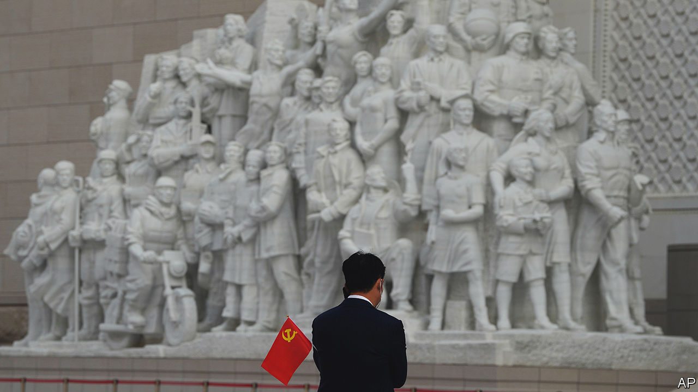

###### Firm control

# China’s Communist Party is tightening its grip in businesses 

##### Foreign investors are worried 

 

> Jul 6th 2023 

It was a chilly afternoon in early February. In Yingshang, a town in the central province of Anhui, local bosses of more than 100 big private firms kept their jackets on as they took their seats behind rows of desks in a Communist Party meeting room. Three officials, flanked by red flags, sat on the dais before them to explain some new procedures. The businessmen were there to learn how to rewrite their company charters to specify a role for the party. 

The officials were from Yingshang’s Administration for Market Regulation, which handles company registrations. It also supervises party committees inside private firms. Over the past two decades the party has been trying to ensure that as many businesses as possible have a party organisation embedded within. Since he took power in 2012, Xi Jinping has been ramping up this effort. By 2015 state-owned enterprises (SOEs) were being pushed to enshrine a leading role for the party in their charters. Pressure has since been growing on private firms, too. Some foreign-invested companies have also been feeling the heat. In boardrooms and on factory floors, the party is gaining muscle. 

It was already strong before this intrusion began. In a one-party state, ruling-party officials naturally hold sway. Woe betide any private boss who crosses them (as several who run big tech firms have been reminded in the past few years). Everyone knows that a person’s position in the party is more important than their government role. A mayor is always subordinate to the local party secretary. No head of a ministry sits in the party’s supreme decision-making body, the Politburo Standing Committee, which has seven members, nor even in the Politburo, which has 24. 

Sometimes it is difficult for an outsider to discern the way the party exerts power: it is omnipresent, but often hard to see. Take the Beijing-based Asian Infrastructure Investment Bank (AIIB), a multilateral institution founded in 2016 by China, its biggest shareholder. Party regulations require that wherever three or more employees in a workplace are party members, they must set up a party branch. One with seven or more members should appoint a party secretary. The AIIB has no declared party structure. But its president, Jin Liqun, is a member and it is safe to assume that many of his Chinese colleagues are, too. 

Last month Bob Pickard, a Canadian working in Beijing as the AIIB’s communications chief, resigned from the bank, saying that it was “dominated” by party people (the bank’s charter says its decisions will not be influenced by the “political character” of any of its members). Canada, which is a member, announced it was freezing its ties with the bank pending an investigation of Mr Pickard’s allegations, which have been denied by China. It may be difficult to prove the party’s role. “It’s tough to connect the dots between them,” Mr Pickard says of former AIIB workmates whom he suspected of being party members. “But it’s clear that there’s a subterranean, or informal, or opaque situation where this group exercises power. As a collective? That needs to be demonstrated.” 

In other kinds of workplace, however, the party wants a conspicuous role. Gone are the days when party branches were often shy about operating openly in non-state entities such as private firms and NGOs. Now branches are coming out from “behind the curtain”, as party literature puts it. And the party is becoming much more assertive about making sure that these branches get more than just a say in organising entertainment for workers. 

In the rewriting of charters, SOEs have blazed the trail. All of those controlled by the central government have done so to clarify the party’s dominant position. As required, they have also arranged for the company party secretary to hold the simultaneous position of chairman of the board (if this wasn’t the case already). 

Some foreign-invested firms in joint ventures with SOEs have come under pressure to follow suit. In 2017 the European Union Chamber of Commerce in Beijing called this a matter of “great concern” that could have “serious consequences for the independent decision-making ability” of these companies. But a Western lawyer involved in such cases says requests by SOE partners for party-related stipulations in joint-venture charters have since become “regular practice”. There is, she says, “no way to say no”. A foreign businessman says an SOE partner at his firm has recently become more insistent that the party chief be consulted about big decisions. 

As the meeting in Yingshang suggests, the private sector is now increasingly in the party’s sights. Participants were told that the charter-rewriting effort was aimed at “upholding and strengthening the party’s all-round leadership of private enterprises”. The revised articles should set out staffing for the party branch, pledge funding for it and embed the party in the “corporate governance structure”, says an account by Yingshang’s party authorities. 

Language used by the party to describe how it should operate in SOEs is now often applied to private firms. “Two-way entry and cross appointment” is one such phrase. It means, in essence, that the company’s management and the party branch’s leadership team should be merged.

That may avoid conflict between the two structures, but it also gives the party a big say over appointments. For a start, it only works if all of the most senior managers are party members. Unlike in SOEs, this is often not the case in private firms. Local officials routinely extol the system, even if they do not order its adoption. By 2021 in the city of Chengde, the bosses of nearly a quarter of private firms were also party chiefs, according to state media. Officials like to talk about the creation among private firms of a “modern enterprise system with Chinese characteristics”. This is another term borrowed from SOEs. It means giving a central role to Communists. 

Ensuring that only those trusted by the party get the top jobs is clearly one of the party’s aims. In 2020 Ye Qing, a vice-chairman of the (party-controlled) All-China Federation of Industry and Commerce, said that, as part of building a modern enterprise system, party branches in private firms should be given “guiding power” over personnel decisions. Human-resources departments should be under party control, he said. A book about party-building in private firms, published in 2010 by the party’s own personnel department, made the purpose clear: “The non-state economy is taking up an ever bigger share of the national economy…If party organisations don’t go and control it, other political forces will exploit [our] weakness.”

It is sometimes unclear, however, how much difference party structures, as distinct from the party’s power generally, make to the way firms operate. Company bosses have always had to cosy up to party officials to get business done. Employees who are party members may enjoy some clout, but they can still be fired. Their loyalty is often more to the business than to the party branch (which, in disputes between workers and management, often prefers to side with the latter). The party talks of “hidden” members in firms: people who prefer not to reveal their party identity or get involved in party affairs because they want to avoid hassle and distraction from work. In a paper published in 2021, Daniel Koss of Harvard University says the party worries about some of its branches becoming “clanified”, meaning dominated by bosses’ relatives who happen to be party members in the same company. 

Such problems, however, will not deter the party from trying to boost its presence. In the Tianjin Economic-Technological Development Area, a business enclave south-east of Beijing, almost all private firms with more than 100 employees have written the party into their charters in the past three years, the zone’s management says. It adds that more than 150 firms there, including foreign ones, have staged events to celebrate the party’s presence within their workforces. There will be plenty more such revelry as the party marches forward. ■


