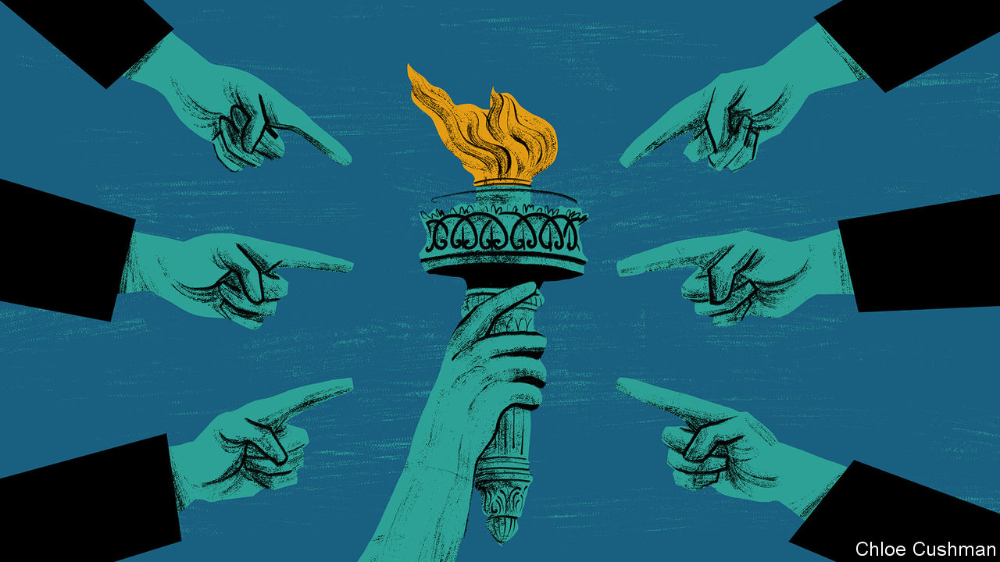

###### Chaguan

# China’s message to the global south 

##### A new propaganda push: “universal values” are a form of racism 

 

> Jul 6th 2023 

To turn on its head a cliché of China analysis, Communist Party leaders may soon learn that behind tempting opportunities, a potential crisis lurks. With each month that the war in Ukraine grinds on, officials in Beijing see new chances to rally and lead an anti-Western bloc formed of low- and middle-income countries. These states blame America and its allies for prolonging the conflict, which is causing energy and food prices to soar worldwide. China’s actions carry risks, for it has no interest in burning all bridges with the West. Still, officials seem unable to resist.

The temptations were on display at the World Peace Forum, a foreign-policy gathering held in Beijing from July 1st to 3rd. Since the war began, Chinese analysts have been surprised by the resentment that many poor countries express towards the governments in America, Europe and elsewhere in the West for treating Ukraine’s invasion as one of the worst emergencies of the century. African leaders, among others, have accused Americans and Europeans of double standards for seeming to care so much about Ukrainian suffering and admitting refugees from Ukraine into their homes, while ignoring miseries caused by wars, famines and other disasters in the developing world. “We never knew that the rest of the world would be so indifferent to this war in Ukraine,” says a scholar from China’s national-security establishment, predicting that the conflict will accelerate the coming of an Asian century. “This is a blow to Western centrality to the world order.”

China still seeks good relations with at least some parts of the West, or at least those countries (including in Europe) with technologies, know-how and investments needed to complete China’s rise. Yet time and again at the forum, Western backers of Ukraine’s self-defence were called heartless for prolonging the war, rather than seeking a swift ceasefire. The recently retired Chinese ambassador in Washington, Cui Tiankai, accused some people of wanting a certain country (meaning Ukraine) to fight to its last man or woman, “which sounds to me like genocide”. Speakers accused America and rich-world allies of hegemonic arrogance, selfishness, hypocrisy and “civilisational superiority” for daring to pass judgment and impose sanctions on Russia, or indeed any regime not run on liberal, democratic lines.

Talk of civilisations is no accident. President Xi Jinping recently unveiled a Global Civilisation Initiative. That builds on his argument that China’s growing strength and prosperity demonstrate that “modernisation does not equal Westernisation”. Under Mr Xi, Chinese officials and state media have taken to arguing that a declining West’s insistence on defending an “international rules-based order” amounts to a form of chauvinism. Chinese officials and scholars compare Western governments fussing about multi-party elections, independent courts or free speech to missionaries, as if the West is telling faraway peoples which god to worship.

China is now applying that argument—in effect, that “universal values” are a form of racism—to the war in Ukraine. At the forum Chinese officials praised countries of the “global south”, meaning Africa, Asia and Latin America, for assertively questioning an international order crafted in 1945 by the winners of the second world war—before, they claim, most modern states even existed. They were echoed by speakers from the developing world, among them Dilma Rousseff, a former president of Brazil. She now runs the Shanghai-based New Development Bank, a multinational lender founded by the BRICS grouping of Brazil, Russia, India, China and South Africa. Accusing America and “the global north” of hoarding wealth and of seeking to contain such rivals as China, Ms Rousseff condemned Western powers for dismissing diversity and trying to impose one model of democracy. “If you don’t accept this imposed value system, you will be punished accordingly, or face measures such as war, coups or sanctions,” she charged. 

Repeatedly, discussions drifted from diplomatic theory to expressions of cultural solidarity. The former ambassador, Mr Cui, welcomed a recent peace mission to Ukraine and Russia by the president of South Africa and other African leaders. On that trip, African politicians emphasised the pain caused by high food prices and called for early talks. Ukraine’s president, Volodymyr Zelensky, told the envoys that negotiating while Russia occupies his country would lead to freezing the war in place. The Russian leader, Vladimir Putin, told the Africans that their plan ignored realities on the ground. In Beijing, Mr Cui lamented that the African delegation was not “treated in a fair or appreciative way”. 

Crushing dissent is despotism, not a cultural trait

In a speech, the minister in charge of the Communist Party’s international department, Liu Jianchao, asserted that Chinese civilisation had upheld a “way of peace” for 5,000 years. Nodding to poor-world concerns, Mr Liu observed that , the Chinese character for peace, is formed of ideograms depicting rice stalks and a mouth. China sees peace as inseparable from food security, development and communication, he averred. China’s vice-president, Han Zheng, told the forum that peace is in China’s DNA. For all the party’s warm words about seeking “harmony not uniformity”, its vision of peace puts order and state power first, at the expense of individual rights. Instead of values that liberal democracies call “universal”, Mr Han spoke of the need for “universal security”. 

Rich-world democracies should not underestimate the appeal of China’s arguments. In part, the West is paying the price for ignoring international rules when it suited, during decades of dominance. As in 1945, universal values need defending from first principles. Transparent rule, free speech and independent courts are not, in truth, tenets of some alien, Western religion. Accountable governance is like clean water: a public good that all deserve to enjoy. Liberal democracies are entitled to notice China leading the fight against such rights. Even as it denounces the West for dividing the world into blocs, China is making that very move. ■


