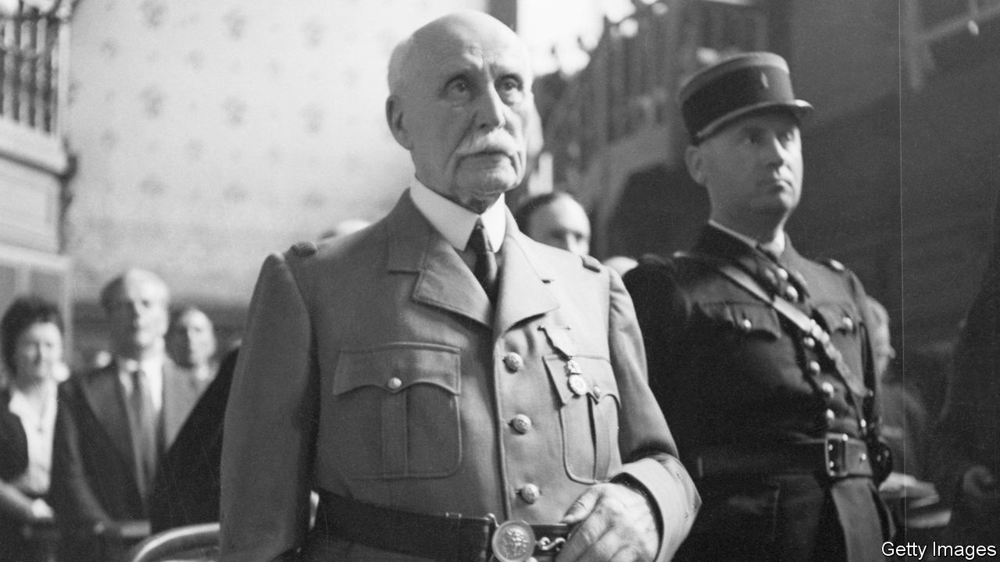

###### Man of dishonour

# A new book revisits the trial of Philippe Pétain in 1945 

##### Julian Jackson uses the case of the collaborationist leader to examine France’s collective guilt 

 

> Jul 6th 2023 

By Julian Jackson. 

Few home-grown 20th-century leaders prompt as much discomfort for the French as . The head of the Vichy regime, who signed the armistice with Germany on June 22nd 1940 and was photographed shaking the hand of Adolf Hitler in the French town of Montoire, embodied his country’s collaboration with Nazi Germany and the sacrifice of its national honour. In this painstakingly researched work, Julian Jackson, a British historian and , examines Pétain’s trial as a way to put both a leader and a country in the dock.

The court case took place over three weeks, between victory over the Third Reich on May 8th 1945 and the Nuremberg trials that began in November that year. Mr Jackson vividly reconstructs the drama. It was the height of summer. Rationing was still in place. But cinemas in Paris were open, as was the Louvre, where the  had returned after being hidden for four years in different secret locations around France. A special high court was set up, and a jury of 24 selected for the trial: all men, half of them members of the Resistance, half pre-war parliamentarians. The prosecution made use of 60 crates of archives from Vichy, and a veritable “Himalaya of official papers”, wrote one investigator, “which soon made our corridors and offices look like wartime trenches”. 

In the courtroom Pétain spoke little and remained inscrutable, “his tired eyes continuously blinking”, as one journalist noted. Indeed the original assumption was that the marshal would be tried in absentia. In 1944 the Nazis had transferred him to the turreted castle of Hohenzollern-Sigmaringen, in , where Louis-Ferdinand Céline, a pro-Vichy French novelist, also found refuge. To general astonishment, the 89-year-old Pétain handed himself in, in order to return to Paris and answer to the French people. 

When the old man in a khaki field uniform entered the courtroom, it fell silent. Pétain’s opening statement, writes Mr Jackson, was “a compilation of dubious assertions and half-truths, approximations and provocations”. He had signed the armistice as an “act of salvation”, he insisted. It had spared France “the fate of ”, argued his defence lawyers. The marshal, they claimed, was not Pierre Laval, the Vichy prime minister, who actually sympathised with Nazi Germany; Pétain had “protected” many Jews. Moreover, “If he was guilty so was all of France.” Parliament, after all, had voted in 1940 to hand over powers to the marshal.

The spectacle was miserable. Léon Blum, France’s pre-war Socialist prime minister, who had been deported to Nazi Germany in 1943, told the court that French leaders “had been dipped into some kind of toxic bath…the nobility and courage of men that one had known corroded and dissolved in front of one’s eyes”. The trial’s conclusion, at a time of intense post-war purges, was never in any doubt. André Mornet, the chief public prosecutor, took five hours to deliver the . Pétain was sentenced to death, a decision that de Gaulle later commuted to life imprisonment. He was stripped of his military honours. 

After meeting Hitler, Pétain had declared: “It is I alone who will be judged by history.” In 1945 the Paris court certainly judged him severely. But it was not until 1995 that a French president, Jacques Chirac, acknowledged his country’s responsibility for terrible acts carried out under occupation, referring specifically to the round-up of thousands of Jews at the Vel’ d’Hiv’ stadium in Paris in 1942 before they were sent to their deaths. This “undermined the Gaullist narrative that between 1940 and 1944 ‘France’ had been in London [where de Gaulle had fled] and that Vichy was a parenthesis in French history”. 

The legal basis for this argument remains contested, as Mr Jackson points out. But only the nationalist right today tries to defend Pétain. Successive presidents have, rather, reaffirmed the French state’s responsibility. When speaking in 2017 of the Vel’ d’Hiv’ round-up, Emmanuel Macron, the current president, stated soberly: “Not a single German took part.” 

Indeed, the complexity of the figure of Pétain is now difficult to evoke for any moderate democratic politician. During the first world war, as Mr Jackson notes, the marshal was a distinguished military tactician, who earned national admiration for commanding the French troops in Verdun. Pétain and de Gaulle were close for several years, and in 1926 visited the Verdun battlefields together. In 2018, ahead of centenary commemorations for the end of the first world war, Mr Macron suggested that it might be “legitimate” to pay homage to Pétain in this specific historical context. The idea prompted an outcry and was quietly dropped. The wound that Pétain left in France remains raw. ■


