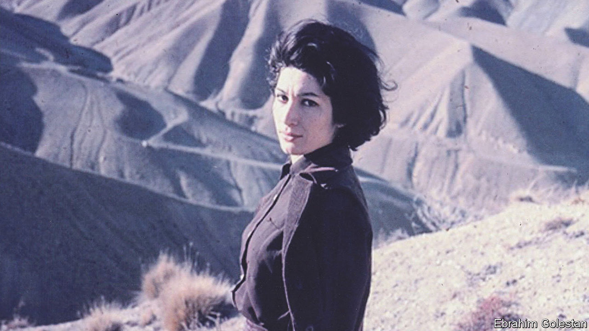

###### Home Entertainment

# Forough Farrokhzad gave voice to Iranian women’s despair and defiance 

##### “If you want these bonds broken,” the 20th-century poet wrote, “grasp the skirt of obstinacy” 

 

> Jul 6th 2023 

Women’s liberty is at the forefront of Iranian politics. In September  was arrested for not wearing her hijab correctly and died in police custody; for weeks people occupied the streets and chanted “women, life, freedom.” The Islamic Revolutionary Guard Corps, the regime’s praetorian guard, has  on the protests and arrested tens of thousands of people. Some police officers have continued to threaten women who do not cover their hair and have erected billboards stating that those forgoing the hijab are dishonouring their families. 

The struggle for female emancipation was powerfully articulated by Forough Farrokhzad, a 20th-century poet. She was born into a strict military family in Tehran in 1934; at the age of 16 she married a distant, much older relative and had a son. In 1954 the couple divorced and, in accordance with the law at that time, she lost custody of the child. Farrokhzad released her first collection of poetry, “Asir” (“The Captive”), the following year.

Her work offered provocative explorations of ; the verses are shot through with religious language. “Weary of divine asceticism,” she wrote, “in the middle of the night in Satan’s bed/I’d seek refuge in the slopes of a fresh sin.” Elsewhere sex and artistic inspiration are entwined: “You kindled my passionate desire/Thus setting my poems afire.”

Farrokhzad saw that the repression of women was having a stultifying effect. Poets such as Rumi had imagined Persia as a thriving garden, yet she saw her country as “dying” and “waiting for rain”. In her final and most widely read collection, “Tavalodi Digar” (“Another Birth”, 1964), a blistering poem attacked self-satisfied elites who “suckle on our past glory”.

She released only four collections of poetry during her short life: she died in 1967, aged 32, in a car accident. Her work was potent enough to cause consternation more than a decade later, during the Islamic revolution of 1979. Religious clerics banned the dissemination of her poetry and, when Farrokhzad’s publisher refused to stop, he was thrown in jail. 

Iranian artists have continued to evoke her verse when drawing attention to the oppression of women. For one photographic series called “Women of Allah” (1994),  wrote lines from the poems on her subjects. In 2002 “The Green Cold”, a documentary about Farrokhzad’s life by Nasser Saffarian, was screened to sold-out audiences for three weeks before it was banned. In 2009, during the presidential-election protests, women etched lines from her poetry on placards when they took to the streets.

Last year New Directions, an American publisher, released a fresh translation of her selected poems. (They are also available online.) Her work is still read widely in Iran as old editions are sold on the black market. Farrokhzad remains a symbol of defiance. “Only you, O Iranian woman, have remained/In bonds of wretchedness, misfortune, and cruelty;/If you want these bonds broken,/grasp the skirt of obstinacy,” she wrote. “Take action because a world/awaits and is in tune with you.” ■


