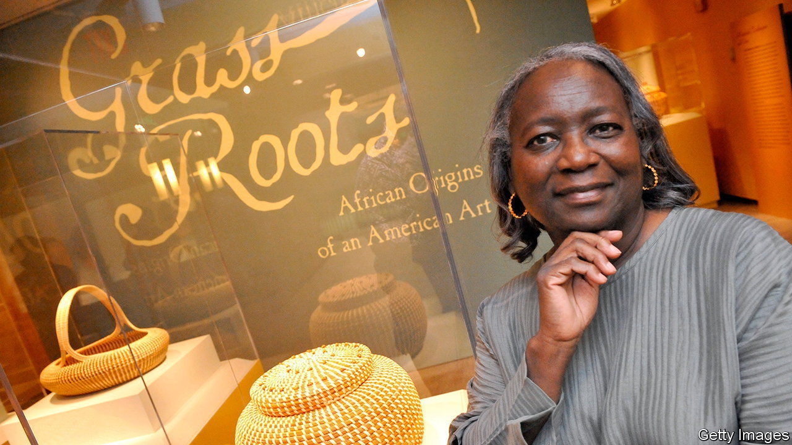

###### Weaving magic

# Mary Jackson has turned sweetgrass basketry into a fine-art form 

##### In the American artist’s hands, items once used for agriculture take on new dimensions 

 

> Jul 6th 2023 

“NEVER AGAIN” sits at the intriguing intersection of art and craft. The object is both a basket, woven from sweetgrass and palmetto, and an abstract sculpture. Much wider than it is tall, from a distance “Never Again” seems to be of one hue, but on closer inspection you can see that its brown, cream and green fibres converge into purposeful, swirling patterns of colour. Such details encourage the viewer to study the work slowly, the way you might scrutinise a particular patch of a  painting. 

The piece was made by Mary Jackson, an African-American fibre artist, in 2007. Dale Rosengarten, a historian and curator, describes Mrs Jackson as a “genius”. Such acclaim is not uncommon. In 2008 Mrs Jackson received one of the MacArthur Foundation’s prestigious grants, worth $500,000, to support the creation of work that both preserved “the centuries-old craft of sweetgrass basketry” and moved “the tradition in stunning new directions”. Two years later, in 2010, she was awarded a National Heritage Fellowship by the National Endowment for the Arts. 

A number of America’s most respected art institutions, including the Smithsonian American Art Museum and the Museum of Fine Arts in Boston, have acquired her pieces. Her work has also been bought by the White House,  and the Japanese royal family. Some of Mrs Jackson’s designs are works of elegant simplicity, even as she draws on a wide variety of influences for her craft.

Born in 1945, Mrs Jackson grew up in Mount Pleasant, South Carolina. She is Gullah, a member of an ethnic group which predominantly lives in the Sea Islands region along the coast of Florida, Georgia and South Carolina. This remoteness has allowed Gullah people to preserve the African roots of their distinct  and culture more than other African-American communities farther inland.

Coiled baskets were originally designed for rice cultivation. In South Carolina the history of agriculture is inextricably linked with slavery: many Gullah people’s enslaved ancestors brought their own farming traditions with them from west and central Africa, including the use of grass baskets for winnowing (tossing rice in the air to remove the husks). South Carolina’s rice trade outlasted slavery, but struggled to keep up with domestic competition; a series of hurricanes in the early 20th century crippled the industry’s infrastructure. 

No longer needed for farm work, the demand for sweetgrass baskets declined. Before the methods for making them were forgotten, however, a burgeoning tourist industry in the 1930s began funnelling travellers through Mount Pleasant on their way to holidays in Charleston. To profit from this, members of the Gullah community started selling decorative interpretations of their traditional baskets to holidaymakers. This new trade provided a source of income for rural black families in the segregated South. 

Mrs Jackson was introduced to traditional weaving techniques by her mother and grandmother at the age of four. As well as mastering the art, learning how to harvest, dry and manipulate the grasses was a way of keeping her and her siblings busy in the summer. As a youngster she regarded basketmaking as something of a chore.

In the 1960s, after finishing school, Mrs Jackson moved to New York to find work. There, she visited the city’s museums and discovered Minimalism,  and other influential contemporary-art movements. When she returned to South Carolina in 1972, she picked up basketmaking again, but with a new sensibility.

Her work pays homage to Gullah basketmaking, yet she has experimented with bold shapes and innovative dimensions. Early works, such as “Cobra with Handle”, were intricate, but still usable, baskets. Mid-career pieces, including “Two Lips”, reveal a subtle turn away from utility towards aestheticism. The piece’s handle connects to a cosmetic “lip” woven midway up the basket. It is a delicate work that is ill-suited to holding rice or produce. 

“I wanted to do something that was very different from what my ancestors made,” she says. Mrs Jackson has been able to create large baskets by using stronger plants than tradition dictates; her oversized pieces have integrated patterns of bulrush as well as palmetto leaves and pine straw. In a testament to her influence, many other modern artisans’ sweetgrass baskets now contain all four materials.

“Never Again” is perhaps the best representation of her work; Mrs Jackson says she named the piece to reflect her belief that she would not be able to create another object as striking. (It took her three years to complete.) All the same, she strives to push her discipline forward. “I don’t think I’ll continue to make these baskets like how I used to,” she says. Instead, approaching her 80s, she is “working on things I haven’t made before”. ■


