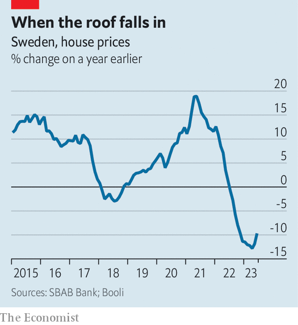

###### Europe’s worst performer

# Can Sweden’s two-track economy avoid a recession? 

##### Property is a big problem 

 

> Jul 6th 2023 

Restaurants and bars were teeming and hotels were fully booked in Stockholm in the week before  on June 24th, when Sweden celebrated the summer solstice. The Swedish capital did not give the impression of a country on the brink of a recession. The happy splashing out on wining and dining was doubtless related to the beautiful weather and catch-up consumption after the pandemic, but it is unlikely to last throughout the year. Many Swedish households are in dire financial straits thanks to an inflation-induced erosion of real wages not seen for 30 years. Forecasts are gloomy, with the European Commission predicting in May that Sweden would be the worst performer of all European economies in 2023, with a 0.5% contraction this year, though other forecasts are marginally less dire. 

 


Sweden’s economy runs on two tracks, says Danske Bank, a Copenhagen-based bank, which actually thinks the economy will grow slightly this year. Consumers and the housing market are dragging the economy down; but the business sector and the labour market are both proving more resilient. Retail sales fell by 11.6% in March compared with the same month last year, according to Statistics Sweden, owing to soaring inflation, which in May was at an annual rate of 9.7%. And as Sweden’s central bank has raised interest rates, borrowing costs have increased, which in turn has caused a fall in house prices (see chart) that is faster than almost anywhere else in Europe. In the last quarter of 2022 they fell more than 10% year-on-year, according to Nordic Credit Rating, a Stockholm-based agency. Nordea Bank reckons they will drop by 20% from peak to trough. 

The country’s biggest landlord, Samhällsbyggnadsbolaget i Norden (SBB), is on the brink of bankruptcy as it struggles to refinance its debt. Its bonds are rated as junk by S&amp;P and Fitch, two credit-rating agencies. Hedge funds are shorting the shares of several debt-laden Swedish real-estate groups, and SBB in particular. The firm recently replaced Ilija Batljan, its founder, as CEO and is considering all strategic options, including an outright sale.

The economy’s second track is in better shape, as the business sector and employment are both holding up. Boosted by the weak krona, Swedish exports have grown strongly since the pandemic, and companies continue to invest in machinery, equipment and research. Construction is stable in spite of the slump in the housing market, because of the government’s investment in infrastructure. The jobless rate at 7.9% is tolerable.

The worst finally seems to be over, with retail sales and consumer confidence indicating that consumption has bottomed out. House prices may stabilise. “But inflation is still very high and the krona is very weak,” says Michael Grahn of Danske Bank. That’s why Riksbank, the central bank, raised rates, for the seventh consecutive time, by 0.25% on June 29th to 3.75% and is expected to increase rates by another 0.25% in September. 

Mr Grahn and most of his peers predict that Sweden will muddle through and is not heading for a replay of the very painful recession in the early 1990s when another property bubble burst. Niklas Wykman, the financial-markets minister, recently told journalists that the state has the tools to stop a property-market plunge from dragging down the entire country. Sweden’s public finances are sound and its banks are, so far, stable and profitable. By the celebrations of in 2024 Sweden is likely to be in better shape, if only slightly. ■

