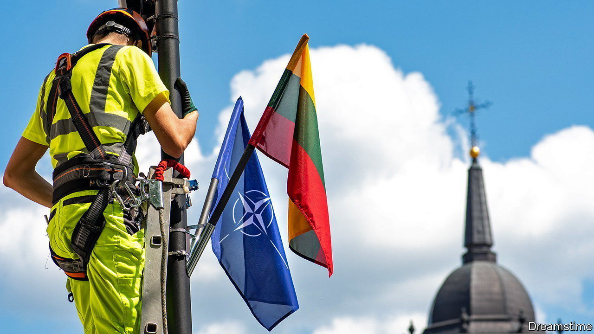
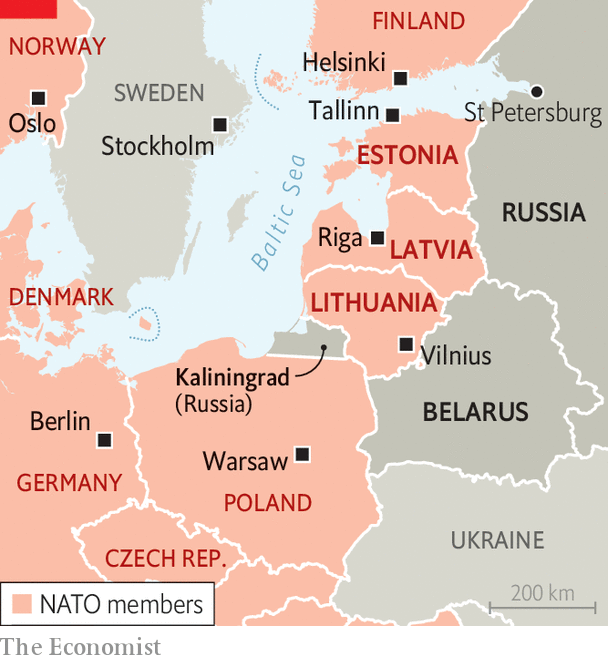

###### Europe’s defence

# The Baltic states fear that NATO is being complacent 

##### Estonia, Latvia and Lithuania see a threat from Russia that will not go away 

 

> Jul 6th 2023 


Vilnius, the newly sparkling but also quaintly baroque capital of Lithuania, sits in a hot spot. Less than an hour’s drive to the east sprawls the Russian satrapy of Belarus, home now not just to Russian tactical nuclear weapons but soon, perhaps, to a large, seasoned Russian mercenary army under restaurauteur-cum-rebel-warlord Yevgeny Prigozhin. Just 150km to the west, bristling with combat planes, missiles and warships, lies the Russian enclave of Kaliningrad. Closer than either, for older Lithuanians, linger memories of decades under Russian rule when their country, along with its two Baltic sisters, Estonia and Latvia, formed unwilling “republics” within the Soviet Union. Russia’s grinding war against nearby Ukraine, yet another former colony, brings those memories alive for younger people, too. 

But as Vilnius braces for a NATO summit on July 11th and 12th that will temporarily swell its population with thousands of soldiers, police, officials and journalists as well as 31 heads of state or government, it is not physical danger that makes locals nervous. The fear across the three Baltic states, perhaps the alliance’s most enthusiastic members, is that their bigger partners will fail to rise to the occasion. “We have proved that we can stay united in the face of a huge challenge, and we have been strong in support of Ukraine,” says Gabrielius Landsbergis, Lithuania’s foreign minister. “But now is the time to seal this politically, and really strengthen the alliance.” 

 


The anxiety is understandable. Historical experience, plus proximity to a belligerent Russian regime under Vladimir Putin, put the Baltics far ahead of the curve on Ukraine. Instead of waiting for Russia’s full-scale invasion to act, the Baltic trio took sharp note of looming dangers way back in 2014 when Mr Putin made his first grabs at Ukraine’s Crimea and Donbas regions. Lithuania and, later, Latvia reintroduced conscription. Lithuania doubled and then tripled defence spending. All three unhitched themselves from Russian energy supplies. They successfully lobbied for bigger allies to pre-position small numbers of troops and supplies on their territory. 

Yet their calls for stronger military deterrents, as well as for measures to protect European economies, were largely ignored in Berlin, Brussels and Paris. When Russian tanks rolled towards Kyiv in February 2022 there was little surprise in the Baltics, but rather a glum pride in being right. “We went from neurotics to experts overnight,” sighs Mihkel Tikk, who directs Estonia’s cyber-defence. Now that the rest of NATO has woken up to the danger, however, satisfaction in the Baltics is tempered by fear that bigger powers will waste the opportunity to put Russia back in its bottle not just temporarily, but for good. 

In the short term there is little doubt what people in the Baltic states most want: all three of their parliaments recently voted overwhelmingly for NATO to include Ukraine as a member. But those votes were symbolic. Although the alliance offered Ukraine a path to membership at a summit in Bucharest way back in 2008, even gung-ho Baltic officials admit it is hard to see how a country at war and under partial occupation can join NATO without instantly drawing its allies into direct combat with a nuclear-armed Russia. The best they expect from a summit declaration on this score is a more explicit commitment to Ukraine’s security, and a more specific promise of eventual membership. It would be nice to have dates and waypoints, says Lithuania’s Mr Landsbergis. 

Further disappointment may be in store if Turkey continues to block NATO membership for Sweden, and if other countries fail to agree that a commitment to spend 2% of their GDP on defence should become a baseline figure and not just a widely ignored target. Estonia is already spending close to 3%, but despite excellent training and high morale its forces remain tiny. A recent promise by Germany’s defence minister, Boris Pistorius, to turn a small, rotating German force stationed in Lithuania into a permanent 4,000-strong brigade, has been widely welcomed.

Privately, however, officers in the region express scepticism that such a deployment will happen soon, or even prove very effective. The massively destructive style of Russia’s Ukraine invasion suggests that small states on its periphery need not just defence, but deterrence. “A reinforcement strategy is helpful, but what we really need is a capacity to inflict strategic paralysis at depth,” says an Estonian field commander. “My capability is only at 50km range. It’s not enough—the Russians don’t care how many men they lose, it can be 3:1 and they will still win.” 

Baltic officials warn against complacency on the part of NATO. “The Russians can take a lot of punishment and just wait, like the Taliban,” says Marko Mihkelson, chair of the foreign-affairs committee in Estonia’s parliament. Don’t forget that Russia’s aim was not Ukraine, but to alter Europe’s security architecture, says a top Baltic diplomat. “They wanted to create a buffer between themselves and Europe, and that buffer would be us.” ■

