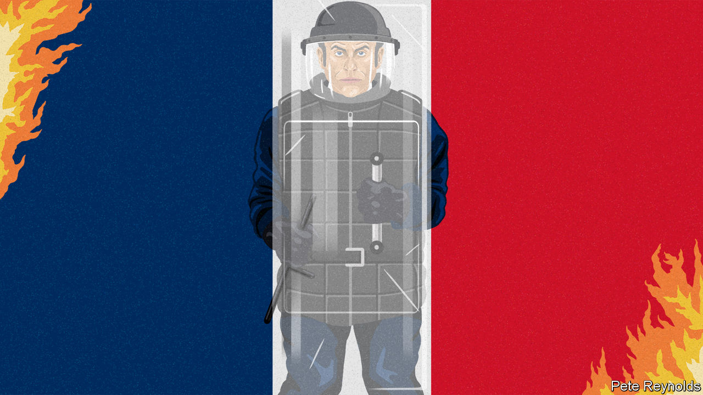

###### Charlemagne

# The burning of the banlieues 

##### France takes a hard look at itself after a week of violence 

 

> Jul 5th 2023 

In 1995 a raw monochrome drama gripped cinema-goers and shook France. Mathieu Kassovitz’s “La Haine” (Hatred), a stylised film about youth, masculinity, guns, friendship and police brutality, awakened the beautiful quarters of Paris to life in the angular high-rise  that ring its cities. More recently Ladj Ly’s “Les Misérables” calmly and forcefully exposed the anger and anguish among a younger generation of boys growing up in those peripheral estates. Successive French film-makers have put their finger on the rage that can at times set the  ablaze. It happened in 2005. Now it has happened again. Yet after all these years France still seems at a loss to understand why.

A single shot fired by a traffic policeman on June 27th pierced the chest of a teenager at the wheel of a car, and set off a week of . In some ways it is simpler to say what this eruption was not about. Two previous waves of rioting under , the French president, carried clear policy demands: one was a protest at an increase in the carbon tax on motor fuel (2018), the other at a rise in the  (2023). Anger was firmly focused on the president. Today’s rioting was neither aimed at Mr Macron, nor politically organised. 

The far left puts the violence down to wilful government neglect. France’s  concentrate poverty, ill-staffed schools and gang rule in remote city fringes: a grim realisation of life on society’s periphery. Yet billions of public money has gone into renovating high-rise estates. Metro lines and tramways have been extended to city outskirts, apprenticeships expanded, primary-class sizes halved. Nanterre, where the 17-year-old, Nahel, was shot, is on a direct underground line to central Paris. There, by the Pablo Picasso estate where he grew up, on a street lined with the grey charred carcasses of torched and overturned cars, lies a post office and a public library; over the road, a sports ground and leafy park. 

The far right blames the rioting on immigration and, said Marine Le Pen, a “problem of police authority”. The rioters, so a statement by two right-wing police unions claimed, were nothing less than “savage hordes”. No matter that Nahel was a French citizen, who grew up in France. Nor that less than one in ten of those arrested for violence or looting was foreign. Nor that their average age was 17. This was a French generation born after the riots of 2005, scarred by covid-19 lockdowns, and turbo-charged by TikTok and Snapchat. “The youngsters we are seeing are not praying to Allah, but to Nike,” wrote Hakim El Karoui, an analyst. 

What then was the rioting about? The people who live on the estates of Nanterre repeatedly bring up one complaint: not about jobs nor poverty, nor the mayor, nor Mr Macron, but the excessive use of force by the police, and the sense that residents are singled out for police checks. “Officers need to be trained so that, when there are police checks, they don’t put the life of an under-aged boy in danger,” said Souleymane. “I’m convinced that the police stop us because of how we look,” added Khadija. Hamid was blunter: “The police are racist.”

France does not like to think it has a policing problem, even as complaints about the disproportionate use of rubber bullets, tear gas and stun grenades pile up. Mercifully, there are far fewer fatal police shootings in France relative to its population than in America. The public prosecutor swiftly charged the policeman who shot Nahel with voluntary homicide. Yet police killings are still more common than in Britain or Germany. In 2022 there were 13 fatal shootings by traffic police, a record. Repression and hostility reinforce each other. The linked question of racial profiling is hard to demonstrate, as France bans ethnic statistics. But an official survey in 2017 suggested that four in five young men “perceived as Arab or black” had been stopped by the police in the previous five years; for the general population the share was below one in five.

In France, born of revolution, the blazing urban fire carries a symbolic echo. In 1871 the Communards burned down the palaces of Paris. , or female arsonists, became notorious. But there is something about the weapon of choice for today’s rioters—the torching of cars and public buildings—that is more of an unstructured howl of defiance, a self-destructive show of power against the forces of law and order. Self-destructive, because the victims were the owners of cars, users of buses and pupils of schools that were torched, who live in those neighbourhoods. Even drug-dealers noted that it was bad for business.

So far not so good

Mr Macron knows that further rioting cannot be prevented only by further repression. He is treading a fine line between expressions of empathy (the shooting of Nahel, he said, was “unforgivable”) and of firmness (the violence, he added, was “unjustifiable”). Paradoxically, the president had just spent three days in Marseille, trying to improve life in rough neighbourhoods. Part of his original pitch for the presidency in 2017 was a promise that where you lived should not determine your life chances. A revival of this spirit, as well as a long hard look at policing, are urgently needed.

In the short run, the tragedy and drama of the past week have weakened Mr Macron, just at a moment when he had begun to recover from months of debilitating pension protests. Abroad, it forced him to cancel a state visit to Germany; a previous state visit, by King Charles III to France, was also cancelled due to (pension) riots. At home, Mr Macron’s centrist minority government is already squeezed between extremes on the left and the right. 

In the long run, the rioting is likely to polarise French politics even further. Above all, four years before a presidential election at which Mr Macron constitutionally cannot stand, it will reinforce Ms Le Pen. As the president tries to pick himself up once again, it is this prospect, as well as a credible response to the rioting, that ought to focus minds. As the famous opening narration of “La Haine” put it: “How you fall does not matter; it’s how you land.” ■


