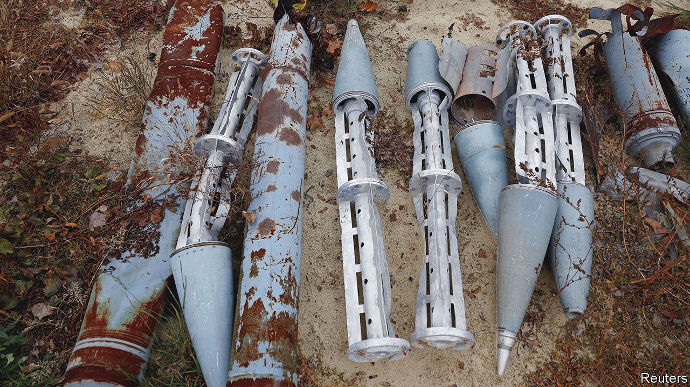
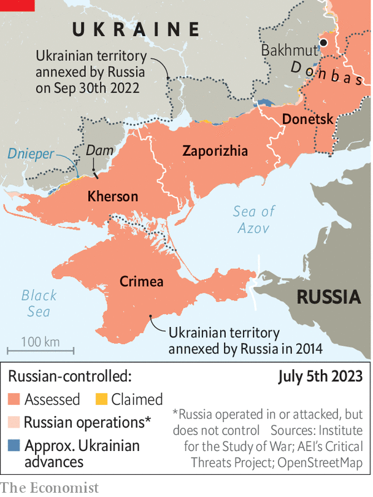

###### Bomblets away

# Ukraine wants American cluster bombs—quickly 

##### They would help the counter-offensive. They are also controversial 

 

> Jul 4th 2023 


AMERICA AND its allies have constantly debated whether to send Ukraine the next big thing: first artillery, then tanks and after that jets. Each taboo has crumbled in turn. But as Ukraine’s counter-offensive approaches its second month, with progress still slow, a few weapons remain on its wish-list. One is the 150km-range Ground Launched Small Diameter Bomb (GLSDB), which America has pledged but not yet dispatched. The second is the 300km-range ATACMS missile, which America remains wary of supplying. The third may be the most important: the humble . 

 are “area effect” weapons which release a larger number of smaller bomblets. They were developed in the second world war to hit multiple targets dispersed over a wide area, particularly infantry and soft-skinned vehicles. The development of shaped charges, which channel explosive energy in a particular direction, allowed later cluster munitions to destroy armour, too. Ukraine has asked America to supply dual-purpose improved conventional munitions (DPICM), a class of cluster munition that could be fired from  or from the rocket launchers that Ukraine has been receiving for around a year.

 


America itself has not used cluster bombs in action since the first weeks of the Iraq war in 2003. But even those countries that disavow their use recognise that they can be potent weapons. In an article for the published in 2019, a British brigadier noted that American DPICMs had “saved the day time and again” by breaking up big enemy formations during  exercises. “They were, and are, a game-changer.” 

Ben Hodges, a former commander of the US Army in Europe, says that cluster munitions could suppress Russian fire from trenches and , giving Ukraine more time to clear a path through minefields, which are proving to be a serious problem. There are other advantages, too. The area effect means that cluster bombs can be fired more quickly than ordinary high-explosive rounds, since the attacker needs less precise intelligence on the target, allowing the gun to scoot away faster. The supply of DPICMs would also ease pressure on ordinary artillery shells, which are in short supply, and on the overworked barrels that fire them. “I cannot see how momentum can be maintained without them,” says a Western official. 

There is a catch. The Convention on Cluster Munitions, finalised in 2008, bans the use, transfer, production and stockpiling of the weapons. Neither America, Ukraine nor Russia is a signatory to the convention, but 25 out of the 31 NATO allies are. America has not thus far provided DPICMs, says the Pentagon’s Laura Cooper, for two reasons: “existing congressional restrictions…and concerns about allied unity”. Germany is blocking Estonia’s proposed transfer of old German cluster munitions.

The convention itself reflects humanitarian concerns. Bomblets, by design, disperse over a wide area, with unexploded ones posing a risk to civilians long after a war is over. Israel’s use of the weapons in 2006 may have contaminated 13 square miles of Lebanese territory, including a huge amount of arable land. Bomblets can also pose a problem for friendly forces: they killed 22 American personnel in Iraq in 1991, during the first Gulf war, slowing an advance on Kuwait airport. “There are much better options than saturating your country with de facto landmines,” argues Marc Garlasco, a military adviser at PAX, a Dutch peace-promoting NGO. “These will kill and maim your soldiers and civilians for decades.” They are “heinous weapons”, agrees Mary Wareham of Human Rights Watch (HRW), another NGO.

Ukrainians retort that they are the ones best placed to judge the trade-off between firepower today and civilian harm on their territory tomorrow. They insist that they would carefully map where the munitions are used, abstain from firing them in urban areas and commit to a post-war  programme. In any case, any taboo over using cluster bombs has already been broken: both Ukraine and Russia have already fired Soviet-era ones at scale, according to data collected by HRW, and Ukraine is also firing some supplied by Turkey. As of April, over 174,000 square kilometres of territory was contaminated with explosive objects. 

Proponents also insist that the weapons are not as hazardous as they once were. Around 2.5% to 5% of the bomblets in America’s older DPICMs fail to explode, remaining a potential danger to civilians for years to come, says an American artillery expert. Officials claim the dud rate for newer ones is around 1.2%, though live-fire testing has cast doubt on that figure. The equivalent rate for the Soviet-type cluster munitions already scattered over Ukraine is probably an order of magnitude higher, says the expert, worsened by poor maintenance. “You’d be shocked at the level of corrosion and disrepair,” says the expert. Whatever America decides—it is thought to be leaning towards a delivery—Ukraine will be dealing with unexploded ordnance for decades to come. ■


