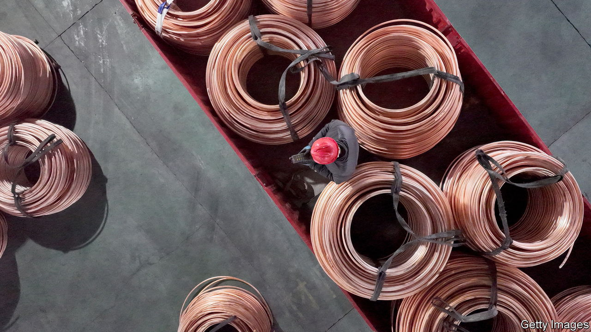
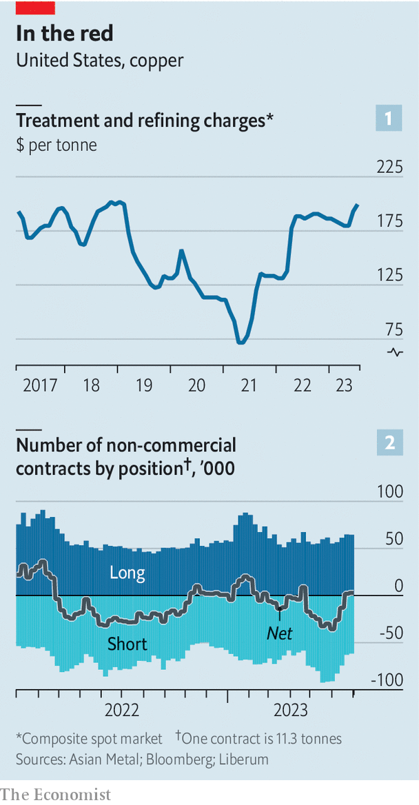

###### Coming a cropper

# Copper is unexpectedly getting cheaper 

##### Why another boom in the key green-transition metal may not happen 

 

> Jul 6th 2023 

IN LATE JUNE Robert Friedland, the bombastic boss of Ivanhoe, a Canadian miner, warned that the world was running the risk of a “train wreck”, when a crunch in copper supply would derail the energy transition. The metal is used in everything from wiring to wind turbines—and green mandates in America, Asia and Europe will soon demand many more of these. The price of copper, Mr Friedland suggested, could jump ten-fold in response. 

Right now, however, the train is not so much derailed as chugging along happily. Having peaked at $10,700 a tonne in March last year, copper prices at the London Metal Exchange have dropped by around 10% since January, to $8,300 a tonne. Spot prices remain on par with or higher than those for delivery in three months, suggesting that investors do not expect them to bounce back soon. What is going on?

Because of its range of uses, which include construction, electronics and weaponry, copper prices indicate the health of the global economy, earning the metal the nickname “Dr Copper”. Worries about the economy may therefore be making investors gloomy about copper’s prospects. The post-covid rebound in China, which consumes as much as 55% of global supply, is already fading. Growth is also flagging in the West as rising interest rates bite. 

Yet the lack-of-demand story does not fully explain the price fall. Despite the country’s construction slump, China is using 5% more copper this year than last, possibly because the metal—used to form cladding, pipes and roofs—tends to track building completions, which have held up, rather than housing starts. A 7% jump in the making of cooling units in anticipation of a hot summer also supports demand. 

 


If copper markets are decidedly cool, then, it is also because supply has risen. Over the winter a series of disruptions—from protests in Peru to floods in Indonesia—dented global production. Now these problems are easing. As a result, smelters are feeling confident enough to charge miners higher fees, indicating no shortage of raw materials (see chart 1).

At the same time, financial investors are snubbing copper. As interest rates rise, they prefer to hold cash-generating assets rather than commodities, which yield nothing. For much of this year “non-commercial” net positioning on copper-futures markets has been in the red, implying that more investors are betting prices will fall than recover (see chart 2). Yet today’s prices remain $2,500 a tonne above production costs at the marginal mine, notes Robert Edwards of CRU, a consultancy. This implies that the recent correction has taken froth out of the market, rather than pushed prices too low, suggesting they could stay subdued for a while.

As the energy transition speeds up, it should give a jolt to demand. Sales of electric vehicles (evs), which are already rising, are expected to ramp up significantly in the coming years, and each unit contains three to four times more copper than its petrol-powered peer. Even in a scenario where the transition happens slowly, the International Energy Agency (IEA), an official forecaster, estimates that copper demand from green uses, propelled by the ev boom and undersea cabling for wind farms, will nearly double by 2040. 

Supply may struggle to keep up. The average age of the world’s ten biggest mines is 64, which is forcing miners to dig deep for ores of ever lower quality, making each new tonne of refined copper costlier to produce. New mines are scarce. Assuming all certain and probable projects go ahead, McKinsey, a consultancy, forecasts that supply will hit 30m tonnes by 2031, 7m tonnes short of estimated demand. 

A severe crunch like that envisioned by Mr Friedland could still be avoided. Most forecasting models, including the IEA’s, expect copper demand outside clean-energy uses to remain stable. Tom Price and Ben Davis of Liberum Capital, an investment bank, reckon this is unlikely, because China’s long building boom has probably ended. Pricey copper will also prompt substitution: some evs already use aluminium wiring. And McKinsey points out that new tech—if it achieves its potential—could close much of the supply gap this decade. There is time to avoid a train wreck. ■


