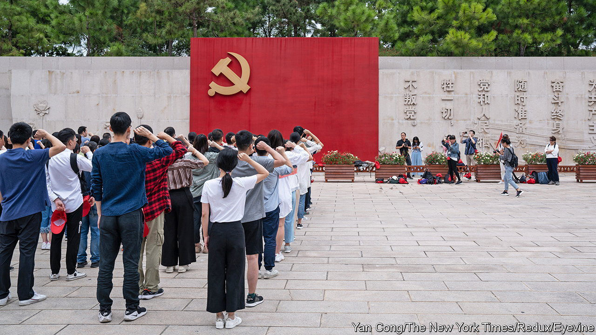
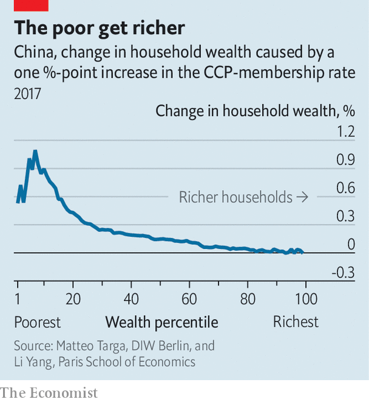

###### Party cooler

# Does it pay to be a communist in China? 

##### A hard-headed assessment of party membership 

 

> Jul 6th 2023 

China’s communists see themselves as a “vanguard party”, full of dedicated social warriors. Less than 9% of the country’s adult population are members, according to figures released on June 30th. Gaining entry can take years. Even Xi Jinping, the party’s boss, was not admitted until his tenth attempt. Aspiring members are often made to attend ideology classes, take written tests, submit “thought reports”, demonstrate their worthiness through community service and survive an interview by a panel of members. Is it worth the bother?

The answer might seem obvious. “Virtually every influential position in China is held by a party member,” as Bruce Dickson of George Washington University has noted. Leaks like the Panama papers have revealed the offshore riches accumulated by the families of party leaders. And Chinese social media will occasionally erupt over indiscreet displays of wealth or privilege by members, like the boss of a PetroChina subsidiary, spotted strolling through a Chengdu shopping district in June holding hands with a fashionable younger employee who was not his wife. Yet changes in the party and the economy may be eroding the material benefits of membership.

Party members can be found at every rung of the economic ladder. Of the poorest tenth of Chinese households, about 14% contain a party member, according to the China Household Finance Survey by Southwestern University of Finance and Economics. A third of members are farmers and workers (down from two-thirds in 1994). Since becoming head of the party in 2012, Mr Xi has urged cadres to adhere to a less hedonistic lifestyle. “Incorruptibility is a blessing and greed is a curse,” he advised in a recent speech. 

In work published in 2019, Plamen Nikolov of Binghamton University and co-authors calculate a 20% wage premium for members over similar workers. One reason, according to other research, may be that card-carrying communists are more likely to get jobs in state-owned enterprises (soes) and official institutions. Figures released in May show urban soes last year paid 89% more than private firms in cities. This gap has grown during Mr Xi’s reign. 

But as any well-trained communist knows, true economic clout derives not from labour but capital. So how does party membership affect the assets people own, such as their stocks, bonds and property?

 


Recent research by Matteo Targa of diw Berlin and Li Yang of the Paris School of Economics reaches a surprising conclusion. The two economists look at the urban wealth distribution, as documented by the China Household Finance Survey. In each wealth bracket, some fraction of households include party members. If the fraction were to increase by one percentage point, what would happen to that bracket’s wealth? Messrs Targa and Li calculate that at the lower rungs of the wealth distribution, party membership makes a substantial difference. At the tenth percentile, for example, a one-percentage-point increase in party-membership rates would increase wealth by almost 0.9% (see chart). But the higher up you go, the weaker the financial rewards seemingly offered by membership. For households at the 93rd percentile and beyond, party membership makes no discernible difference at all.

One reason for this divergence is property. Among the middle and upper echelons of Chinese society, almost everybody now owns a flat, whether they are a member of the party or not. And so everyone in these wealth brackets has benefited from the long real-estate boom that ended in 2021. Home ownership is, unsurprisingly, patchier among people on the lower rungs of the ladder. For these households, party membership may be a decisive factor governing whether or not they own a flat. 

In the five years since the household-finance survey was carried out, home-ownership rates in China have risen further. House prices have also recently fallen in cities, narrowing the gap between the propertied classes and everyone else. Both of these trends probably mean that becoming a communist confers less of a material benefit than it did five years ago, let alone 20 years back. Thanks to these economic forces, Mr Xi may get the more ascetic cadres for which he has been looking. His purges and rectification campaigns have abolished some of the perks of party membership. His mishandling of China’s property market may have helped, too. ■


