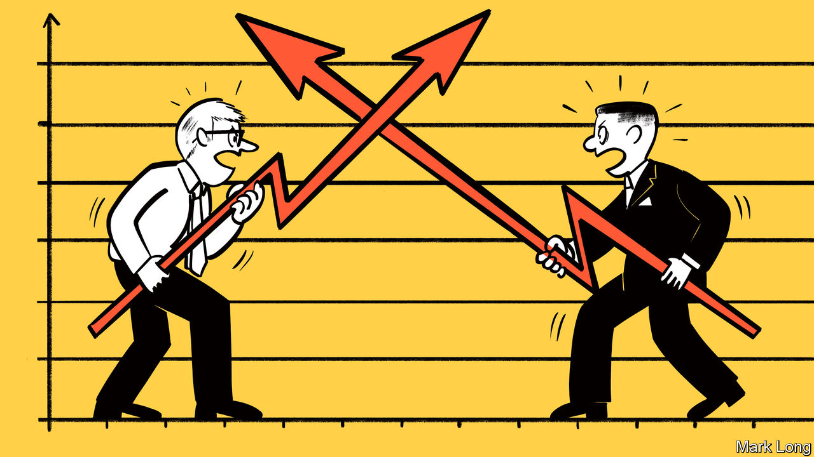
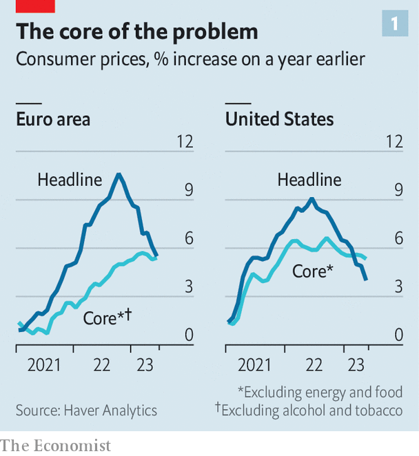
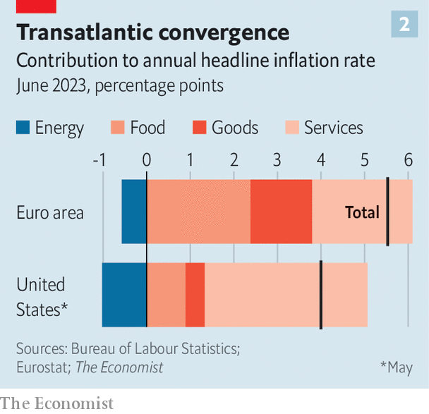

###### Price wars

# Economists draw swords over how to fix inflation 

##### A dispatch from the intellectual battlefield 

 

> Jul 5th 2023 

For as long as inflation has been high economists have fought about where it came from and what must be done to bring it down. Since central bankers have raised interest rates and headline inflation is falling, this debate may seem increasingly academic. In fact, it is increasingly important. Inflation is falling mostly because energy prices are down, a trend that will not last for ever. Underlying or “core” inflation is more stubborn (see chart 1). History suggests that even a small amount of sticky underlying inflation is hard to dislodge. 

 


So the chiefs of the world’s most important central banks are now warning that their job is far from done. “Getting inflation back down to 2% has a long way to go,” said Jerome Powell, chairman of the Federal Reserve, on June 29th. “We cannot waver, and we cannot declare victory,” Christine Lagarde, president of the European Central Bank, told a meeting of policymakers in Portugal just two days earlier. Andrew Bailey, governor of the Bank of England, recently said that interest rates will probably stay higher than markets expect. 

This means that there will be no let-up in the economists’ wars. The first front is partly ideological, and concerns who should shoulder the blame for rising prices. An unconventional but popular theory suggests greedy firms are at fault. This idea first emerged in America in mid-2021, when profit margins for non-financial companies were unusually strong and inflation was taking off. It is now gaining a second wind, propelled by the IMF, which recently found that rising profits “account for almost half the increase” in euro-zone inflation over the past two years. Ms Lagarde appears to be entertaining the thesis, too, telling the European Parliament that “certain sectors” had “taken advantage” of the economic turmoil, and that “it’s important that competition authorities could actually look at those behaviours.”

Greedflation is a comforting idea for left-leaning types who feel that blame for inflation is too often pinned on workers. Yet it would be strange to think firms suddenly became greedier, making prices accelerate. Inflation is caused by demand exceeding supply—something that offers plentiful profit opportunities. The greedflation thesis thus “muddles inflation’s symptoms with its cause”, according to Neil Shearing of Capital Economics, a consultancy. Wages have tended to play catch-up with prices, not vice versa, because, as the IMF’s economists note, “wages are slower than prices to react to shocks”. That is a crucial lesson from today’s inflationary episode for those who always view economic stimulus as being pro-worker.

The second front in the inflation wars concerns geography. America’s inflation was at first more home-grown than the euro zone’s. Uncle Sam spent 26% of GDP on fiscal stimulus during covid-19, compared with 8-15% in Europe’s big economies. And Europe faced a worse energy shock than America after Russia invaded Ukraine, both because of its dependence on Russian natural gas and the greater share of income that is spent on energy. A recent paper by Pierre-Olivier Gourinchas, chief economist at the IMF, and colleagues attributes just 6% of the euro zone’s underlying inflation surge to economic overheating, compared with 80% of America’s. 

This implies that Europe can get away with looser policy. The 3% of GDP of extra fiscal stimulus the euro zone has recently unleashed by subsidising energy bills, the authors find, has not contributed to overheating, and by reducing measured energy prices may even have stopped an inflationary mindset from taking hold. (The authors caution that things might have been different had energy prices not fallen, reducing the subsidy.) Interest rates are lower in Europe, too. Financial markets expect them to peak at around 4% in the euro zone, compared with 5.5% in America. 

 


Despite all this, inflation problems on each side of the Atlantic actually seem to be becoming more alike over time. In both places, inflation is increasingly driven by the price of local services, rather than food and energy (see chart 2). The pattern suggests that price rises in both places are being driven by strong domestic spending. Calculated on a comparable basis, core inflation is higher in the euro zone. So is wage growth. According to trackers produced by Goldman Sachs, a bank, wages are growing at an annualised pace of 4-4.5% in America, and nearly 5.5% in the euro area.

Hence the importance of a final front: the labour market. Even if profit margins fall, central banks cannot hit their 2% inflation targets on a sustained basis without the demand for and supply of workers coming into better balance. Last year economists debated whether in America this required a higher unemployment rate. Chris Waller of the Fed said no: it was plausible job vacancies, which had been unusually high, could fall instead. Olivier Blanchard, Alex Domash and Lawrence Summers were more pessimistic. In past economic cycles, they pointed out, vacancies fell only as unemployment rose. Since then Mr Waller’s vision has in part materialised. Vacancies have fallen enough that, according to Goldman, the rebalancing of the labour market is three-quarters complete. Unemployment remains remarkably low, at 3.7%.

Yet the process seems to have stalled of late (fresh data were due to be released as we published this article). Mr Blanchard and Ben Bernanke, a former Fed chairman, recently estimated that, given the most recent relationship between vacancies and joblessness, getting inflation to the Fed’s target would require the unemployment rate to exceed 4.3% for “a period of time”. Luca Gagliardone and Mark Gertler, two economists, reckon that unemployment might rise to 5.5% in 2024, resulting in inflation dropping to 3% in a year and then falling towards 2% “at a very slow pace”. 

Rises in unemployment of such a size are not enormous, but in the past have typically been associated with recessions. Meanwhile, in the euro zone, vacancies have not been particularly elevated relative to unemployment, making the route to a painless disinflation even more difficult to foresee. It is this front of the inflation wars which is most finely poised—and where the stakes are highest. ■


