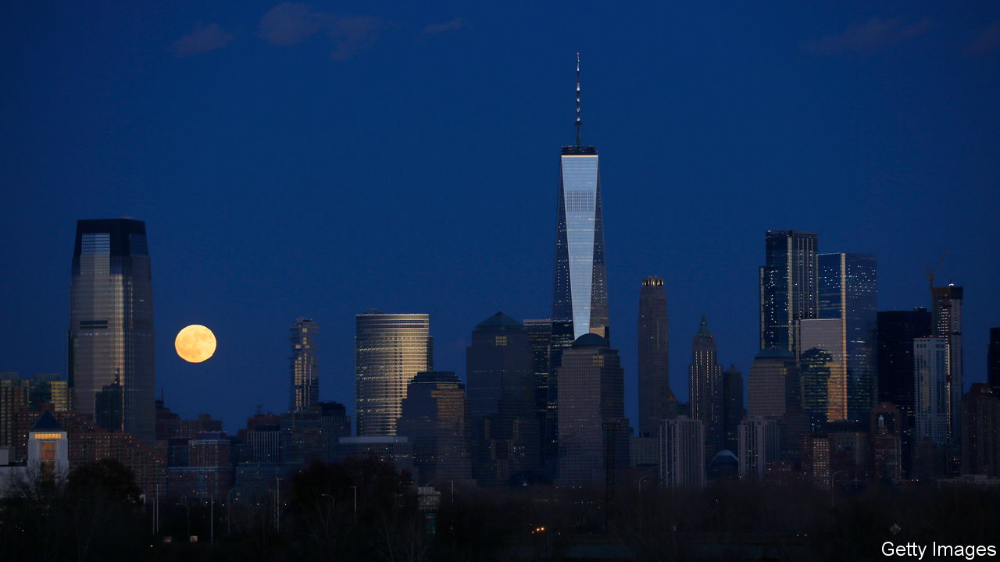
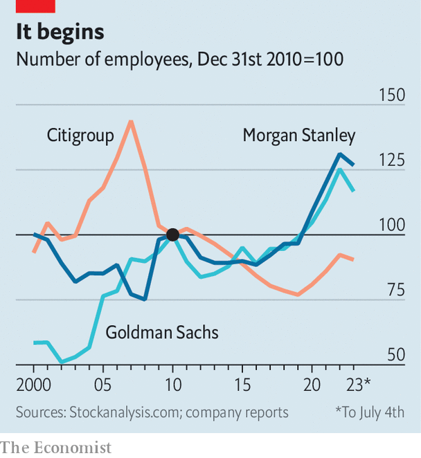

###### The city sleeps

# How far will Wall Street job losses go? 

##### History suggests firing seasons take time to build momentum 

 

> Jul 6th 2023 

It is easy now to point to phenomena that were features of the zero-interest-rate age. Ape jpegs selling for millions of dollars; algorithms pricing and buying homes; 20-something tech workers making “day in the life” TikToks that consisted entirely of them making snacks. Record-breaking profits at investment banks appear to be another relic of the golden age. Workers hired to meet roaring demand have been left twiddling their thumbs. Now they are being shown the door. 

Ahead of releasing their second-quarter earnings, institutions on Wall Street are trimming staff. Goldman Sachs culled 3,200 in the first quarter; on May 30th reports suggested the bank was letting go of another 250—this time mostly from among senior ranks. Morgan Stanley fired 3,000 or so in the second quarter. Bank of America has cut 4,000 and Citigroup 5,000. Lay-offs are also plaguing less glamorous bits of finance. Accenture and kpmg have both swung the axe. 

 


This matters not only for the poor souls handed their belongings in a cardboard box, but for the city of New York. Just as tech lay-offs have hurt San Francisco, so finance lay-offs will hurt the Big Apple. According to Enrico Moretti, an economist at the University of California, Berkeley, each of the “knowledge jobs” that make cities like New York and San Francisco successful in turn supports another five service roles—some high-paying (like lawyers), others less so (like baristas). Even if there are not additional firings, Wall Street’s retrenchment will take a toll. According to New York’s state comptroller, the average bonus pool shrank by one-fifth in the last financial year, the biggest drop since the global financial crisis of 2007-09.

Although banks did not balloon quite as much as tech firms during the covid-19 pandemic, when online activity surged and working patterns seemed ready to change for good, the axe is cutting almost as deep in places. Meta’s workforce nearly doubled in size between 2019 and 2022; the firm has since let go about half of new additions. Goldman’s workforce expanded by just over one-quarter between the end of 2019 and the end of 2022, from around 38,000 to just over 48,000. By laying off some 3,450 people the firm has unwound one-third of this increase. 

Other banks have been a little slower to scale back. At Morgan Stanley, where employment also leapt by one-third over the same period, just one-eighth of the increase has been unwound. It is a similar story at Citigroup. There have yet to be major lay-offs at JPMorgan Chase, the king of Wall Street. Altogether, job losses might slow New York’s economy a tad—perhaps the market for TriBeCa lofts will cool—but they will hardly prove a fatal blow to a city of its size and vitality. 

Yet perhaps there is further for the story to run. Tech-industry lay-offs got going in earnest in 2022, when almost 165,000 jobs were lost. They are now coming thick and fast. Since the start of the year, more than 210,000 jobs have been cut. History suggests that firing seasons build momentum. It took years for banks to downsize in the wake of the global financial crisis. Just as with the tech companies, lay-offs would need to be several times bigger to return financial firms to their pre-pandemic sizes. Although banks are trimming the fat, they do not yet look lean. ■


