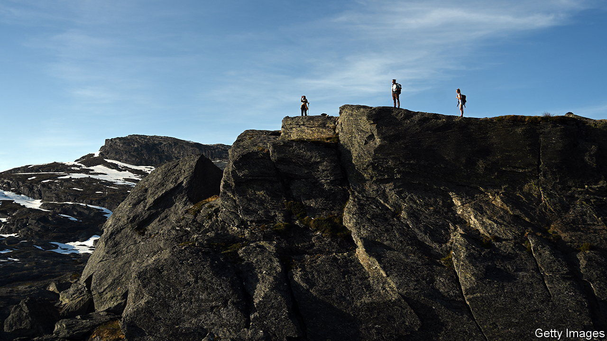
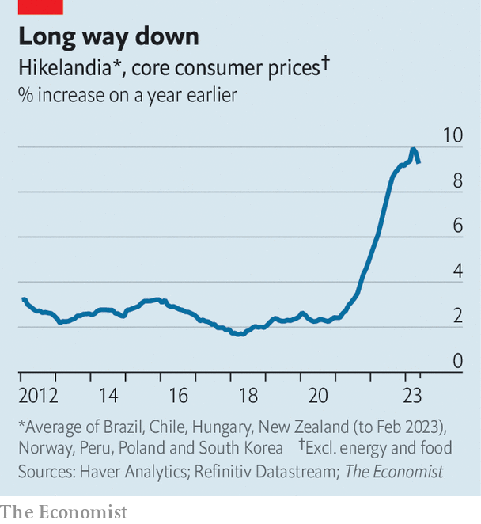

###### A belated victory

# How to win the battle against inflation 

##### Lessons from Hikelandia, home to the world’s most dogged central bankers 

 

> Jul 6th 2023 

Over the past year we have examined the economic fortunes of Hikelandia. In this group of eight countries—Brazil, Chile, Hungary, New Zealand, Norway, Peru, Poland and South Korea—central banks have fought inflation with unparalleled aggression. Hikelandia started raising interest rates a whole year before America’s Federal Reserve, putting it well ahead of the curve. Since then its average policy rate has risen by more than seven percentage points, compared with around five for the Fed. Yet for months Hikelandia’s central bankers had little joy: inflation kept rising.

Now, at long last, that is changing. Although Hikelandia’s “core” inflation, a measure that strips out volatile prices such as for food and energy, is still too high, at around 9% year on year, it is on the way down, in part because higher rates are starting to bite (see chart). Hikelandia’s experience offers a glimmer of hope for other inflation-fighting central banks.

 


Wage inflation is moderating across the land. In Chile, for example, pay growth is down a little from the outrageously high 11% year-on-year rate reached in January. This, in turn, is helping cut measures of inflationary pressure. In October South Korea’s inflation rate in the labour-intensive service sector was 4.2% year on year; it has since fallen to 3.3%. Poland’s has slipped from 13.4% in December to 12.3%.

Inflation expectations are also dropping, influenced by falling energy and food prices. The average Brazilian expects inflation of 4% over the next year, down from 6% for much of 2022. Kiwis reckon inflation in five years’ time will be around 1%, half their forecast in December.

Norway is the only member of Hikelandia that seems to be making no progress. In May core prices unexpectedly rose by 6.7% year on year, a new high. A weaker krone is raising the cost of imports. Strong domestic demand is playing a role, too. In June the central bank surprised markets in an attempt to cool things down, raising the policy rate by 0.5 percentage points.

Outside Oslo, the mood music in Hikelandia’s central banks has changed. Officials are still talking tough, of course. South Korea’s rate-setters insist that they will maintain hawkish policy for a “considerable time”. Brazil’s monetary-policy committee worries about “a larger or more persistent de-anchoring of long-term inflation expectations”. Yet this hides the fact that Hikelandia’s central banks have largely stopped raising rates. Chile’s bank believes inflationary risks “have been balancing out”. Hungary’s rate-setters expect that “disinflation will continue to accelerate”.

Success has come at a cost, though. In 2021 the world economy and Hikelandia grew at the same speed. Now, global growth is 2.5% at an annualised rate, and Hikelandia is stagnating. The unemployment rate has risen by close to a percentage point from a recent low in Chile, and is inching up in Brazil and New Zealand. At least for a while, Hikelandia’s policymakers will probably see a slower economy as a price worth paying. Inflation will have to fall an awfully long way before we start calling these countries “Cutlandia”. ■


