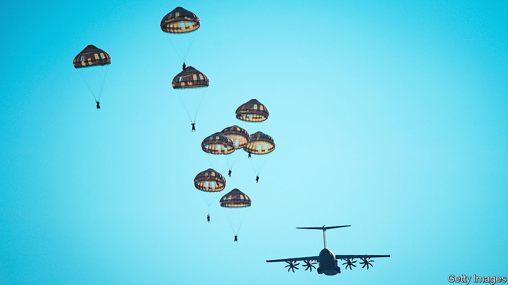
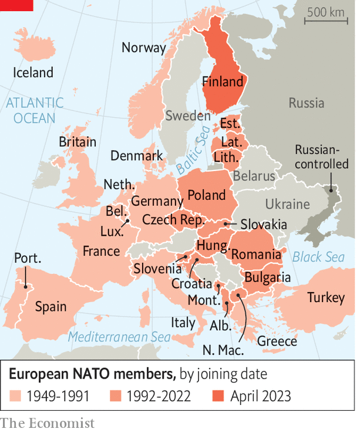
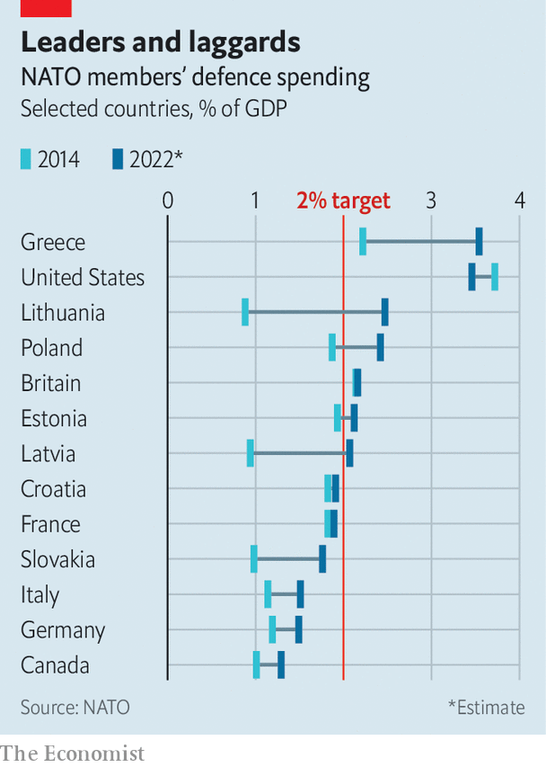

###### Shaping up and tooling up

# NATO is drafting new plans to defend Europe 

##### They look set to be approved at a crucial summit this month 

 

> Jul 2nd 2023 


WHEN THE boxer Mike Tyson was asked ahead of a fight whether he was concerned about an opponent’s plan, he was blunt: “Everybody has a plan ‘til they get punched in the mouth.” With NATO it has been the other way around. For 42 years the alliance prepared for conventional and nuclear war with the Soviet Union and its allies. In 1991 the Warsaw Pact fell apart and the plans fell into abeyance. Now Russia’s invasion of Ukraine highlights the need for new strategies. 

On July 11th and 12th leaders will gather in Vilnius, the capital of Lithuania, for NATO’s annual summit. They are expected to approve the alliance’s first comprehensive defence plans since the cold war. “It’s the most dramatic change…since the fall of the Berlin Wall,” says Matthew Van Wagenen, an American general in the Supreme Headquarters Allied Powers Europe (SHAPE). The question is whether the allies can live up to their ambition.

There is much to discuss in Vilnius. Jens Stoltenberg, the secretary-general of NATO, has just had his  for another year (the allies could not agree on a candidate to replace him). Ukraine wants an invitation to  after the war; in the meantime it expects detailed and substantial guarantees of long-term aid. A sticking-point will be Turkey’s continued veto of Sweden’s . Another will be the alliance’s relationship with Asia. The allies agree that China is having an ever-larger impact on European security—not least through its —but a row over whether to open a NATO office in Tokyo reveals splits over how to respond. 

Despite all this, it is the planned overhaul of NATO’s military machinery that is the most consequential item on the agenda. The architect of the defence reforms is Chris Cavoli, an American general who serves as Supreme Allied Commander Europe (SACEUR). His job was first held by Dwight Eisenhower—whose globe still sits in General Cavoli’s office in the Belgian city of Mons. General Cavoli, a Russian speaker educated at Princeton and Yale, is widely considered to be one of the most impressive officers of his generation. His plans run to 4,000 (classified) pages.

The centrepiece is a trio of regional plans: one for the north, covering the Atlantic and ; one for the centre, which addresses the Baltic and central Europe down to the Alps; and a southern plan for the Mediterranean and Black Sea. There are sub-plans for space, cyber operations and special forces. Russia, unsurprisingly, is the focus, but not exclusively so: the southern plan, on Turkey’s insistence, splits its attention evenly between the threat from Russia and from terrorist groups. 

The first and most important purpose of the documents is deterrence. “The key for NATO war plans has always been that Moscow knows there are NATO war plans,” says Tim Sayle, a historian of the alliance at the University of Toronto.

That said, the plans also provide clear guidance for every armed force in Europe and North America about how to act should conflict erupt. “As a young sub-lieutenant, I knew precisely where my artillery battery was going to go—which town,” says General Darryl Williams, commander of the US Army in Europe, reflecting on his deployment to West Germany in 1983. “We look forward to a time here, very quickly, where we’ll be able to get that kind of clarity again.” Later this year, General Cavoli will allocate specific countries to specific roles or parts of the front. Battalions and brigades can get to know their patch in advance, whether that is a Norwegian island or a stretch of the Carpathians. 

Mission accepted

Knowing one’s task is not the same as being able to carry it out, of course. Another hope is that the plans will prompt reform and increase accountability. During the cold war SHAPE had a large staff that could continually test how ready national forces were for combat. This team dwindled but is growing once more: “SACEUR has now got a big stick to beat nations with,” says a European official. At last year’s NATO summit in Madrid the allies agreed they would collectively keep over 100,000 troops ready to deploy in less than ten days, and another 200,000 on a month’s readiness—a far larger number of high-readiness troops than before. Just as important is that allies will now “declare” to General Cavoli which units are available at any time. 

In recent weeks America, Germany and Britain have all practised how they could quickly scale up their battalion-sized deployments in Poland, Lithuania and Estonia into brigade-sized formations. Italy will probably soon run a similar test in Bulgaria. The aim of this is to assure the Baltic states, and to demonstrate to Russia, that these armies are agile enough to reinforce NATO’s eastern front more quickly than Russia can mobilise for an attack. This month Germany, whose armed forces have been in poor shape over the past decade, . It promised that it would eventually station a whole brigade on Lithuanian soil—an unprecedented commitment. NATO exercises are also becoming more demanding: they are “more or less rehearsals”, says one official. The largest in decades, Steadfast Jupiter, should take place later this year. 

NATO’s new plans will not only keep armies on their toes, but also set priorities for procurement and investment. Collective defence of the continent requires heavy weaponry: jets, tanks and artillery. But for years following the attacks on September 11th, 2001 the allies were fighting guerrilla wars in Afghanistan and Iraq that demanded somewhat different kinds of kit: mine-resistant vehicles, transport helicopters and light infantry. NATO did not impose any discipline on what its members purchased: “We have had no requirements on the nations that have really been enforced over the last 30 years,” says General Van Wagenen. The aim is now to bring demand and supply into line again through a mechanism known as the “force structure requirement”—essentially, General Cavoli’s list of what is needed if his military strategy is to work as it is intended to do. 

A NATO bigwig points to five immediate priorities: combat-capable ground forces, particularly heavy armoured brigades; integrated air- and missile-defence systems capable of protecting units on the move; long-range firepower such as artillery and rocket launchers; digital networks that allow data to move around the battlefield and back to headquarters quickly and securely; and logistics to shunt large armies across Europe while keeping them adequately supplied. 

This list largely reflects needs that have been identified while observing the war in Ukraine: old-fashioned artillery has inflicted the majority of casualties; manoeuvring without armour has proven extremely costly. The problem is that the majority of European armies fare woefully on most of these measures (notwithstanding pockets of excellence, such as Finland’s artillery-rich army of conscripts). 

A paper published by the International Institute for Strategic Studies (IISS), a think-tank in London, concludes that the number of combat battalions in some of NATO’s largest armies barely changed between 2015 and 2023, despite the growing threat from Russia. France and Germany have each added one battalion’s worth of forces, a piddling amount, and even Poland has added only two. Britain has lost five over that period. “Most…nations now can only field one full-strength brigade,” laments a senior NATO general—a number that would dismay any cold-war general transplanted to the present. The same is true of naval forces. Commodore Carsten Fjord-Larsen of the Danish navy laments that in 2002 his navy fielded 34 combat units. The figure is now down to five. 

Ammunition holdings are a serious problem. Britain “has probably not got a sufficient stockpile for a heavy armoured brigade to fight an intense war”, says Ben Barry, a retired brigadier now at the IISS and a co-author of the report. In private, British generals agree. Ukraine’s offensive compounds the problem: every ten days that country is chewing through as many shells as America produces in a month. Countries are having to choose between keeping Ukraine solvent and maintaining their own reserves. 

The right kit

There are also other holes. NATO has around ten corps headquarters but most are lacking in artillery, air-defence and helicopter brigades to support the divisions under their command, says Mr Barry. “The corps commander hasn’t got any troops he can use to shape the .” 

Such calculations highlight Europe’s dependency on America. The Pentagon puts others to shame by positioning 22 battalion-equivalents in Europe, mostly under V Corps in Poland. That is up from six in 2015; it is roughly the same number that Britain has in total. Will it last? “The inconvenient truth for Europe is that what’s currently in V Corps reflects a lot of reinforcement that took place last year,” says Mr Barry. “But the overall direction of travel of US deployments is away from Europe towards the Indo-Pacific.” If a crisis were to , Europe could find itself rather worryingly exposed.

And yet the new plans also draw America and Europe closer in important ways. “Not many people really get this,” says the NATO bigwig, “but America is coming back into the NATO planning system in a big way.” For the past 20 years, he says, the United States European Command (EUCOM) in Stuttgart in Germany—America’s military command for the continent—largely kept to itself, scribbling defence plans at a time when European armed forces were doing little detailed planning of their own. NATO’s new plans are aligned with American thinking. In many ways they are products of it (General Cavoli is commander of both EUCOM and NATO). That suggests America is plugging back in—despite political jitters over the possible re-election of Donald Trump next year. 

Broader reforms being carried out on NATO’s command structure exemplify similar dynamics. SHAPE’s very headquarters is being transformed, says General Van Wagenen: the second floor has been “gutted” to put in a new operations centre. A new land command to handle NATO operations north of the Alps could have been hosted by Poland or Germany, both of which were interested in the job; instead the US Army is taking on that task itself. The new command will be in General Williams’ headquarters in Wiesbaden. Paradoxically, given fears of American abandonment, some Europeans fret that American generals are taking over. “Yes,” retorts the bigwig, “they’re taking the lead because they intend to fight here: that’s quite good news if you’re European.” 

Of maps and machinery

The new reforms are profoundly shaped by the way the alliance’s membership has changed over the past 30 years. In 1989, before the fall of the Berlin Wall, NATO’s border with the Warsaw Pact was essentially the inner-German border—1,380km in length, almost all of it heavily militarised—plus a small area in northern Norway. By 2004, when the Baltic states joined NATO, its border with Russia was only 800km long. But when Finland joined on April 4th this year, that more than doubled at a stroke (see map). General Cavoli’s canvas stretches from the freezing cold of the Arctic to the baking heat of Anatolia.

 


In 1989 “everybody had fixed positions”, says General Van Wagenen. Armies were larger, on both sides, and troops were packed densely along the front lines. Now smaller armies are stretched across a far larger front. “You have to have more agile forces,” says the general. “A new alert system aims to sharpen NATO’s intelligence machinery, so that elements of its new plans can be activated swiftly in response to early signs of trouble, such as Russian troop movements. 

Finland’s accession brings new opportunities, too. Its highly professional and well-equipped army, which can mobilise huge numbers of conscripts quickly, is likely to drive up standards in the alliance, says one official. Its membership “tidies up that Nordic and Baltic geography very nicely,” says another, with Russia’s route out of the Gulf of Finland and into the Baltic Sea increasingly constrained by NATO states (more so if Sweden joins, too). “It poses far more challenges to Russia than to NATO,” adds the official. In March American reconnaissance aircraft began flying over Finland, something that would have been outlandish 18 months ago. 

 


If NATO has an ambitious agenda, the biggest question is how to afford it. “We are champions in announcing things,” says a German NATO commander, “not in implementing.” At a summit in Wales in 2014, following Russia’s first invasion of Ukraine, allies promised to “move towards” the NATO target of spending 2% of GDP by 2024. Only three allies met the target then. Now seven do (see chart). Germany will get there next year, France in 2025. But most lag far behind. In Vilnius the allies are expected to set a new defence-investment pledge. The 2% target may become a floor, rather than a target. Eastern allies—such as Poland, which may spend a whopping 4% of its GDP on defence this year, and Estonia, which says it will get to 3%—are keen on this. But raising the target would only highlight the chasm that already exists between hopes and reality.

Ben Wallace, Britain’s defence secretary, says that some countries “really don’t want to do 2%”—Canada is the largest example—and that others will peak at 2% without being able to sustain it. “There is some backsliding going on,” he warns. “In real terms we [Europe] invest less in defence now than we did in 2021,” complains Kusti Salm, the top civil servant in Estonia’s defence ministry. NATO’s new plans will give national army chiefs and defence ministers more leverage with finance ministers: failure to meet the spending target will no longer be just a source of embarrassment at each annual summit, liable to provoke a gentle dressing-down from Mr Stoltenberg, but may also leave a tangible hole in the continent’s war plans. “It changes the entire discussion around defence spending,” says Mr Sayle, “or at least it did in the cold war.” 

One catch is that Russia’s invasion of Ukraine, while catalysing reforms, has also cast doubt on whether the threat it poses to NATO members is as great as was previously thought. Russia’s armed forces have proved less capable than most experts and officials had expected. Its army has had perhaps 60,000 men killed, including many of the most professional men and officers. Huge amounts of equipment have been destroyed, including over 1,300 tanks. Some European generals reckon this takes the pressure off: they think it will take Russia a decade to reconstitute.

The bear and its wounds

General Cavoli frequently rebuts this idea. In April he told America’s Congress that the Russian army, though “degenerated somewhat”, was larger than at the outset of war. Russia’s air force was largely intact, he said, with over 1,000 fighters and bombers, as was the navy. Russia’s submarine force remains a particular concern. This is not simply an American view. Russia is developing “frightening underwater capabilities”, warns a German naval officer, pointing to threats to undersea infrastructure such as pipelines and cables. “They are way ahead of NATO in this.” An Estonian field commander notes that, at every level of command, “Russian officers are gaining experience we don’t have.” 

NATO’s own assessments suggest that Russia could rebuild its forces in as little as three to seven years. That is less time than it will take to recapitalise and re-equip Europe’s hollowed-out armed forces; to rebuild defence industries capable of meeting wartime demand for shells and weapons; and to revive cold-war military skills such as river crossings and division-level command. Eastern allies are not inclined to assume that Russia will dally. And Ukraine’s future is far from assured; its counter-offensive has so far proceeded more slowly than planned. “This month in 2023”, says Mr Salm, “is the most decisive moment for our generation.” ■


