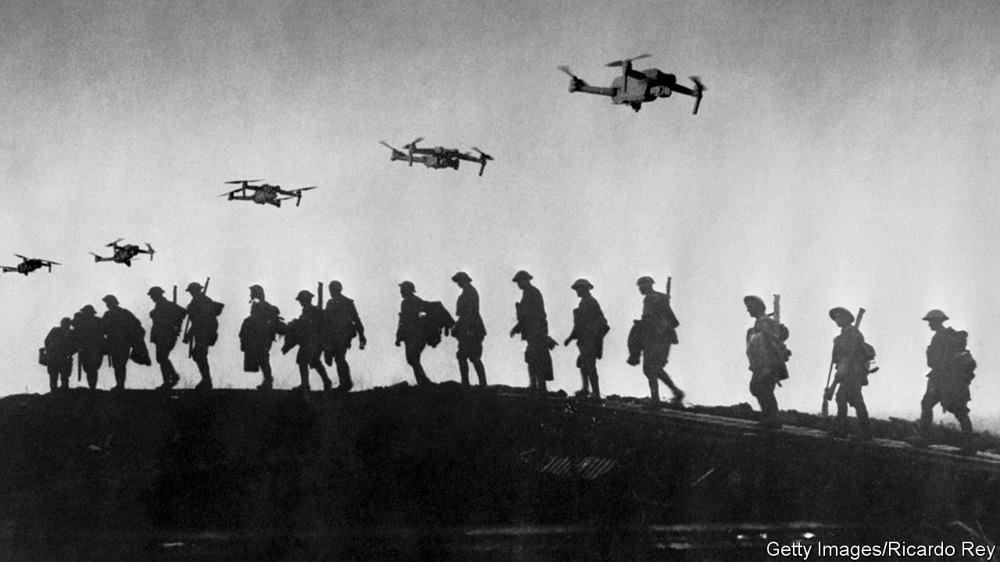

###### The future of war

# A new era of high-tech war has begun 

##### Technology has transformed the battlefield. Democracies must respond accordingly 

 

> Jul 6th 2023 


Big wars are tragedies for the people and countries that fight them. They also transform how the world prepares for conflict, with momentous consequences for global security. Britain, France and Germany sent observers to the American civil war to study battles like Gettysburg. The tank duels of the Yom Kippur war in 1973 accelerated the shift of America’s army from the force that lost in Vietnam to the one that thumped Iraq in 1991. That campaign, in turn, led China’s leaders to rebuild the People’s Liberation Army into the  it is today.

The war in Ukraine is the largest in Europe since 1945. It will shape the understanding of combat for decades to come. It has shattered any illusions that modern conflict might be limited to counterinsurgency campaigns or evolve towards low-casualty struggles in cyberspace. Instead it points to a new kind of high-intensity war that combines cutting-edge tech with industrial-scale killing and munitions consumption, even as it draws in civilians, allies and private firms. You can be sure that autocratic regimes are studying how to get an edge in any coming conflict. Rather than recoiling from the death and destruction, liberal societies must recognise that wars between industrialised economies are an all-too-real prospect—and start to prepare. 

As our  explains, Ukraine’s killing fields hold three big lessons. The first is that the battlefield is becoming transparent. Forget binoculars or maps; think of all-seeing sensors on satellites and fleets of drones. Cheap and ubiquitous, they yield data for processing by ever-improving algorithms that can pick out needles from haystacks: the mobile signal of a Russian general, say, or the outline of a camouflaged tank. This information can then be relayed by satellites to the lowliest soldier at the front, or used to aim artillery and rockets with unprecedented precision and range.

This quality of hyper-transparency means that future wars will hinge on reconnaissance. The priorities will be to detect the enemy first, before they spot you; to blind their sensors, whether drones or satellites; and to disrupt their means of sending data across the battlefield, whether through cyber-attacks, electronic warfare or old-fashioned explosives. Troops will have to develop new ways of fighting, relying on mobility, dispersal, concealment and deception. Big armies that fail to invest in new technologies or to develop new doctrines will be overwhelmed by smaller ones that do.

Even in the age of artificial intelligence, the second lesson is that war may still involve an immense physical mass of hundreds of thousands of humans, and millions of machines and munitions. Casualties in Ukraine have been severe: the ability to see targets and hit them precisely sends the body-count soaring. To adapt, troops have shifted mountains of mud to dig trenches worthy of Verdun or Passchendaele. The consumption of munitions and equipment is staggering: Russia has fired 10m shells in a year. Ukraine loses 10,000 drones per month. It is asking its allies for old-school cluster munitions to help its .

Eventually, technology may change how this requirement for physical “mass” is met and maintained. On June 30th General Mark Milley, America’s most senior soldier, predicted that a third of advanced armed forces would be robotic in 10-15 years’ time: think of pilotless air forces and crewless tanks. Yet armies need to be able to fight in this decade as well as the next one. That means replenishing stockpiles to prepare for high attrition rates, creating the industrial capacity to manufacture hardware at far greater scale and ensuring that armies have reserves of manpower. A  on July 11th and 12th will be a test of whether Western countries can continue to reinvigorate their alliance to these ends.


The third lesson—one that also applied for much of the 20th century—is that the boundary of a big war is wide and indistinct. The West’s conflicts in Afghanistan and Iraq were fought by small professional armies and imposed a light burden on civilians at home (but often lots of misery on local people). In Ukraine civilians have been sucked into the war as victims—over 9,000 have died—but also participants: a provincial grandmother can help guide artillery fire through a smartphone app. And beyond the old defence-industrial complex, a new cohort of private firms has proved crucial. Ukraine’s battlefield software is hosted on big tech’s cloud servers abroad; Finnish firms provide targeting data and American ones satellite comms. A network of allies, with different levels of commitment, has helped supply Ukraine and enforce sanctions and an embargo on Russian trade.

New boundaries create fresh problems. The growing participation of civilians raises legal and ethical questions. Private companies located outside the physical conflict zone may be subject to virtual or armed attack. As new firms become involved, governments need to ensure that no company is a single point of failure. 

No two wars are the same. A fight between India and China may take place on the rooftop of the world. A Sino-American clash over Taiwan would feature more air and naval power, long-range missiles and disruptions to trade. The mutual threat of nuclear use has probably acted to limit escalation in Ukraine: nato has not directly engaged a nuclear-armed enemy and Russia’s threats have been bluster so far. But in a fight over Taiwan, America and China would be tempted to attack each other in space, which could lead to nuclear escalation, especially if early-warning and command-and-control satellites were disabled. 

Silicon Valley and the Somme

For liberal societies the temptation is to step back from the horrors of Ukraine, and from the vast cost and effort of modernising their armed forces. Yet they cannot assume that such a conflict, between large industrialised economies, will be a one-off event. An autocratic and unstable Russia may pose a threat to the West for decades to come. China’s rising military clout is a destabilising factor in Asia, and a global resurgence of autocracy could make conflicts more likely. Armies that do not learn the lessons of the new kind of industrial war on display in Ukraine risk losing to those that do. ■


