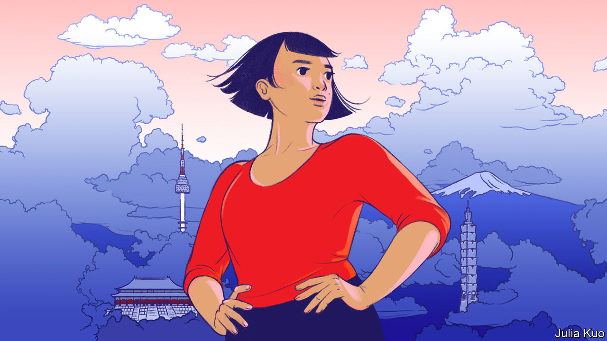

###### East Asia’s lopsided revolution

# The new Asian family 

##### East Asian governments must try to manage a momentous social change they cannot prevent 

 

> Jul 6th 2023 

The concept of “Asian values”, once  by leaders across the region, went out of vogue after the Asian financial crisis of 1997. The idea that East and South-East Asia’s disciplined governments had a unique economic edge over the decadent West suddenly seemed less compelling. Today in prosperous East Asia a different facet of those ballyhooed values is looking even more parlous. In China, Japan, South Korea and Taiwan, Asians’ supposed commitment to conservative family life is collapsing. As we report in our Asia and China sections this week, millions of young people are opting for looser, often lonelier and——less male-dominated arrangements. In a region that is home to over a fifth of humanity, the socioeconomic and demographic consequences will be vast, potentially destabilising and will shape millions of lives. 

In Japan, where the shift first became evident, married couples with at least one child accounted for 42% of households in 1980, and single people 20%. That has flipped. In 2020 couples with children accounted for 25% of households, and singletons 38%. And the decline is continuing. Last year 17% of Japanese men and 15% of women aged 18-34 said they would not marry, up from 2% and 4% in the early 1980s, and China recorded its lowest-ever number of marriages, half as many as a decade ago. 

In some ways young Chinese, Japanese, Taiwanese and South Koreans are following a path charted in . Between 1960 and 2010 Europe’s marriage rate fell by half, for many of the reasons that are now driving down East Asian rates. To many people, marriage seems increasingly anachronistic and unaffordable. Across East Asia it is still widely understood in Confucian terms, as the union of a dominant man and submissive woman. In South Korea a married woman is referred to as , or “home person”, and her husband as , or “man outside”. 

High property prices are an added disincentive to setting up a marital home. Alternative domestic arrangements are becoming more accepted; besides singledom, they include intergenerational flat-sharing and, less often, cohabiting and gay partnerships. And growing numbers of middle-class women are putting off marriage to concentrate on their careers. 

Traditional values are hard on women at work, too. East Asia has some of the world’s best-educated women, yet its overall record on female empowerment is poor and in some ways worsening. On the World Economic Forum’s gender-equality ranking of 153 countries, China—where women are said to “hold up half the sky”—slipped from 63rd in 2006 to 102nd in 2022. South Korea has the widest gender pay gap in the OECD.

If most of this sounds familiar, two things make East Asia’s great social change distinct and hugely troublesome. First, the taboo against having children outside marriage remains as rigid as ever. Across the OECD, 40% of births are outside wedlock. In Japan, South Korea and Taiwan less than 5% are. (The figure in China is unavailable, revealingly, but not thought to be higher.)

The result is a plummeting fertility rate. South Korea’s, at 0.78, is the lowest recorded anywhere and Taiwan’s only slightly higher. Japan’s and China’s are just above half the replacement rate. China’s cruel one-child policy, now replaced by panicked officials with calls to have three, exacerbated its demographic squeeze. But as the regional picture shows, it would have happened anyway. The total population of the four East Asian countries is predicted to shrink by 28% between 2020 and 2075.

The second problem is that the region’s governments are making the situation worse. None seriously broaches the only policy guaranteed to revive East Asia’s flagging demography: mass immigration. Their main response is to try to resuscitate marriage with economic perks—including tax breaks and subsidised weddings—with little success. South Korea’s president, Yoon Suk-yeol, admits that his country has, in essence, squandered 280trn won ($215bn) on such policies. Worse, he and his counterparts in China and Japan are doubling down on the conservative approach that their citizens increasingly object to.

South Korea’s previous administration sought to extend benefits to single parents and unmarried couples. Mr Yoon, who blames the low fertility rate on feminism, has put a stop to that. Under Xi Jinping, China promises its citizens a Confucian revival and arrests gay-rights activists. Japan’s ever-ruling Liberal Democratic Party is also against reforming marriage, including by refusing to make it available to gay couples, although most voters want to see that change.

There are pockets of progress, notably in Taiwan, which recently took a more liberal course. It has legalised same-sex marriage and in May permitted gay couples to adopt children—though it is too soon to know whether these changes will show up in the statistics. But the region as a whole is stuck between modernity and tradition, suffering some of the worst effects of both. East Asians are free to disdain traditional family roles, but not to redefine them. That is why millions resort to childlessness and solitude.

Governments should try to complete this lopsided revolution. Even if social change is not entirely within their grasp, and does not happen overnight, they can at least stop resisting it. To make family life more attractive, they need to deal with its gender imbalances as well as its costs by, for example, making paternity leave routine. They should look beyond heterosexual marriage, as their citizens have, and extend legal recognition to cohabiting, gay and other non-traditional arrangements—and afford them the support married couples now enjoy, especially over child-rearing. It is self-defeating and outrageous that China prevents single women from freezing their eggs, or that Japan makes it nearly impossible for gay couples to foster children.

Let them not wed

Such policies would not fix the region’s demography. But they would have a more positive effect on it than the current ones. More important, they would leave millions freer to lead the lives they choose, especially women and gay people. East Asian governments have overseen the greatest-ever economic boom. Now they must attend to their citizens’ happiness and liberty. ■


