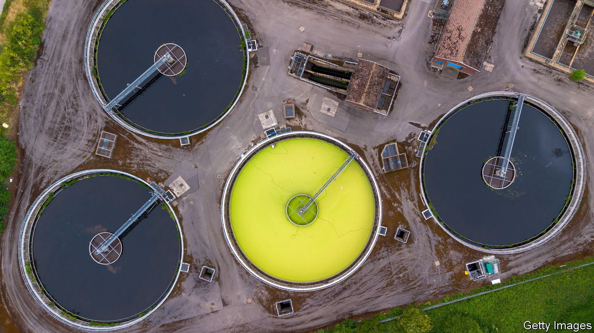

###### Britain’s water mess

# The real problem with Britain’s water companies 

##### Blame financial blunders and timid regulation, not privatisation 

 

> Jul 5th 2023 

The privatisation of  in England and Wales, more than 30 years ago, now looks like a rip-off. Private-equity firms have loaded some water companies with debt. That helped juice their returns but left them financially fragile. While many water bosses made out like bandits, raw sewage was being dumped in rivers and on beaches. The companies, notably Thames Water, are now seen as the unacceptable face of Britain’s utility privatisations. Critics, backed by voters on the left and right, are calling for .

This may be effective demagoguery, but it is wrong. In the aftermath of the water mess, consumers will end up paying more—not because of unscrupulous water-company bosses, but because of , the industry’s feeble, ill-advised regulator. 

Two separate problems with privatised water are often mixed up. One is the fragility of some firms; the other is a lack of spending on infrastructure. The first is being talked about because Thames Water, the largest water company, is in trouble. It has £16bn ($20bn) of debt and, as much of that is linked to inflation, faces a growing interest bill. Shareholders have coughed up only £500m of the £1.5bn it needs to turn the business around. The firm’s boss resigned on June 27th, and the government is preparing a contingency plan to take it into temporary ownership. 

Thames Water is not alone. Private-equity investors have saddled much of the industry with debt. Last month Yorkshire Water said it had raised £500m from its owners. That came after Ofwat warned that its borrowings were greater than its assets (counting derivatives and pension obligations). At least publicly traded water companies all have lower debt levels. 

It is true that dividends of £65.9bn were extracted from companies in the years between privatisation in 1989 and 2022. However, the fallout from this financial engineering lands not on current bill payers, but on the companies’ bondholders. If any water companies fail, that need not affect the public, because shareholders and bondholders should pay the price. Financial ring-fencing, enforced by Ofwat, and the special administrative regime, a form of bankruptcy, should keep the water flowing. Government help may be needed, but the costs can be clawed back from bondholders through debt write-downs. 

Water firms have failed before, without any calamity. Hyder, a utilities group, went bust in 2000. It had owned Welsh Water, which later left bankruptcy and now operates as a not-for-profit. And after Wessex Water’s parent company, Enron, went bankrupt in 2001, the subsidiary found a new owner and continued operating. On neither occasion did the government intervene. 

The second, separate, problem is the lack of investment in infrastructure. Climate change and a growing population mean that the south-east of England urgently needs more reservoirs. Across the country, water companies should be spending more to fix leaks and fit more households with water meters. They also need to upgrade their facilities to stop sewage getting into rivers.

The blame for the lack of investment does not lie with profiteering bosses, however, but with Ofwat. In five-yearly reviews negotiated with the companies, it sets limits on price increases for consumers and on total permitted expenditure, including on investment. As local monopolies, the companies have the power to pass on the approved costs of any investment to their customers. But, anxious to keep customers’ bills down, Ofwat has limited the rate of investment. The consequences are washing up on Britain’s sewage-strewn beaches.

In deep water

Now it is time to spend more. The costs will fall on consumers: one way or another, if Britons want cleaner water they will have to pay for it. Private investors will demand a higher return on any funds they put in, especially if the water companies’ scope to borrow is limited. 

But talk of nationalisation is a distraction—and a poor use of scarce public funds. Whether water companies are owned by the state or remain in private hands, a fierce watchdog will be needed to keep the industry in line. Indeed, elected politicians would probably be even more reluctant than arms-length regulators to spend taxpayers’ money or raise bills to pay for necessary investment. Those regulators will, at least, now have the cautionary tale of Ofwat’s failings to guide them. ■

