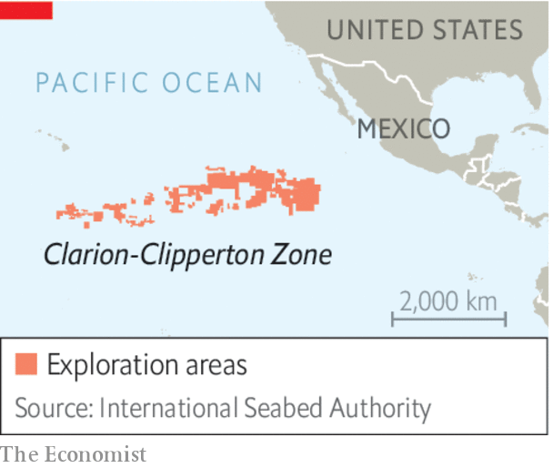

###### Deep-sea mining

# The world needs more battery metals. Time to mine the seabed 

##### Getting nickel from the deep causes much less damage than getting it on land 

 

> Jul 6th 2023 

Burning fuel to move humans and goods by road produced about 6bn tonnes of carbon dioxide in 2021, 16% of global energy-related emissions. If countries are to curb the increase in the world’s temperature, they must stop these emissions. That means building battery-powered vehicles which run on electricity rather than internal combustion. And that in turn means  on an unprecedented scale.

Take , which is used in the part of a battery that stores energy. The International Energy Agency reckons 80m tonnes of it must be mined between now and 2040 if the world is to hit its climate targets. That is more nickel than has ever been mined, and approaches the 100m tonnes of global unmined reserves measured by the United States Geological Survey.

 


It is a truism among resource economists that new demand creates new reserves, as price signals spur exploration and innovation. But that takes time, and the need is urgent. Happily, there exists a vast untapped source of the metal. A stretch of seabed in the Pacific Ocean, called the Clarion-Clipperton Zone (CCZ), some 4,000 metres deep, holds a staggering 340m tonnes of nickel. The trouble is that the rules covering seabed mining, which the International Seabed Authority (ISA), an arm of the un, has been working on for 29 years, have been held back by a weak bureaucracy and the questionable concerns of conservationists. On July 9th a deadline for finalising them is likely to be missed. The isa must publish the rules as soon as possible, so that mining can begin. 

Nickel sits on the seabed in potato-sized lumps called nodules, bound up with cobalt, copper and manganese, which are also present in quantities more than sufficient to meet the needs of the green-energy transition. The nodules were created over millions of years as metal particles drifted down and clumped together on the sea floor. They can be vacuumed up using bus-sized robots, then pumped to a ship on the surface. 

Conservationists say this process poses grave environmental risks. Carbon will be kicked out of the seabed and make its way into the atmosphere, they argue, generating more warming; life-choking sediment plumes will be created by the collection system and hitherto untouched CCZ ecosystems will be destroyed, disrupting food webs and damaging fisheries.

But on closer examination many of these arguments are spurious. When it comes to nickel, mining the CCZ is greener and cleaner than mining on dry land. Research shows that the amount of carbon stored in the ccz is negligible, meaning that mining will not stir up enough of it into the atmosphere to add to warming. Nor, according to research from the Massachusetts Institute of Technology, will the sediment churned up spread as far or as thickly as claimed.

The most serious concern is the threat to diverse organisms that are unknown to science. But life in the CCZ is scarce—some 270,000 tonnes of biomass would be destroyed by mining—and mostly microbial. And because the CCZ is the oceanic food web’s final stop, there would be few spillovers to other ecosystems. Compare that with the situation in , the country that dominates nickel supply and holds a fifth of all reserves. If all those reserves were mined, at least 10m tonnes of living organisms would be destroyed (as in the CCZ, mostly species unknown to science). The associated emissions would also be ten times higher.

Several ISA members have called for a “precautionary pause”, claiming that too little is known about the impacts of CCZ mining. This logic is backwards. Too much is known about the vital need for nickel, and the environmental destruction that is wrought by obtaining it on land, for anything other than cautious but expedited action to be a sensible path. Battery technologies that use less nickel—or even none at all—may in time reduce the need for it, but on current trends vast amounts are called for. Member states should therefore seek to finalise the rules as soon as possible, and then to monitor the impact on the CCZ and surrounding ocean as mining takes place. The reward is a cooler planet that hosts a greater abundance of life. ■

