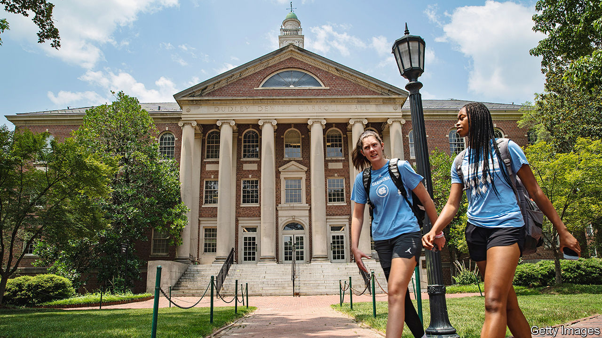

###### Supreme sort

# Why affirmative action in American universities had to go 

##### And why what comes after could be better 

 

> Jun 30th 2023 

SHOULD CITIZENS be treated differently based on the colour of their skin? Most people would say not, but others insist that they should—if the ends are sufficiently enlightened. 

Not long after America dismantled over two centuries of slavery and segregation, it embarked on a project of “affirmative action”: legally sanctioned positive discrimination for African-Americans (later expanded to other “under-represented minorities”) who wanted to go to selective universities. At the time, the affront to liberal norms of fairness and equality under the law was assuaged by the fact that the people who stood to benefit had been oppressed. Yet after 50 years with more racial progress than setbacks, an applicant to America’s top universities with the right skin colour still has a much better chance of getting in than one with identical credentials but the wrong skin colour. On June 29th the Supreme Court . 

It was right to do so. That is because  rested on contorted constitutional logic. It was also unpopular outside progressive circles. Worst of all, it . America’s best universities have never been representative, even with race-based affirmative action. The very same universities favour the children of alumni and donors—a shadow, unjustifiable affirmative-action scheme for the white and wealthy hidden behind the prominent one for black and Hispanic applicants (many of whom were wealthy themselves). 

The Supreme Court’s ruling will reverberate widely, encouraging lawsuits to end racial preferences in other areas, such as government contracting. But the immediate impact will be on universities, and the task is to ensure that it is beneficial.

Start with the shaky legal justification for race-conscious admissions. After the civil-rights era, America began to try to live up to its constitutional promise to guarantee all its citizens due process and equal protection under the law. That is why, in 1978, the Supreme Court justified affirmative action not as reparations for a terrible past, but with the argument that diversity promotes “cross-racial understanding and the breaking down of racial stereotypes”. 

It was always odd that affirmative action was crafted for the benefit of black students’ white peers. Nonetheless, top universities leapt on the rationale of diversity, using it to construct racially balanced classes while suggesting that these were the happy result not of quotas, which are banned, but of “race-conscious” holistic admissions schemes that treat people as individuals rather than as avatars for their racial group.

In last week’s decision the court’s dissenting liberal justices claimed that the new ban “will serve only to highlight the court’s own impotence in the face of an America whose cries for equality resound”. In fact Americans were not happy with the old policy. Even liberal Californians voted down a proposal in 2020 to reinstate affirmative action, banned in the state since 1996. Polls show that many more Americans oppose taking race into account for admissions than favour it. That is also true of Asian-Americans, who typically lean left but bear the heaviest cost of race-based admissions because they are deemed to be “over-represented” (despite suffering discrimination in their own right).

The court’s decision could yet become the catalyst for . The extraordinary benefits that Harvard and Yale shower upon the children of alumni and donors make a mockery of meritocracy and progressivism. Those practices, the subject of a new legal challenge, should go. 

Universities seeking social justice should stop using race as a proxy for disadvantage and start looking at the thing itself. Instead of giving a leg-up to members of groups that are on average badly off, they should favour individuals who are poor. One trial found that simply offering application-fee waivers to promising students from poor backgrounds dramatically increased the chance of them ending up in highly selective universities.

The best universities may seek stealthy ways to preserve racial preferences. Many are dropping requirements for standardised tests, which would make it harder to detect quiet discrimination against members of unfavoured groups who shine in them. Writing to students and alumni, Harvard quoted part of the majority opinion that opens the door to considering race if an applicant were to write about it in a submitted essay. “We will certainly comply with the Court’s decision,” it wrote, impishly. 

Rather than coaxing a generation of minority students into drafting disingenuous adversity statements—and continuing to admit a vast hereditary mediocracy through the back door—universities like Harvard would do well to craft a fairer system of admissions. They should not seek to protect the monied (albeit multicoloured) monoculture that they have created. Instead they should take the chance to become the genuinely representative institutions that they claim to be. ■


