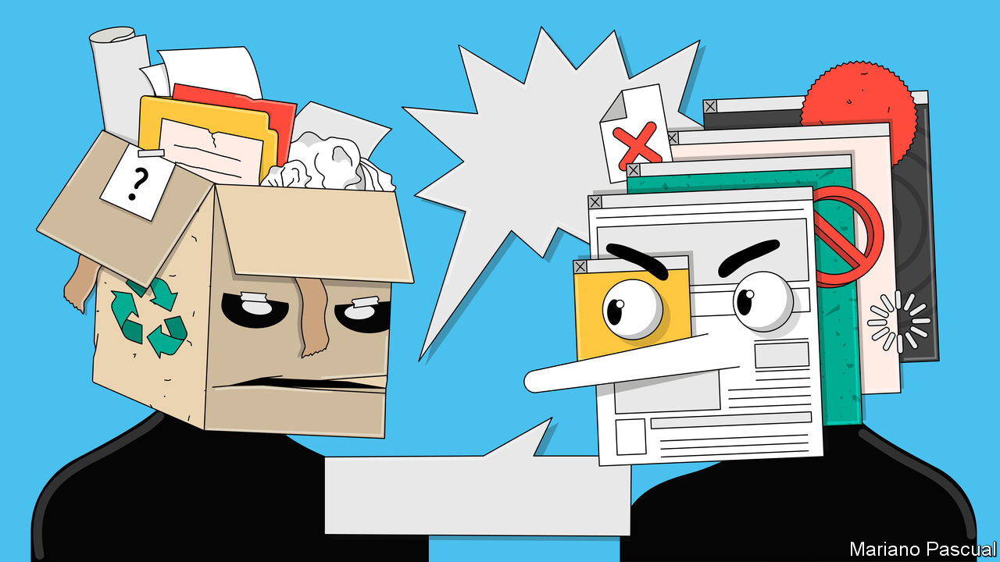
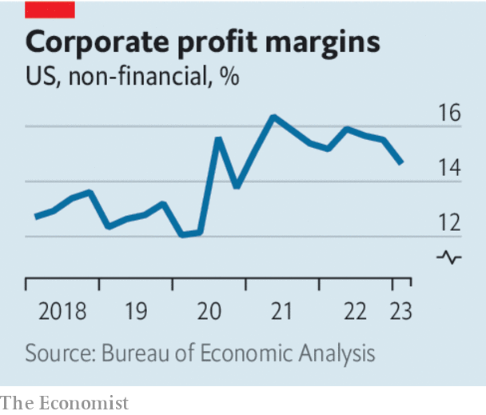

###### An enduring error

# “Greedflation” is a nonsense idea 

##### Inflation is the result of economic policy mistakes and war, not corporate avarice 

 

> Jul 6th 2023 

Inflation is high, and the search is on for the culprit. The latest in the frame in Europe is profiteering businesses. The idea that greedy companies were to blame has taken a knock in America, where corporate profits are falling even as consumer prices continue to rise too fast. But that has not stopped the notion taking hold across the Atlantic. The IMF has found that higher profits “account for almost half the increase” in the euro zone’s inflation and Christine Lagarde, the president of the European Central Bank, has at times seemed sympathetic to the argument. In Britain the government has asked regulators to look for evidence of price gouging; on July 3rd the competition watchdog added fuel to the fire with a finding that supermarkets had increased their margins on petrol between 2019 and 2022.

The “greedflation” thesis is in part a reaction against another common explanation for : that it is driven by fast-growing wages. Central bankers live in fear of wage-price spirals. Last year Andrew Bailey, governor of the Bank of England, asked workers to “think and reflect” before asking for pay rises. The remark was incendiary because the inflation that has  since 2021 has largely left workers worse off. Wages have not driven prices up but lagged behind them. 

 


Yet to argue that companies must therefore be to blame is to confuse cause and effect. In America the profit margins of non-financial corporations surged after vast fiscal stimulus during the pandemic, which amounted to more than 25% of GDP and included three rounds of cheques sent directly to most households. The infusion of cash into the economy—which the Federal Reserve chose not to offset with higher interest rates—set off a consumer-spending boom that overwhelmed the world’s covid-strained supply chains, disrupting other economies. With too much cash chasing too few goods, it was inevitable that companies would make more money. Then, after Russia invaded Ukraine, companies producing energy or food also found themselves selling into a shortage. Their prices and profits shot up. 

Europe’s economy has not overheated as quickly or to the same extent as America’s. But the euro zone has recently spent 3.3% of GdP subsidising energy bills and its interest rates are still too low given the underlying . Today it is displaying familiar symptoms: high core inflation, high profits and wages that are surging in a tight labour market. It seems likely that profit margins there will also follow America’s downwards; analysts expect the profits of listed companies to decline this year.

Regardless, the fact that companies raise their prices in response to shortages is not only defensible but desirable. The alternative to letting the price mechanism bring supply and demand into line is to rely on something worse, such as rationing or queues. Though there may be examples of opportunistic or anti-competitive behaviour, the effects are unlikely to have been material. British supermarkets increased their profits by 6p ($0.08) on a litre of petrol, which today costs £1.46, but they did so at a time when the peak rate of annual fuel inflation was 129%. Properly measured, economy-wide profit margins have not surged in Britain.

Ms Lagarde has said that it would be desirable for profit margins in the euro zone to fall. She is right; such a decline would be disinflationary and would restore workers’ share of the economic pie. But that does not mean that a crackdown on corporate greed is needed. Instead, monetary and fiscal policymakers need to continue to correct the error of excessive stimulus by raising interest rates and tightening fiscal policy. 

The right lesson to draw from the past two years is not that companies have got greedier, but that workers suffer when policymakers let inflation run out of control. All the more reason, in short, to care about price stability in the first place. ■

