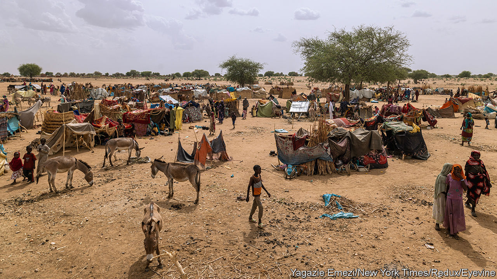
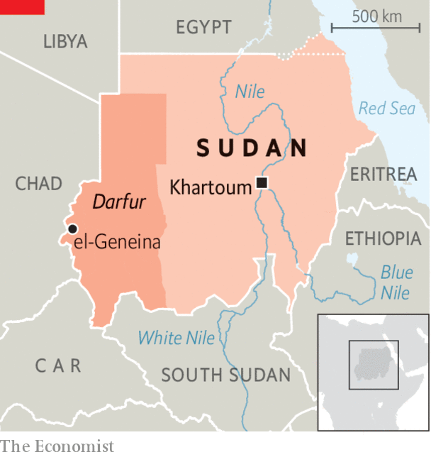

###### Civil war in Sudan

# Genocide all over again? 

##### The killing spree in Darfur 20 years ago is being repeated 

 

> Jul 6th 2023 

First the attackers besieged the city, burning the main market and preventing food and medical supplies from getting in. Then the militiamen proceeded methodically to destroy anything—hospitals, schools, electricity and telecoms—which the people of el-Geneina, in West Darfur, might need to survive. “It was routinised and systematic,” says Nathaniel Raymond, a conflict monitor at Yale University. On June 14th West Darfur’s governor appealed for foreign intervention to stop what he termed “a genocide”. The next day he was murdered in what Mr Raymond calls an “ISIS-style totemic killing”, referring to the jihadists who single out leading opponents for assassination across the Middle East and Africa. In the next 48 hours thousands of el-Geneina’s civilians fled or were killed. Aid-workers, visiting later, described the city as a ghost town.

 


Since the battle for el-Geneina began in April, soon after the start of Sudan’s wider civil war, some 180,000 civilians in the area have escaped to Chad. Most of them are Masalit, a black African tribe which has long predominated in the west of Sudan’s enormous Darfur region. Satellite imagery suggests that a vast area of the city has been destroyed or damaged by fire, with between 1,100 and 5,000 civilians perishing. So far this is probably the highest death toll of the war in one area, including Khartoum, the capital, which is still the conflict’s core. Refugees from el-Geneina tell of armed Arab militiamen going from door to door, shooting young men dead on the spot. On the road west to Chad (see map), gun-toting militiamen at makeshift checkpoints have robbed and shot civilians fleeing from the mayhem. 

Sudan’s civil war consists of several overlapping conflicts. The main one is still focused on Khartoum, where two armed factions vie for control of the whole country. The regular army under Sudan’s de facto president, General Abdel Fattah al-Burhan, is fighting against the paramilitary Rapid Support Forces (RSF), led by Muhammad Hamdan Dagalo, better known as Hemedti. This main conflict, which began in mid-April, has already uprooted millions and laid waste much of the capital. 

The war in Darfur, by contrast, has raged and sputtered for 20 years. It began in 2003 with an armed rebellion by neglected and aggrieved African tribes, such as the Masalit, against the Arab-dominated government of Omar al-Bashir, then Sudan’s dictator. In response he armed nomadic Arab cattle-herders as his proxies, unleashing them on the black African farmers with such ferocity that in 2010 he was indicted by the International Criminal Court (ICC) on charges of genocide. In the first five years of the conflict, some 300,000 people may have died, with as many as 2.7m driven from their homes. 

These marauding, government-backed Arab militias, notorious for raping women and ransacking villages, came to be known as the Janjaweed: devils on horseback, led by Mr Dagalo. With Mr Bashir’s blessing, he eventually turned the Janjaweed into the RSF, which became a multinational business empire with links to the United Arab Emirates and Russia’s Wagner Group. Now he aspires to rule Sudan. 

Those deadly droughts

Darfur’s war in the 2000s was dubbed the 21st century’s first genocide. It may also have been the world’s first climate-change war. Resource-rich but drought-prone, the region’s land had long been contested, as desertification spread and rainfall dwindled. But it took the Arab-supremacist policies of Mr Bashir and his Islamist allies to make Darfur explode. Hopes for a durable peace rose there in 2019 when Mr Bashir’s regime fell and a democratic transition seemed to beckon. A peace deal in 2020 brought Darfuri rebel leaders into a power-sharing government in Khartoum, promising fairer access to resources and the return of land to those who had been driven away. By 2021 a hybrid force of UN and African Union peacekeepers, deployed in 2007, had pulled out. 

But none of those responsible for Darfur’s initial catastrophe—not just Mr Bashir but also the two generals now battling to succeed him—was brought to justice. Many of Darfur’s Arab tribes, as well as their black compatriots, still felt excluded. Violence by Arabs against returning Africans, including the Masalit, soon spread again. Almost as soon as the peacekeepers left, fighting resumed, forcing more than 400,000 people from their homes. 

As the war between the army and the paramilitary RSF intensified, so did fighting between the Janjaweed and their opponents in Darfur. Aid-workers fear the carnage may already be on a par with the early 2000s. “This is the worst war I’ve seen in 20 years as an aid-worker,” says Justine Muzik of Solidarités International, a France-based humanitarian charity, who was in el-Geneina in late June. Videos on social media show fighters voicing ethnic slurs and boasting of turning the area Arab. Volker Perthes, the UN’s special representative in Sudan, describes the war in West Darfur as “ethnic cleansing, grand scale”.

Today’s Janjaweed are using “tactics, techniques and procedures” identical to those in the 2000s, says Mr Raymond. But whereas they were then on horses and lightly armed, “now they are on the back of pickup trucks, moving very fast, using deadly weapons,” says a UN worker. Eyewitnesses describe soldiers in RSF uniforms arming the Janjaweed before they jointly attacked towns like el-Geneina.

The RSF says it is not involved in what it shrugs off as local tribal conflicts. But it can be hard to distinguish its fighters from the Janjaweed. Moreover, el-Geneina is a key staging post for supplying the RSF in its bid to conquer all of Sudan. Kholood Khair of Insight Strategy Partners, a Sudanese think-tank, says Mr Dagalo is getting arms, fuel and mercenaries from neighbouring Libya and the Central African Republic. Access through Chad would be vital, too.

The army’s contingents in Darfur are outgunned and outnumbered so cannot defend the Darfuris from the predations of the RSF or its allied militias, as they are tied up battling for Khartoum. In several Darfur towns they are said to have withdrawn to barracks, enabling the RSF to take over.

At present the region’s non-Arabs cannot expect an international response along the lines of 2007. “This time there is no international clamour about the war in either Khartoum or Darfur,” says Gayle Smith, a former director for Africa on America’s National Security Council. In some places truces have been arranged by activists and religious leaders. In el-Geneina an edgy calm prevails. But fearful residents are still fleeing the city, with furniture and belongings piled high. “They’re trying to save everything they can,” says Ms Muzik. Darfur’s—and Sudan’s—long nightmare is far from over. ■

