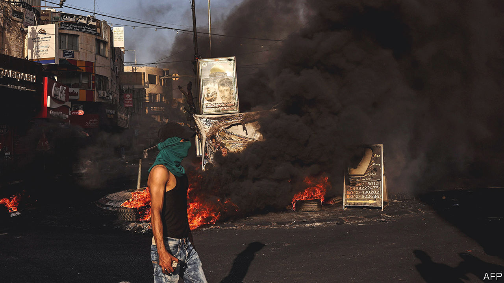
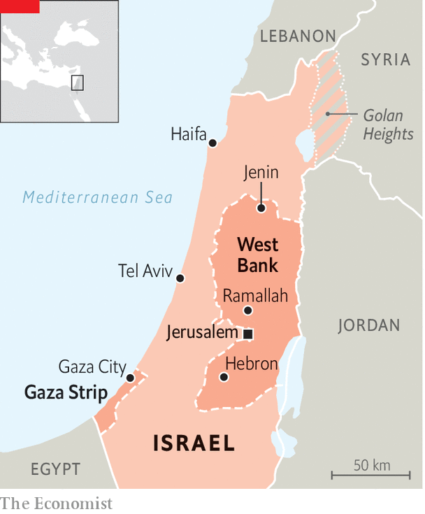

###### Another battle for Jenin

# Israel launched its biggest raid on the West Bank in over 20 years 

##### The incursion into Jenin will not stop the violence 

 

> Jul 6th 2023 

The israeli operation in Jenin was in its final hours on the afternoon of July 4th as a small armoured convoy traversed the wreckage in the town’s main square, avoiding Palestinian ambulances hurrying back and forth. Nearly 1,000 Israeli special forces had entered the previous morning, covered by drone strikes, in pursuit of some 300 militants of Kata’ib Jenin (the Jenin Brigades) who for nearly two years have controlled Jenin’s refugee camp. Twelve Palestinians (Israel says they were militants) and an Israeli soldier were killed. Dozens of Palestinians were wounded and captured. The Israelis say 30 workshops and weapons caches have been destroyed.

But the Palestinians’ resistance did not disappear. As your correspondent drove into Jenin with an Israeli unit, an improvised explosive device (IED) detonated beneath the lead vehicle, which just made it to makeshift headquarters on the edge of the camp. In the streets youngsters pelted the convoy with rocks and paint-bombs, while shots were sporadically fired at it from afar. By the morning of July 5th the Israelis had left, ending a 48-hour operation, the biggest raid on a Palestinian city in the occupied West Bank since 2002. But Brigadier General Avi Bluth, head of Israel’s forces there, has little doubt that the militants will soon be back. 

Jenin camp is one of the Palestinians’ oldest. Around 18,000 people are crammed into less than half a square kilometre. The town has one of the highest unemployment rates in the West Bank; much of its residents’ income is from day-labourers working in Israel. For two years it has posed a severe headache to Israeli security forces and to those of the toothless Palestinian Authority based in Ramallah, just north of Jerusalem. The Palestinian security forces are unlikely to re-establish their writ in Jenin for the foreseeable future. 

 


Jenin has long been a symbol of deadly terror for Israelis and diehard resistance for Palestinians, who abhor Israel’s military occupation of the West Bank and generally despise the corrupt and sclerotic rule of Mahmoud Abbas, the 87-year-old Palestinian president who is regarded by them as a proxy for Israel. Hamas, an Islamist group that runs Gaza, said a car-ramming and stabbing attack on July 4th in Tel Aviv was in revenge for the raid on Jenin.

Since spring last year, militants based in Jenin have carried out a string of attacks, including one in Tel Aviv last April in which three Israelis were shot dead in the main nightlife district. In response Israeli security forces have made regular raids on Jenin to kill or capture important figures in the brigades. But, as a senior Israeli officer recently admitted: “The fact they are not part of any established network or organisation has made it very difficult to root them out.” The brigades are made up of young men, some affiliated to various Palestinian factions and others to none of them. They have made IEDs that can disable Israeli armoured vehicles. They have also tried to build rockets to hit villages in Israel proper. Their growing firepower was one reason for the latest incursion.

Israel’s generals reckon the latest operation may suffice for the time being. But the Israeli far right are demanding more and wider operations, including against the restive West Bank city of Nablus. Jewish settlers in the West Bank and their influential backers in the cabinet of Binyamin Netanyahu, the prime minister, played a part in encouraging the latest attack on Jenin. 

Israel has been here before. In April 2002, after a series of suicide-bombings in Israel during the second , an uprising that lasted from 2000 to 2005, the Israeli army battled for 11 days to control the Jenin refugee camp, where many of those bombings had originated. More than 50 Palestinians and 23 Israeli soldiers were killed. Armoured bulldozers razed much of the camp. This time, largely due to better intelligence and aerial surveillance, the incursion was shorter and less destructive. But future battles for Jenin surely await.

The violence has not yet spread to other parts of the West Bank. But even if the incursion does not cause it to escalate, the anger of young Palestinians will only grow in the absence of a serious process towards statehood or equality. As sophisticated and powerful as Israel’s army is, it can only buy temporary respite. ■

