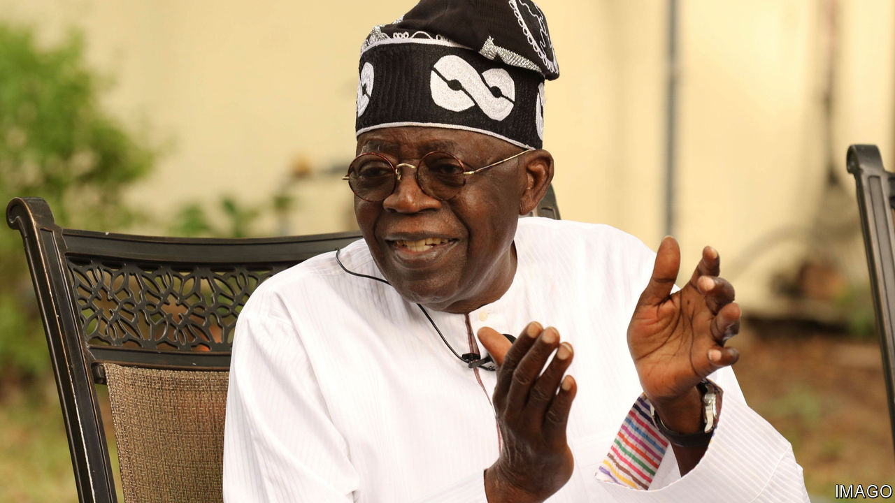

###### Shake it up

# Nigeria’s new president acts fast 

##### Bola Tinubu’s first moves are impressive 

 

> Jul 6th 2023 

During his inaugural speech on May 29th in Abuja, the capital, President Bola Tinubu shocked and delighted reform-minded Nigerians by veering off-script to announce an end to subsidising petroleum products, which for decades has drained the treasury of revenues from the country’s most valuable natural resource. Since then, he has continued to shake the establishment with a string of night-time press statements which heralded the firing of his central-bank governor, the top brass of the army and the heads of several key government agencies, including the police, the customs service and the financial-crimes commission. 

His biggest scalp was that of the central banker, Godwin Emefiele, whom the secret police detained—so far without charge—on June 9th. Mr Tinubu explained that “the financial system [had been] rotten” under the supervision of Mr Emefiele, who had held the job for the past nine years. 

Many Nigerians blame Mr Emefiele for Nigeria’s economic woes. Since he took office Nigeria has twice fallen into recession. Annual inflation recently hit 22%, the highest for 18 years. The central bank has been accused of profligacy by lending the government $53bn in recent years. Last year debt servicing alone chewed up a grim 96% of government revenues. 

Moreover, some of the ousted governor’s other policies were abject failures, such as his sudden plan to redesign some banknotes and scrap the old ones, leading to severe shortages of cash needed by Nigerians for day-to-day living. He was also blamed for overseeing Nigeria’s multiple foreign-exchange rates, which boosted the black market and deterred foreign trade. Mr Tinubu has ordered the immediate reunification of the rates. Their confusing multiplicity contributed to the dramatic decline of foreign direct investment in Nigeria in the past few years.

Whether Mr Emefiele’s arrest is lawful is another matter. Nigeria’s government has often taken a shoot-first-ask-questions-later approach to such matters. A court is expected to determine the constitutionality of the detention by July 13th. Mr Emefiele’s friends say he is an innocent man being scapegoated.

Mr Tinubu’s speedy appointments on the security side are intended to help curb terrorism in the country’s northeast and the scourge of kidnapping in the northwest, as well as violence elsewhere. SBM, an intelligence outfit based in Lagos, the commercial capital, estimates that between July 2021 and June 2022, 3,420 people, including hundreds of schoolchildren, were kidnapped. Mr Tinubu has appointed Nuhu Ribadu, an ex-policeman who once headed the financial-crimes commission, as his new security adviser.

Busy Mr Tinubu has evidently managed to find time to attend to less pressing matters. He has renamed no fewer than 15 airports dotted around the country to honour notable Nigerians with local connections, including Muhammadu Buhari, his dozier predecessor. The main airport in Lagos, where Mr Tinubu made his reputation as a punchy governor, is still named after a previous president, General Murtala Muhammed, who was assassinated in 1976. Nigerians are hoping for livelier yet safer leadership under their new man. ■

