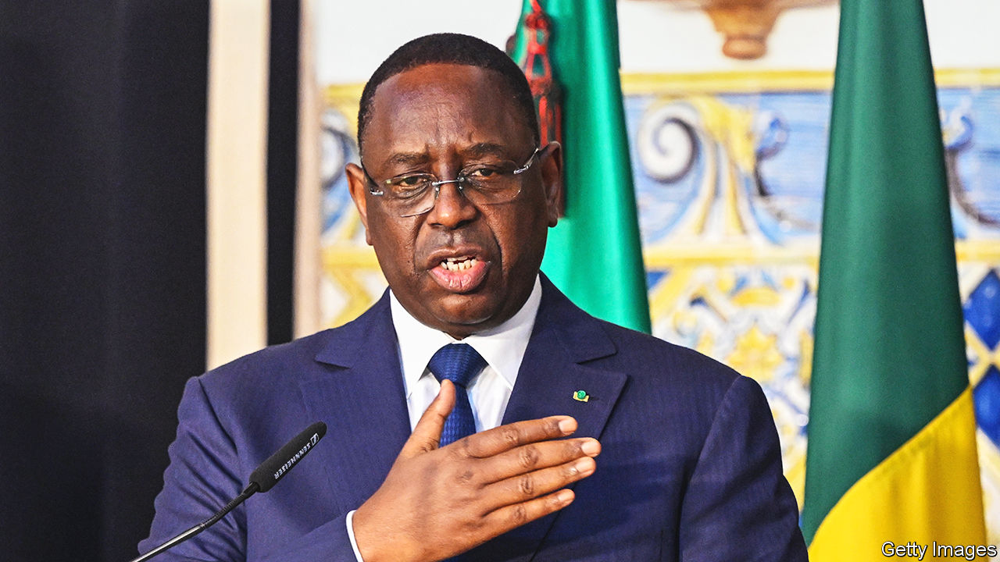

###### Sensible Sall

# Senegal’s President Macky Sall says he won’t stand for a third term 

##### Violence would probably have erupted if he had said otherwise 

 

> Jul 6th 2023 

“My long and carefully considered decision is not to be a candidate in the next election,” declared Senegal’s president on July 3rd. That ended years of speculation over whether Macky Sall would seek a constitution-bending third term in next year’s election. It also assuaged fears of more bloody clashes if he did. Alioune Tine of Afrikajom Centre, a think-tank in Dakar, the capital, echoed the feelings of many Senegalese democrats: “It’s a great feeling of deliverance.” 

Violent protests against Mr Sall began in March 2021 when Ousmane Sonko, a prominent opposition leader, was accused of rape and later arrested. Many protesters believed that Mr Sall was targeting political rivals and wanted to run for a third term. Last month protests spiralled after Mr Sonko was sentenced to two years in prison for “corruption of youth”, which almost certainly rules him out of the election. At least 37 people have been killed in protests since 2021, many of them shot by security forces, says Amnesty International, a rights group. The fate of Mr Sonko, who is not yet behind bars, could cause ructions. But Mr Sall’s decision greatly reduces the risk of violence. 

It also gives a much-needed fillip to democracy in the region. Three nearby countries—Burkina Faso, Guinea and Mali—are run by soldiers. In Ivory Coast, west Africa’s other Francophone pillar, President Alassane Ouattara is serving a third term based on a dubious twist of the constitution. Indeed, of all mainland Francophone Africa’s countries, arguably only Senegal can boast that it is genuinely democratic. It has largely free elections, a record of transferring power between opposing parties, and (still) resilient constitutional limits. 

A bevy of global bigwigs was quick to laud the decision. António Guterres, the UN head, wrote of his “deep appreciation for President Macky Sall and the statesmanship he has shown”. Many Senegalese are less gushing. “It’s not him that decided to leave, it’s the population that decided for him,” says Ousmane Diouf, an ex-soldier, alluding to the protests. 

Plenty of locals believe Mr Sall should never have needed to make his declaration. “You do two terms and leave. That’s how it is,” says Souleymane, a 27-year-old watchman. Mr Sall has only ever presided under a constitution that sets the limit at two terms. Yet he has implausibly claimed—and did so again in his speech—that he was permitted to stand for a third term, arguing that a tweak to the constitution in 2016 to reduce terms from seven years to five had reset the count on the number of mandates. 

Aged 61, Mr Sall will now be in high demand for everything from peacemaking to lucrative global directorships. And he will be a favourite for the prize of $5m that Mo Ibrahim, a Sudanese-British telecoms tycoon, awards to an Africa leader who has demonstrated good governance—and respect for term limits. There are worse fates. ■

