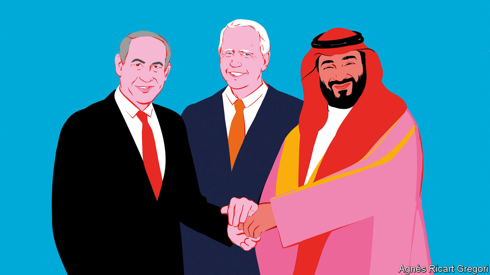

###### Middle East diplomacy

# What MBS wants from Joe Biden 

##### In return for recognising Israel, Saudi Arabia wants American weapons and nuclear technology 

 

> Jul 5th 2023 

Few questions in the Middle East evoke such dread as “why aren’t you married?” It signals a judgmental grilling. Anyone can play interrogator: parents, taxi drivers—even an American president.

Saudi Arabia and Israel have been carrying on their relationship in secret for a decade. Joe Biden wants them to make it official. For the Saudis this is an inopportune moment. Israel has a hard-right government. The Arab League this month accused it of “war crimes” for an .

Yet the Biden administration wants to broker a deal by the end of the year whereby the two countries establish formal relations. In recent weeks the president’s aides have flown to the kingdom to ask Muhammad bin Salman, the powerful crown prince, what it would take to tie the knot.

The prince had a ready answer. He wants a large dowry from the Americans: weapons, a security pact, and help with the kingdom’s fledgling nuclear programme (uranium, not gold, is the metal of love). It would be less a Saudi-Israeli pact, in other words, than a Saudi-American one.

Supporters say it is worth the price to usher in a new era for the Middle East. Yet the Saudis’ demands undercut those lofty arguments. They have an honest view of normalisation: as a transactional security pact, not a transformational one.

During its first 72 years as a state, Israel established official ties with only two Arab countries: Egypt and Jordan. Over four months in 2020, it added four more—Bahrain, Morocco, Sudan and the United Arab Emirates (uae)—via the Abraham accords. Donald Trump made it a priority to expand Israel’s relationships in the region, and so has his successor.

For a time, a favourite diplomatic parlour game was to guess which Arab states might come next. Saudi Arabia always seemed like the big prize. It is the region’s largest economy, its diplomatic heavyweight and the birthplace of Islam.

Such talk has cooled since December, though, when Binyamin Netanyahu returned to power in Israel. Though the accords remain intact, the public ardour of Israel’s new Arab friends has cooled. In public, Saudi officials are still coy about normalisation. But in recent months many experts have become convinced there is a real chance for a deal.

There are other subtle hints. The kingdom has long insisted that it could recognise Israel only if Israel accepts the Arab Peace Initiative, a plan endorsed by the Arab League in 2002 that offered normal ties in exchange for the creation of a Palestinian state.

Yet Faisal bin Farhan, the Saudi foreign minister, made no mention of it last month at a press conference in Riyadh alongside his American counterpart. Instead he spoke of needing a “pathway to peace” for Palestinians: without it, he said, “any normalisation will have limited benefits”. The rhetorical shift was not lost on listeners in Washington.

Instead of making demands of Israel, the Saudis are now making them of America. They want a stronger defence pact, something that would bind America to protect the kingdom. They want easier access to American weapons. And they want American help to set up a civilian nuclear programme, which would include facilities to enrich uranium inside the kingdom.

It is not unprecedented to ask for sweeteners: America has always helped cement Arab-Israeli treaties. It has sent Egypt more than $50bn in military aid since the country made peace with Israel in 1979. Mr Trump promised a sale of F-35 fighter jets to entice the uae into the Abraham accords (though America has yet to deliver them).

The Saudi demands go far beyond money or weapons, however—and are unlikely to be met. A formal defence treaty would have to be ratified by a Senate that rarely ratifies anything these days. Arms deals often require approval from Congress and lawmakers from both parties are wary of sending weapons to Saudi Arabia.

A nuclear programme would be more controversial still. The Saudis could follow the path of the uae, which swore off enriching its own uranium to secure access to American technology. Insisting on their own enrichment capacity—at a time when Iran has enriched uranium to nearly weapons-grade—would raise fears of a regional arms race. Even in a bitterly divided Washington, both Democrats and Republicans could probably agree that nuclear proliferation is bad.

This points to a bigger problem with the hasty push for a deal. American supporters of an agreement make several arguments in favour. One is that it could cement an alliance against Iran, a nemesis to Israel and Saudi Arabia. The Saudi army is not known for its prowess, however. Israel would not want to rely on it in a conflict, and the Saudis, who signed a reconciliation deal with Iran in March, would probably prefer to sit one out anyway.

Equally unrealistic is the idea that it would compel the Saudis to distance themselves from China and Russia. The kingdom, like other Gulf states, wants to avoid picking sides in the great-power competition. It is not about to abandon America—but nor will it turn down lucrative ties with China, or its oil partnership with Russia.

A more plausible argument, on the face of it, is that Saudi recognition of Israel could convince other Arab states to do so. But public opinion probably rules it out in countries like Algeria, Lebanon and Tunisia. And the emirs of Kuwait and Qatar would be loth to follow their neighbour. 

For decades, many Western diplomats saw the Israeli-Palestinian conflict as the region’s main problem. The Arab spring proved such thinking facile. Decades of awful, authoritarian governance plunged the Middle East into violent upheaval, with Israel playing hardly any role in it.

The push for a Saudi-Israeli deal risks repeating that flawed thinking, only in reverse. Boosters say it would be transformative—yet many of its purported benefits seem far-fetched. That does not make it an unworthy goal. But America will have to decide whether it is worth the price. ■


