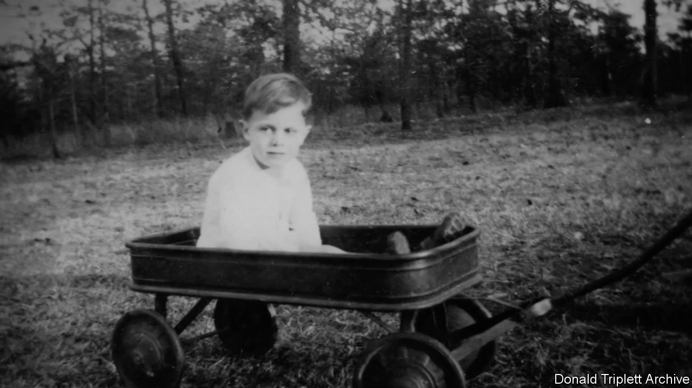

###### Through the dark clouds shining

# Donald Triplett was the first man diagnosed with autism 

##### The man who was autism’s “Case 1” died on June 15th, aged 89 

 

> Jul 6th 2023 

At first there were words, so many words. “Chrysanthemum!” was a favourite. He used to like saying that one. And “Dahlia” too—he liked that one so much he would repeat it: “Dahlia! Dahlia! Dahlia!” The five-year-old Donald Triplett had non-floral favourites as well. Sometimes, he sounded like an irate grammarian: “Semicolon, capital, slain, slain,” he would say. Then, as if conciliatory: “I could put a little comma.” Some of his phrases had an almost biblical beauty: “Through the dark clouds shining.”

But if his words could be brilliant his meaning was often opaque. When he said “you” he meant “me”. When he said “yes” it meant “pick me up and put me on your shoulders.” When someone stood on his toy he said “umbrella”. And what he meant by “chrysanthemum” was anybody’s guess. He had other idiosyncrasies, too. He shook his head, constantly, from side to side. He gave people numbers, not just names. And if his toys weren’t just so, he screamed till the muscles stood out on his neck. Most upsetting of all, he never seemed glad to see his mother, Mary. But he loved making things—blocks, pans, ashtrays, anything at all—spin. And when they span the boy would, as the psychiatrist’s report observed, jump up and down “in ecstasy”.

There were so many words. But there was no word for Donald. In the 1930s American psychiatry was not short of terms for what they called “nature’s mistakes”. There was “imbecile” and “cretin” and “lunatic”; there was “simpleton” and “dullard” and “dunce”. However there was nothing to describe a little boy who liked to shout “chrysanthemum” but didn’t hug his mother. Mary begged doctors to give her a term. She even took her son to Leo Kanner, the best child psychiatrist in America, but he too demurred. Modern medicine, he told her, had no words for this. So in despair she came up with her own. Her son, she wrote, was “hopelessly insane”. Kanner would, eventually, opt for a more neutral term for Donald. He would call him “Case 1”.

An earlier doctor, near her home in Forest, Mississippi, had been far less cautious. He had known exactly what was wrong with Mary’s boy: it was Mary. She had overstimulated him, with all her songs and all that talking. He knew how to cure him, too: Mary must put Donald in an institution, away from her. So she and her husband put their boy in the family Buick and drove him to a children’s institution in a town called Sanatorium. Then they left him there. And, in a way, it worked: Donald’s tantrums and screaming stopped. However so too did everything else. There was no more humming, or singing, or spinning. Now Donald did almost nothing at all. He just sat, motionless, in his regulation white bloomers and top. He was three years old. 

Which was why Mary ended up taking him to Kanner. He was an Austrian-Jewish psychiatrist who had come to America years before (he would later help hundreds of people escape from Nazi Germany). He was never much of a one for putting labels on people: they were more complicated than that. Then Mary turned up in his office with her boy Donald, and her husband, and her husband’s 33 pages of typed notes on his son (“obsessive”, Kanner observed). He read the notes and he studied the boy. He stuck a pin in Donald’s arm and was riveted to see that though the boy pushed the pin away, “He was never angry at the interfering person.” And he could see that this needed a name.

Kanner started work on a paper. He would include ten other children in it too but Donald would be his first: “Case 1”. Many of these children had wildly different characteristics, he wrote. However they all shared one thing: an “inability to relate themselves in the ordinary way to people”. Common English had no word for this, so Kanner borrowed a word for it from elsewhere in psychiatry. The word he chose came from a Greek word, “autos”, which meant “self”. Donald, he wrote, was “autistic”. Kanner went further: this “unique syndrome not heretofore reported” was rare—but probably more frequent than “the paucity of observed cases” made it seem. Kanner’s paper has since been cited 17,000 times. 

Later, Kanner would always say that he hadn’t discovered autism: it was there before. Not that the people of Forest, Mississippi, the home of its first case, knew much about that. Back in Forest (population—as Don could tell you—5,330), they hadn’t really heard about “autism”. But everyone knew Don. After those spells away, Don had come back to Forest and spent the rest of his life there: he graduated from high school there; learned to drive there; he even got a job in the bank there: he could add long numbers in his head faster than you could type them into a calculator. Sure, he was different. And never much of a one for chit-chat. But that was just Don. Too clever for his own good. A genius, they reckoned. 

And he was happy. He still gave numbers to people, too. Pastor Mark was 472. His friend Celeste was 1,315. Olivia and Toby were 154 and 155. And he just loved to flick people with rubber bands. At first he had flicked his colleagues at work, but then he got in a whole lot of trouble for that. So he took to getting his fellow workers when they were out and about. In the grocery store. In the parking lot. He used to keep the bands on his wrist so he was always ready. He particularly liked to flick Celeste in church. She’d feel the flick—it really stung!—and she’d know: that’s Don. 

Later, when other people started to know who Don was too, Forest looked out for him. When some journalists had wanted to write about him, they’d approached locals to ask if they could be introduced. Sure, they had said. Then they had said: and if you hurt him in any way we’ll make sure you regret it. Don’s story became a book; the book became a film, “In A Different Key”; and Don became an entry in the “Encyclopaedia Britannica”. 

Though to the people of Forest, he was always just Don. The pastor who preached at his funeral began his sermon by introducing himself with his number: I’m 472, he said. Later, others in the congregation had joined in: I’m 1,316. I’m 40. I’m 30. But Don had never given himself a number, so neither did they. To them, Donald Triplett—Case 1—was always just Don. ■

