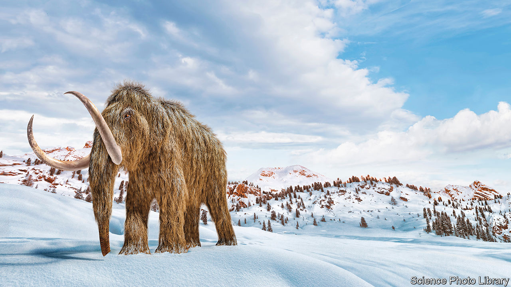

###### The Fred Flintstone diet

# A Belgian company wants to create woolly-mammoth burgers 

##### DNA from extinct species is inspiring other business plans, too 

 

> Jul 5th 2023 

Just a strand of Elvis’s hair would do. Pluck out his DNA and it could be copied millions of times using a technique called the polymerase chain reaction (PCR). That was the business plan pitched in the 1990s by Kary Mullis, an American biologist. Mullis had helped develop PCR in the 1980s; in 1993 he shared a Nobel prize. “StarGene”, as his company was known, hoped to make money by selling jewellery stuffed with celebrity DNA. 

The idea never quite worked out. But that has not stopped a slew of newer firms also hoping to mine gold from dead individuals—or even entire species. Paleo, for instance, is a Belgian startup that creates synthetic proteins for the artificial-meat business. Driven in part by a “childhood fascination with prehistory”, Hermes Sanctorum, the company’s CEO, is keen to expand the business into making woolly-mammoth burgers. 

Working with the Centre for Palaeogenetics in Sweden, the firm has obtained fragments of DNA from mammoth teeth found in the Siberian permafrost that are up to 1.2m years old. These fragments were combined with DNA from Asian and African elephants, the mammoth’s nearest living relatives, to reconstruct what the firm hopes is the mammoth version of the gene that encodes myoglobin, a protein that helps give meat its rich taste and vibrant red colour.

That gene was inserted into the DNA of yeast, which duly began turning out mammoth myoglobin. The protein was mixed with binders such as potato starch, oil, salt and other flavours so that it resembled the taste and texture of a burger. Paleo’s patent claims the myoglobin causes a range of chemical reactions between other ingredients in the burger, producing flavours that are obtainable in no other way. Mr Sanctorum, for his part, says mammoth burgers taste “more intense” than beef. The firm raised €12m ($13.1m) in its first funding round in February, and hints its mammoth meat will be publicly available soon. Several vegan-burger makers and an ice-age theme park are reportedly interested.

Paleo is not the only company exploring mammoth meat. Vow, an Australian company, says it has made a volleyball-sized lump of the stuff by injecting engineered mammoth myoglobin into lab-grown stem cells derived from sheep. Geltor, a startup that has raised more than $100m, opted for a different extinct, elephantine species. It took sequenced mastodon DNA and used it to produce collagen, a protein found in skin and tendons. The stuff was eventually turned into gelatine for gummy sweets. 

And it is not just extinct animals that companies think might prove valuable. Haeckels, a British cosmetics firm, is attempting to engineer scents from extinct flowers for use in perfumes. Geltor has also produced human collagen for use in the cosmetics business. Perhaps engineering some from a celebrity’s DNA would be a hit?■


