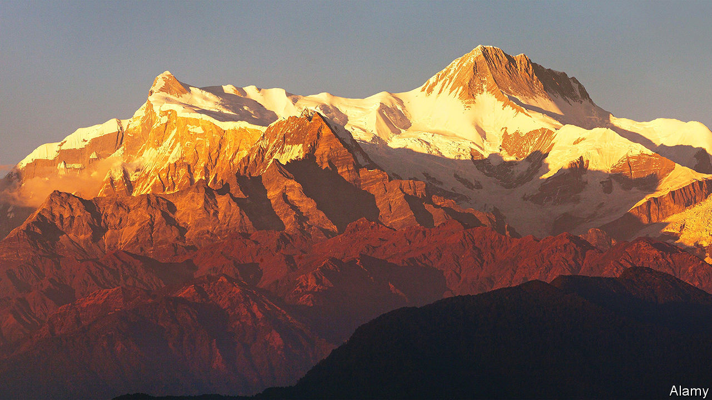

###### Hitting peak peak

# A gigantic landslide shows the limit to how high mountains can grow 

##### Enough rock fell off a Himalayan peak to bury Paris to the height of the Eiffel Tower 

 

> Jul 6th 2023 

In geology, unlike business, nothing is too big to fail. Mountains offer the most spectacular example. Pushed up by the crumpling of Earth’s crust following the collision of tectonic plates, they could in theory keep rising almost indefinitely. In practice, they do not. A suite of geological processes—including the grinding of glaciers, the gentle impact of rain, and forcible cracking by freezing and thawing of water—erode them down to size.

In a paper published in  Jérome Lavé, a geologist at the University of Lorraine, describes another, much more spectacular mechanism. Dr Lavé has collected evidence suggesting that, in around 1190, an enormous landslide slashed perhaps 500 metres from the height of Annapurna IV, a mountain in the Himalayas that stands about 7,500 metres high today. If he is right, it would be one of the biggest landslips ever recorded. The falling mountain top would have displaced up to 27 cubic kilometres of rock—roughly enough to bury the entirety of Manhattan to about the height of the Empire State Building.

As the rubble crashed down, the energy released would have been equivalent to around six times that of the Tsar Bomba, the biggest nuclear weapon ever detonated. “I don’t think I could imagine what it would sound like,” says Ann Rowan, a geologist at the University of Bergen who was not involved in Dr Lavé’s work. 

Dr Lavé’s suspicions were aroused while doing fieldwork in the Ganga plain in Nepal in 2012. He noticed that the ground beneath his feet had an unusual composition. A 50-metre core drilled out of the rock showed an average concentration of limestone of around 10%. But for one 4-metre stretch the concentration rose to nearly 50%, “which is enormous, and completely abnormal”, he says.

This suggested that the rocks in question had made their way to the Ganga plain from the Annapurna massif, hundreds of kilometres away. That, in turn, hinted at a massive landslide in the (geologically) recent past. After examining satellite images of the massif, and taking a helicopter ride to have a look for himself, Dr Lavé spotted a large rubble field which looked like it could have been caused by the same event. So he visited the site the following year, becoming only the second geologist known to have done so, and took some samples. Examining the surrounding cliffs for signs of a collapse, he noticed that a peak known as Annapurna IV offered a relatively smooth, steep face which seemed to fit.

Back home, he sent samples from the rubble field, the rock core and others from the path the landslide might have taken for dating. Should their ages roughly correspond, that would suggest they were linked to the same event. By measuring the abundance of chlorine-36 (a radioactive isotope which accumulates in surface rocks and decays once they are buried), and carbon-14 (another which accumulates in living matter and decays after death), his colleagues dated the samples to the late 12th century, and to within a couple of decades of each other. That is within the accuracy limits of the dating techniques themselves.

Besides shedding light on a previously unknown cataclysm, Dr Lavé’s work could plug a gap in the dominant explanation for why mountains stop growing, which is known as the “glacial buzzsaw” hypothesis. Under this model, it is glaciers, which are extremely effective at carving scoops out of mountains, that are mostly responsible for curbing their growth. 

The problem with that theory, says Dr Rowan, is that there are some peaks that manage to escape the erosive effect of glaciers, and then grow so steeply that glaciers can no longer stick to their sides. “The question is,” she asks, “what stops these mountains getting bigger?”

Landslides could well be one answer. While the exact trigger for the Annapurna landslide is unknown, Dr Lavé’s idea is that, with nothing to shave rock off their tips, very high mountains simply keep growing until their weight is too much for their lower slopes—which do still experience erosion—to support. 

Working out exactly how and when the tipping point is reached will require examining other such rockslides. Unfortunately, due to the actions of both glaciers and swollen rivers during the monsoon season, the rubble from the Annapurna landslip is vanishing fast. Dr Lavé reckons that only about 10% of the dislodged material now remains in place. Older rockslides, assuming there were any, may already be impossible to reconstruct. ■


