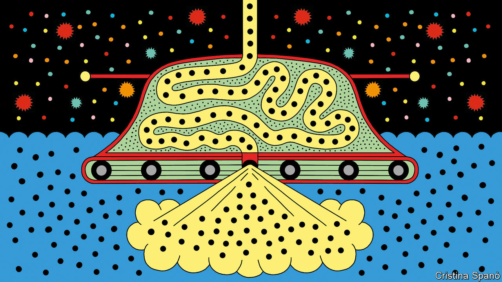
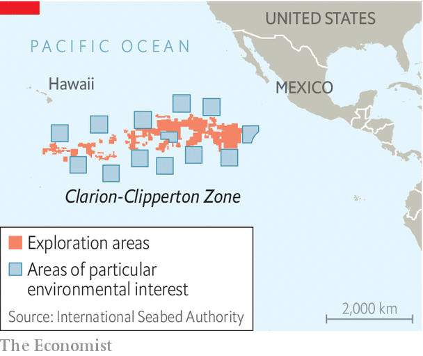

###### Raiding Davy Jones’s locker

# Deep-sea mining may soon ease the world’s battery-metal shortage 

##### Taking nickel from rainforests destroys 30 times more life than getting it from the depths 

 

> Jul 2nd 2023 

Pushed by the threat of , rich countries are embarking on a . Britain, France and Norway, among others, plan to ban the sale of new internal-combustion cars. Even where bans are not on the statute books,  are growing rapidly. Power grids are changing too, as  and solar panels displace fossil-fuelled power plants. The International Energy Agency (IEA) reckons the world will add as much renewable power in the coming five years as it did in the past 20. 

All that means batteries, and lots of them—both to propel the cars and to store energy from intermittent renewable power stations. Demand for the minerals from which those batteries are made is soaring. Nickel in particular is in short supply. The element is used in the cathodes of high-quality electric-car batteries to boost capacity and cut weight. The IEA calculates that, if it is to meet its decarbonisation goals, the world will need to be producing 6.3m tonnes of nickel a year by 2040, roughly double what it managed in 2022. That adds up to some 80m tonnes of nickel in total between now and then.

 


Over the past five years most of the growth in demand has been met by , which has been bulldozing rainforests to get at the ore beneath. In 2017 the country produced just 17% of the world’s nickel, according to CRU, a metals research firm. Today it is responsible for around half, or 1.6m tonnes a year, and that number is rising. CRU thinks Indonesia will account for 85% of production growth between now and 2027. Even so, that is unlikely to be enough to meet rising demand. And as  increases, it is expected to replace palm-oil production as the primary cause of deforestation in the country.

But there is an alternative. A patch of Pacific Ocean seabed called the Clarion-Clipperton Zone (CCZ) is dotted with trillions of potato-sized lumps of nickel, cobalt, manganese and copper, all of which are of interest to battery-makers (see map). Collectively the nodules hold an estimated 340m tonnes of nickel alone—more than three times the United States Geological Survey’s estimate of the world’s land-based reserves. Companies have been keen to mine them for several years. With the coming expiry, on July 9th, of an international bureaucratic deadline, that prospect looks more likely than ever. 

It’s better down where it’s wetter

That date marks two years since the island nation of Nauru, on behalf of a mining company it sponsors called The Metals Company (TMC), told the International Seabed Authority (ISA), an appendage of the United Nations, that it wanted to mine a part of the CCZ to which it has been granted access. That triggered a requirement for the ISA to complete rules on commercial use of the deposits. If those regulations are not ready by July 9th—and it seems they will not be—then the ISA is required to “consider and provisionally approve” TMC’s application. (The firm itself says it hopes to wait until rules can be agreed.)

TMC’s plan is about as straightforward as underwater mining can be. Its first target is a patch of the CCZ called NORI-D, which covers about 2.5m hectares of ocean floor (an area about 20% bigger than Wales). Gerard Barron, TMC’s boss, estimates there are about 3.8m tonnes of nickel in the area. Since the nodules are simply sitting on the bottom of the ocean, the firm plans to send a large robot to the seabed to hoover them up. The gathered nodules will then be sucked up to a support ship on the surface through a high-tech pipe, similar to ones used in the oil-and-gas industry. Mr Barron says that his firm can break even on nodule collection at nickel prices as low as $6,000 per tonne; nickel currently sells for about $22,000 per tonne.

The support ship will wash off any sediment, then offload the nodules to a second ship which will ferry them back to shore for processing. The surplus sediment, meanwhile, will be released back into the sea at a depth of around 1,500 metres, far below most ocean life. And TMC is not the only firm interested. A Belgian firm called Global Sea Mineral Resources—a subsidiary of Deme, a dredging giant—is also keen, and has tested a sea-floor robot and riser system similar to TMC’s. Three Chinese firms—Beijing Pioneer, China Merchants and China Minmetals—are circling too, though they are reckoned to be further behind technologically. 

As with mining on land, taking nickel from the sea will damage the surrounding ecosystem. Although the CCZ is deep, dark and cold, it is not lifeless. TMC’s robot will destroy many organisms it drives across, as well as any that live on the nodules it collects. It will also kick up plumes of sediment, some of which will drift onto nearby organisms and kill them (though research suggests the plumes tend not to rise more than two metres above the seabed). 

Adrian Glover, a marine biologist at the Natural History Museum in London, points out that, because life evolved first in the oceans and only later moved to the land, the majority of the genetic diversity on the planet is still found underwater. Although the deep-ocean floor is dark and nutrient-poor, it nevertheless supports thousands of unique species. Most are microbes, but there are also worms, sponges and other invertebrates. The diversity of life is “very high”, says Dr Glover.

Yet in several respects, mining the seabed has a smaller environmental footprint than mining in Indonesia. The harsh deep-sea environment means that, although its inhabitants may be highly diverse, they are not very abundant. A paper published in  in 2016 found that a given square metre of CCZ supports between one and two living organisms, weighing a couple of grams at most. A square metre of Indonesian rainforest, by contrast, contains about 30,000 grams of plant biomass alone, and plenty more if you weigh up primates, birds, reptiles and insects too. 

But it is not enough to simply weigh the biomass in each ecosystem. The amount of nickel that can be produced per hectare is also relevant. The 2.5m hectares of seabed that TMC hopes to exploit is expected to yield about 3.8m tonnes of nickel, or about 1.5 tonnes per hectare. 

Getting hard numbers for land-based mining is tricky, for the firms that do it are less transparent than those hoping to mine the seabed. But investigative reporting from the Pulitzer Centre, a non-profit media outlet, suggests each hectare of rainforest on Sulawesi, the Indonesian island at the centre of the country’s nickel industry, will produce around 675 tonnes of nickel. (One reason land deposits produce so much more nickel, despite the lower quality of the ore, is because the ore extends far beneath the surface, whereas nodules exist only on the seabed.)

All that makes a very rough comparison possible. Around 13 kilograms of biomass would be lost for every tonne of CCZ nickel mined. Each tonne mined on Sulawesi would destroy around 450kg of plants alone—plus an unknown amount of animal biomass, too. 

Pick your poison

There are other environmental arguments in favour of mining the seabed. The nodules contain much higher concentrations of metal than deposits on land, which means less energy is required to process them. Peter Tom Jones, the director of the KU Leuven Institute for Sustainable Metals and Materials, in Belgium, reckons that processing the nodules will produce about 40% less greenhouse-gas emissions than those from terrestrial ore. 

And because the nodules must be taken away for processing anyway, companies like TMC can be encouraged to choose places where energy comes with low emissions. Indonesian nickel ore, in contrast, is uneconomic unless it is processed near where it was mined. That almost always means using electricity from coal plants or diesel generators. Alex Laugharne, an analyst at CRU, reckons Indonesian nickel production emits about 60 tonnes of carbon dioxide for each tonne of nickel. An audit of TMC’s plans carried out by Benchmark Minerals Intelligence, a firm based in London, found that each tonne of nickel harvested from the seabed would produce about six tonnes of CO.

In any case, metal collected from the seabed is unlikely to entirely replace that mined from the rainforest. Battery production is growing so fast that nickel will probably be dug up from wherever it can be found. But if the ocean nodules can be brought to market affordably, the sheer volume of metal available may start to ease the pressure on Indonesian forests. The arguments are unlikely to stay theoretical for long. Mr Barron of TMC aims to start producing nickel and other metals from the seabed by the end of next year. ■


