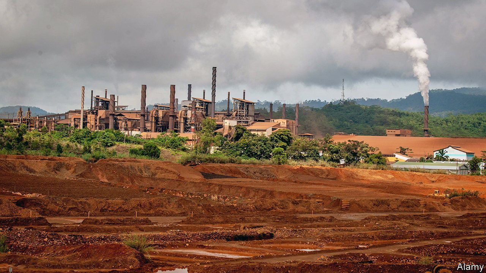
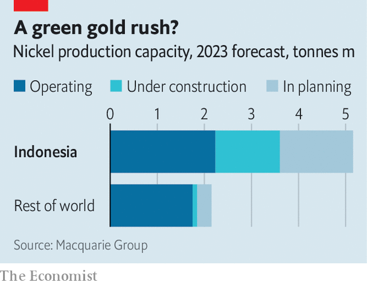

###### Digging up the jungle

# New technology could cement Indonesia’s dominance of vital nickel 

##### But harvesting the crucial metal will be bad news for the country’s rainforests 

 

> Jul 5th 2023 

Each year scientists discover an average of five new bird species. In 2013, on a trip to a remote set of islands in Indonesia, researchers found ten in six weeks—the biggest haul in more than a century. The region in question, known as Wallacea after Alfred Russel Wallace, a 19th-century naturalist, is one of the world’s biodiversity hotspots. Its rainforests host creatures found nowhere else, such as the maleo, an endangered bird that uses sunlit beaches and geothermal heat to keep its eggs warm rather than incubating them itself.

But Wallacea’s environment is rich in more than wildlife. Logging, clearance for agriculture and, more recently, the growth of palm-oil plantations have seen huge areas of forest chopped down since the middle of the 20th century. 

 


Now a new resource boom is under way. Indonesia is already the world’s biggest producer of nickel, a metal that is—among other uses—vital for building high-performance batteries. Demand for those is expected to increase hugely as demand for electric cars ramps up. Helped by new technologies for extracting nickel from the soil, Indonesia is planning big production increases (see chart). Macquarie Group, an Australian financial firm, thinks that by 2025 the country could supply 60% of the world’s nickel, up from around half today. 

Most of the world’s nickel, including that mined in Indonesia, comes from laterite ores. These, in turn, come in two sorts, limonite and saprolite. Saprolite, which contains higher concentrations of nickel, is well-suited for processing in a device known as a rotary kiln electric furnace (RKEF). This melts the ore at more than 1,500°C, producing a compound of nickel and iron called nickel pig iron (NPI), much of which is in turn used to produce stainless steel. But by injecting sulphur into the NPI to displace the iron, a higher-purity product, nickel matte, can be produced that is suitable for batteries. 

That approach has two drawbacks. The first is that it is energy-intensive. In Indonesia, that energy usually comes from coal-fired power stations built near the mines. Coal is cheap and reliable, but produces plenty of greenhouse gases. With Western electric-car makers such as Tesla keen to tout the green credentials of their products, that is a big concern. 

The more fundamental problem is that much of Indonesia’s saprolite has already been dug up and exported, mostly to China. In 2020 Indonesia imposed an export ban on what is left. But most of the country’s remaining nickel is locked up in deposits of limonite, which are not suitable for the RKEF process. 

For decades, mining firms have experimented with an alternative called high pressure acid leaching (HPAL). Instead of melting the ore, it is put in a pressure cooker-like machine and mixed with sulphuric acid, which strips the nickel out. The method works with limonite, and can directly produce the high-purity nickel needed in batteries. But it has been hard to master, with pilot plants costing far more than planned and operating well under their supposed capacity. 

Recently, though, that seems to have changed. Three HPAL plants have started up in Indonesia since 2021. Another seven (including five in Sulawesi) are under development, according to the Indonesian Nickel Miners Association. Most are built with Chinese technology. Two of the three operating plants are based on designs from China Enfi Engineering Corporation, a subsidiary of the China Metallurgical Group Corporation that operates an HPAL plant in Papua New Guinea. 

Besides their ability to process limonite, HPAL plants are greener too—at least in some ways. Without the need for high temperatures, they use much less energy than RKEF plants, and so produce less carbon. But the process also produces a great deal of toxic slurry. Known as “tailings” in mining jargon, these are difficult and expensive to dispose of safely.

There are three ways to dispose of HPAL waste: pump it into the sea (which the Indonesian government bans), store it in dams or dry the waste and stack it. For now, Indonesia’s HPAL plants dry-stack their tailings. But this requires lots of land. Given the amount of nickel the country is forecast to produce, the plants will eventually run out of room. Firms may opt to build tailings dams instead—although Indonesia’s vulnerability to earthquakes and heavy rain will make that tricky.

Even if the waste is stored properly, deforested mining land erodes rapidly, especially given the intensity of the tropical rains. Run-off from mines can contaminate rivers and lakes. As of 2022, the Indonesian government has granted over 1m hectares of mining concessions, according to the Indonesian Forum for the Environment, a charity. Almost three-quarters are in the country’s dwindling forested areas. 

Exactly how big the environmental impact will prove to be is hard to know. Very few Indonesian nickel miners make public disclosures. And while carbon emissions can, in principle at least, be counted, lost biodiversity is harder to measure. Pressure to stay as green as possible may come from further up the supply chain. From 2024, battery manufacturers in the European Union, one of the world’s biggest markets, will have to disclose the carbon footprints of their batteries. But battling climate change, it seems, will be bad news for Indonesia’s remaining rainforests. ■


