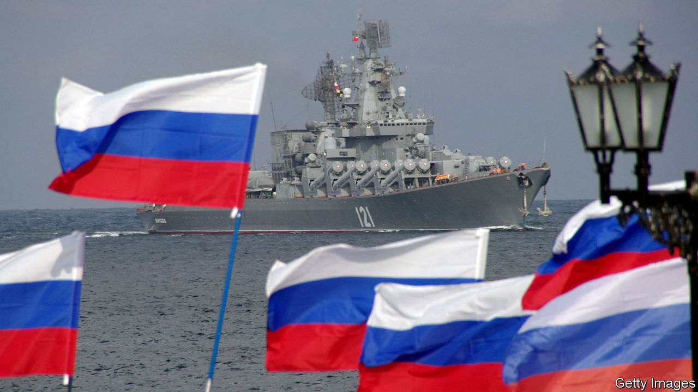
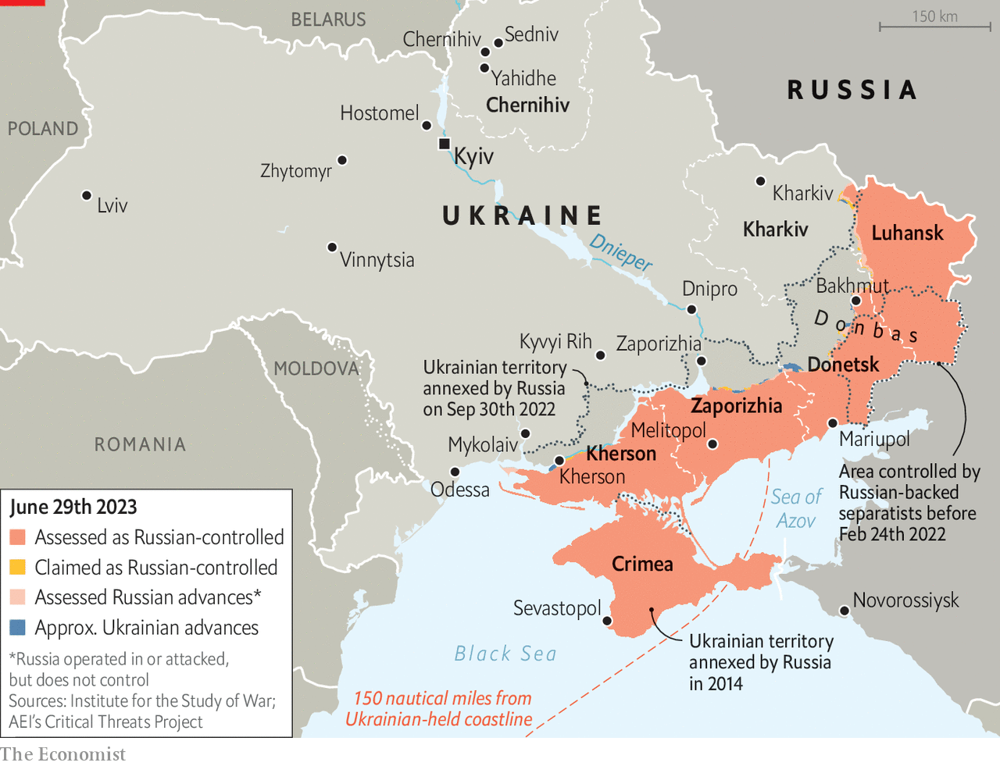

###### Naval warfare

# How oceans became new technological battlefields 

##### Ukraine has repelled the Black Sea Fleet. But naval drones may not be enough to defeat it 

 

> Jul 3rd 2023 

“LARGER FLEETS win,” says Rear Admiral James Parkin, the Royal Navy’s director of development. Out of 28 maritime battles, he says, all but three were won by the bigger fleet. When Russia invaded Ukraine last year it had around 20 warships in the Black Sea. Ukraine’s navy barely existed. On day one, it scuttled its sole frigate—a rusty Soviet-era cruiser on which this correspondent once hitched a ride to Odessa—to stop it falling into Russian hands. Yet the war at sea, like the one on land, has confounded expectations. “After the war we will certainly write a textbook,” says Vice-Admiral Oleksiy Neizhpapa, Ukraine’s navy chief. “And we’ll send it to all the NATO military academies.” 

The inflection point came on April 14th 2022, when Ukraine sank the , a Russian cruiser, the largest loss of a warship since the Falklands war in 1982. The Black Sea Fleet promptly moved back and is still 100-150 nautical miles off the Ukrainian coast, says Admiral Neizhpapa. That has lifted the threat of an amphibious assault on Odessa: anti-tank obstacles that once guarded roads have been pushed aside and soldiers sent to other parts of the front. And it paved the way for a deal in July whereby Russia agreed to let Ukraine keep exporting grain. This helps not only Ukraine, 70% of whose pre-war trade went through the Black Sea, but also grain-importing countries of the global south.

There was nothing revolutionary about the  operation. “To me, it shows the importance of proper land-based anti-ship missiles, sea mines and good intelligence,” says Niklas Granholm of FOI, Sweden’s defence research agency, “all put together in a coherent operational concept.” Luck played a role: atmospheric conditions might have let Ukraine’s radars see unusually far. So did Russia’s ineptitude. Just as its massive tank losses were down to poor tactics, not technological change making armour obsolete, so the  is a cautionary tale of getting the basics right.

 


Being hit is one thing; failing to control the subsequent fire is another. “Damage control remains a key metric against which professional naval standards should be assessed,” concludes Alessio Patalano of King’s College London. “On the day of the sinking I was confronted by army colleagues: this must surely be the end of the idea of building big warships?” recalls Rune Andersen, chief of the Norwegian navy. “I said no: it’s the end of having a 40-year-old warship which hasn’t been updated and without trained crews.” A newer warship with better air defences and a sharper crew might have parried the Ukrainian missiles.


The maritime contest is in stalemate. Ukraine has achieved “sea denial” near its coast, stopping Russian ships coming close. But Russian warplanes roam freely, preventing Ukrainian naval vessels from coming out. The result is a “grey area” of 25,000 square kilometres in the north-west Black Sea in which neither side can “move freely”, says Admiral Neizhpapa. Russia’s Black Sea Fleet squats in relative safety, imposing a distant blockade and frequently lobbing Kalibr cruise missiles at Ukraine. Ukraine has good intelligence on the fleet’s movements thanks to America and Britain, which are fusing data from satellites and surveillance aircraft. But it lacks missiles with sufficient range to hit what it sees. That has forced it to turn to other means. 

A striking feature of the war has been Ukraine’s use of uncrewed surface vessels (USvs), essentially drone boats, to reach Russian-controlled territory. In October and November these were deployed alongside aerial drones to attack Sevastopol, headquarters of the Russian Black Sea Fleet, and an oil depot in Novorossiysk, a Russian port. Other attacks have followed, including an apparently successful hit on an intelligence ship near the Bosporus on May 24th. These carry on a long tradition of naval raiding. 

Iran-backed Houthi rebels used a USV to strike a Saudi frigate in 2017. America tried drone boats as early as the 1940s. But modern electronics, powerful artificial intelligence and ubiquitous satellite communications—in Ukraine’s case via Starlink—have made possible sleek USVs that are less conspicuous on radar and have the ability to navigate over long distances and find targets. Ukraine cannot match the Black Sea Fleet on equal terms. But it can chip away at its ports and logistics.

“Drones are very important elements of our warfare right now,” says Admiral Neizhpapa. “The warfare of the future is a warfare of drones.” He adds that Ukraine is learning by doing. “No other country has as much experience using naval drones.” Whether that will be enough to break Russia’s blockade is another question. A raid on Sevastopol in March seems to have been repelled, with one USV blocked by a boom and two others destroyed by machineguns. Not every USV will get through. But the technology is proving itself on another, murkier front of the naval war.

On September 26th 2022 explosions ripped through the Nord Stream 1 and 2 gas pipelines from Russia to Germany via the Baltic Sea. The culprits remain unknown. But the incidents underscored the vulnerability of underwater infrastructure to sabotage. Russian reconnaissance of cables and pipelines is decades old, well-resourced and growing in intensity, according to American and European security officials.

In April a Scandinavian documentary unveiled details of a fleet of Russian ships, disguised as fishing trawlers and research vessels, operating in the North Sea. One of those ships, the , was tracked near seven wind farms off the British and Dutch coasts during a single trip. When journalists approached, they were greeted by masked gunmen. 

Protecting every inch of cable or pipeline is impossible, concede naval officials. But drones are part of the answer. After the Nord Stream attacks, European governments urgently wanted to map out potential threats. Admiral Andersen says Norway reached out to private companies working offshore in activities such as oil and gas. “We found an industry with a huge sense of responsibility and a willingness to contribute.”

Within days he had 600 advanced undersea drones, some remotely operated and others autonomous. Working with Britain, Denmark, Germany and the Netherlands, these scanned “every inch” of gas infrastructure over 9,000 square kilometres, before moving on to power and data cables. The project showed how technology that once seeped from the military into the civilian world can now move in the other direction. On February 15th NATO established a new critical undersea infrastructure co-ordination cell to encourage such defensive co-operation.

Offence is another matter. The paradox is that the countries helping Ukraine to build such systems—often in deep secrecy—and providing it with the intelligence necessary to use them effectively, such as up-to-date maps of Russian jamming, are themselves constrained in their ability to develop the same technology at home. “The things that a British company funded by British taxpayers’ money and cohered by British military officers can do in Ukraine I cannot do in the UK because peacetime regulations forbid it,” laments Admiral Parkin.

European maritime authorities do not want drones wandering off course into civilian waters. That prevents navies from training and experimenting as boldly as they might. Pity the ambitious admiral. “We’re at a bit of a moment in uncrewed surface vessels in particular which is equivalent to the man with a red flag walking in front of a motor car.”■ 

