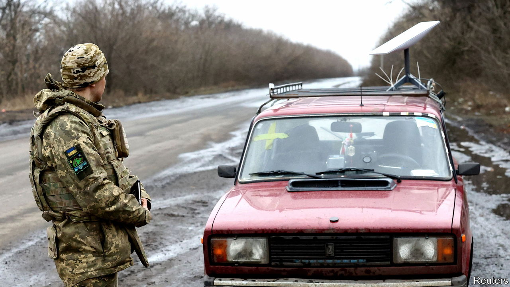
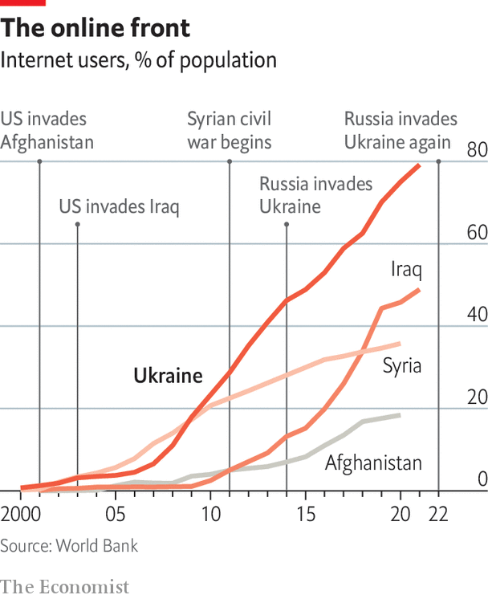

###### Total war

# Technology is deepening civilian involvement in war 

##### Another chapter in our special report on the future of warfare considers the big legal questions raised by the fusion of civilian and military activity 

 

> Jul 3rd 2023 

EARLY IN THE war 20 Russian fuel tankers rolled into Sedniv, a small town in Chernihiv province, north of Kyiv. “The locals called us,” says Major-General Viktor Nikolyuk, commander of Ukrainian forces in the north, “and said: what should we do?” His answer was simple: “Drain them.” Locals on horses and tractors, carrying bottles, barrels and teapots, siphoned off fuel with the cry of —glory to Ukraine. The general could hardly believe it when another round of tankers appeared shortly afterwards. Those, too, were relieved of their cargo.

Small wars are fought by a country’s armed forces. Total wars are waged by entire nations. Civilians have played a huge role in the defence of Ukraine. When Ukrposhta, Ukraine’s national postal agency, held a competition to design a stamp, the winning entry depicted a tractor towing away a captured Russian tank—one of the war’s most iconic images. When Kyiv was under threat, civilians mixed Molotov cocktails to hurl at invading armoured vehicles. Volunteers have raised money for vehicles and drones. The Serhiy Prytula Foundation, a civilian charity, even bought a satellite for the army. “Kyiv has placed cross-society resistance at the heart of its national defence,” writes Hanna Shelest of Ukrainian Prism, a think-tank. 

Not uncommonly for total wars, the civilian-military distinction has broken down. “A huge role was played by the local population,” says General Nikolyuk. Locals hid mobile phones from Russian troops and revealed the location of their equipment by dropping virtual pins on Google Maps (a dedicated government app, eVorog, now offers a way for civilians to pass on intelligence). Colonel Oleh Shevchuk, commander of Ukraine’s 43rd artillery brigade, and Serhiy Ogerenko, his chief of staff, speaking to , a newspaper, say civilians helped correct artillery fire, even using their own commercial drones. 

 


Colonel Shevchuk says that, if his men knew that Russians were near a particular village but were unsure precisely where, they would open Google Maps, find a local shop and cold-call it. “Good evening, we are from Ukraine! Do you have any [Russians] about? Yes. Where? Where? Behind Grandma Hanna’s house. Which house is that? Well, everyone knows her! So you talk to people a little bit and work out where everything is.” On one occasion, he says, a petrol-station owner offered the password to its surveillance camera, giving the army a live view of a Chechen column heading for Kyiv.

Digitally enabled popular resistance on this scale would have been largely impossible 15 years ago. Jack McDonald of King’s College London points out that, when America invaded Afghanistan in 2001, less than 1% of the local population had access to the internet. In Syria in 2011, when a civil war was already under way and mobile-phone footage of combat became widespread, the rate was still only 22%. When Russia invaded Ukraine in 2014 it had reached 46%. When it did it again last year the figure had shot up to almost 80%. “What you’re seeing in Ukraine,” he says, “is what’s going to be standard.”

This connectivity and the proliferation of smartphones that rely on it has accelerated and transformed an older form of civilian-military collaboration, familiar from the resistance networks of occupied France in the second world war. For some time, says General Sir Jim Hockenhull, Britain’s chief of defence intelligence at the outset of the invasion, armies tried to make every soldier and platform a sensor. “What’s happened is that so many people have become sensors.” The result, he says, is a crowd-sourced “civilian sensor network” that has proved “really, really important”. 


The civilian network is not just for sensing. On February 26th, two days into the war, Mykhailo Fedorov, Ukraine’s deputy minister, publicly appealed to volunteers to conduct cyber-attacks against Russian businesses and government departments. The result was the IT Army of Ukraine, a group of nearly 200,000 volunteer hackers. Mr Fedorov asked hackers to target Russian state agencies, state-owned firms and banks. 

Civilian involvement extends beyond Ukraine’s borders. By providing connectivity through its Starlink satellites, SpaceX has become an integral part of the Ukrainian army’s kill chain. Satellites operated by ICEYE, a Finnish firm, provide detailed radar images of Russian military positions. Ukraine’s Delta app, essentially a live map which fuses military intelligence from different sources, is hosted on cloud servers abroad, points out Keir Giles of Chatham House, a think-tank.

Who is fighting whom?

This growing “civilianisation of the digital battlefield”, as Kubo Macak, a legal adviser at the International Committee of the Red Cross (ICRC), calls it, has legal consequences. ICEYE satellites may be legitimate military objectives, legal experts say. Since Delta is facilitating combat operations, Russia would consider its cloud servers abroad to be “valuable targets”, suggests Mr Giles. The IT Army’s activities have prompted serious misgivings among scholars of international law and cyberspace. 

A core principle of international humanitarian law is that armed forces must discriminate between combatants and non-combatants. But if civilians are building drones, hauling military gear over the border from Poland, reporting on troop movements through apps and correcting artillery fire over video chat, do they become legitimate military targets? The Geneva Conventions lay down that civilians lose protection “for such time as they take a direct part in hostilities”. But what this means is hotly disputed.

The ICRC says direct participation must involve actions that deliberately affect military operations in favour of one side. That is a high bar. Experts agree that civilians who just answer questions do not meet the threshold. Colonel Shevchuk’s phone calls would not automatically implicate those who pick up. Moreover, most intelligence passed on by apps is “too general or insignificant to meet the threshold of harm criterion,” argues Mr Macak. A civilian would have to gather and transmit information “as part of a co-ordinated operation for the purposes of a specific attack”. But flying a drone to correct shellfire would surely qualify. 

One lesson is that connectivity is increasingly a vital military resource. The Taliban long ago tore down mobile-phone towers to stop Afghan villagers sending tip-offs to security forces. Mexican drug cartels now use signal-jamming equipment. General Nikolyuk says that civilian assistance was less forthcoming in Kharkiv and Donetsk in the east because Russia had disrupted mobile-phone networks in those areas.

All this presupposes that armies are making good-faith efforts to discriminate between civilians and soldiers—that they care about the laws of war. If Ukrainian civilians have so often been willing to jeopardise their status as non-combatants, it may be because Russia’s army has shown scant regard for such niceties. General Nikolyuk recalls Russian troops establishing a headquarters in a school in Yahidne, a village south of Chernihiv. Hundreds of locals were imprisoned in the basement. On another occasion in nearby Lukashivka, he says Russian soldiers, spotting a Ukrainian drone, forced women and children to walk down the street as human shields. “What do you do in such cases? You bite your fists with impotence and that’s it.”■

