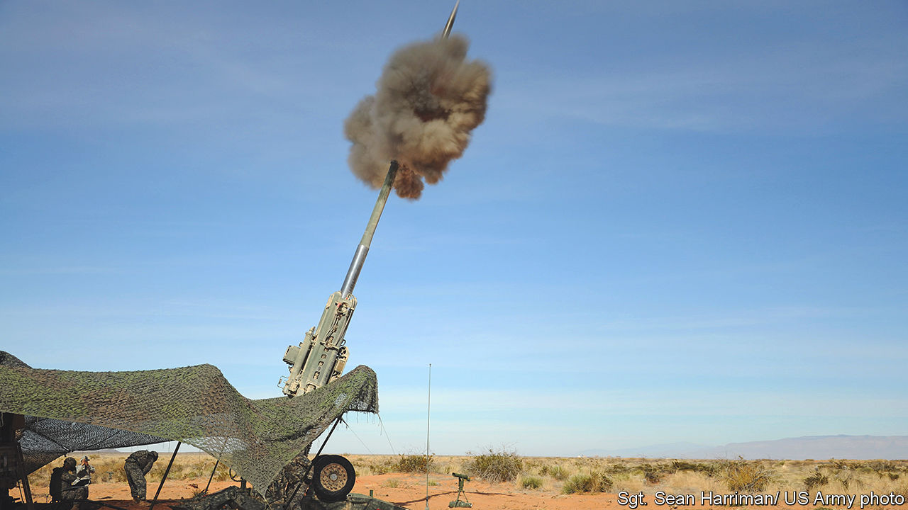

###### Electronic warfare

# The latest in the battle of jamming with electronic beams 

##### Jamming is knocking drones and missiles out of the sky 

 

> Jul 3rd 2023 

WHEN UKRAINIAN gunners began firing Excalibur precision-guided shells early in the war they were cock-a-hoop. Ordinary shells required many rounds to hit their targets, even if you knew precisely what you were aiming at. Excalibur, guided by GPS, appeared to be a silver bullet: one shot, one strike. But in March 2023 something changed. Excalibur shells began falling out of the sky or failing to destroy their targets. And not just one: weeks went by without registering a successful hit. It was an unsettling reminder of how the electronic war in Ukraine has profoundly affected the visible one.

If modern warfare rests on three pillars—ever-more powerful sensors to detect targets, increasingly precise munitions to hit them, and networks that connect the two— can chip away at each. Excaliburs were probably dropping like flies because Russia was turning on powerful jammers that disrupted the GPS signals guiding them to their targets or, more likely, the radar fuze that tells them when to explode. They were not the only weapons to be discombobulated in this way.

Leaked Pentagon documents from the spring show that four out of nine Ukrainian air strikes with American-supplied JDAM-ER bombs may have missed their targets because of Russian GPS jamming. “[Russian] jammers are a high priority,” read one slide, “and we will continue to…recommend that those jammers are disrupted/destroyed…to the maximum extent possible.” GMLRS, the precision-guided rockets fired by American HIMARS launchers, have also increasingly missed targets or failed to achieve their desired effects. The airwaves in Kyiv and Moscow are thick with jamming as both sides seek to deflect drones and missiles.

This sort of electronic warfare (EW, in the lingo) is not new. It probably began in 1904 during the Russo-Japanese war. Although the shells of that era were dumb—the radar proximity fuze was 40 years away and GPS satellites more than 70—the age of radio had arrived. An enterprising Russian radio operator in Port Arthur drowned out transmissions from a Japanese warship that was helping correct naval gunfire. During the second world war, the so-called battle of the beams saw Britain jam and deceive radio signals used by German bombers to navigate to their targets. And as air power grew in importance through the cold war, finding and jamming the emissions of air-defence radars became vital. 


Russia was long believed to excel at this. It invested heavily in new EW vehicles a decade ago and battle-tested many in Ukraine in 2014 and then Syria in 2015, often causing disruption to civilian airliners. But its latest invasion of Ukraine offers a more mixed picture. Russian EW was “highly effective” in some areas, concludes the RUSI think-tank. Ukrainian jets initially found that their communications, navigation and radar were all disrupted and in some cases knocked out. The disruption to Excalibur has disturbed some Western officials. But Russia’s land and maritime capabilities have been “lacklustre”, argues Thomas Withingon, an expert analyst of EW. “Our [pre-war] assessment of Russian EW capability was at the pessimistic end of the range,” agrees Edward Stringer, a retired air marshal in Britain’s Royal Air Force. “Russian EW is eminently beatable.”

It may not always feel like that to a drone operator. Ukraine sometimes loses as many as 10,000  in a single month. Around half of those losses are directly caused by electronic attack, according to Andriy (not his real name), a senior officer in Ukraine’s general staff. Jamming often blocks the control signals used to fly a drone remotely or the communication link needed to send data. Operators can get round this by telling a drone to fly a preset route and downloading data when it returns, but that delays targeting by hours. And it does not resolve the core problem: that most drones are lost when their GPS signal is disrupted, causing them to wander off. 

This creates a stark trade-off for defenders. Military drones (and missiles) can be fitted with special receivers that read “M-code” signals from American GPS satellites. Those signals are higher powered than civilian GPS and encrypted, making them both easier to pick up and harder to jam—about eight times harder, says Dana Goward, president of the Resilient Navigation and Timing Foundation, a non-profit in Virginia. But M-code receivers are subject to export controls and pricier. Electronic shielding costs money and adds weight. Ukraine’s drone fleet is mostly cheap to the point of being easily disposable. 

That is changing, albeit slowly. Ukrainian officials hope to phase out the Chinese DJI consumer drones that are ubiquitous on both sides of the front line in favour of more professional platforms. “One of the takeaways from Ukraine is that having any unencrypted radio link is no longer a choice,” says Mr Withington. “If you’re NATO, you need to encrypt everything.” Even then, M-code would offer only “marginal” benefit, cautions Mr Goward, because the technology is now nearly two decades old and GPS signals are inherently weak. 

Being weak is not the same as being unusable. Western armies have long worried that Russia’s electronic blitz might counter their technological advantage. “Electronic warfare is the great leveller,” wrote Major-General Charles Collins, assistant chief of the general staff in the British army, in a recent paper. “By depriving forces of connectivity, it drives armies back to the 20th century.” Yet that has not proved true in Ukraine. 

In truth, jamming is imperfect and intermittent. One reason is that EW systems are scarce. Russia has been forced to keep some at home to protect cities and bases. Another is that using them comes at a price. Big jammers emit a powerful signal, making them conspicuous targets. Russia has had to pull many of its best ones farther to the rear, says one official. This leaves gaps to exploit. America is providing Ukraine with cuts, or maps, of electromagnetic activity—essentially, the location of jamming and the frequencies used—32 times a day, says T.J. Holland of America’s XVIII Corps. That is a boon to Ukrainian drone operators. 

Jamming the jammers

It is not the case that EW has cut off all communications, either. Russia has failed to knock out the Starlink terminals that give Ukraine’s army near-universal internet access via communication satellites. One reason is that a Starlink beam is extremely narrow —you have to get within 100-200 metres to spot it, says Andriy. Russian EW vehicles also seem incapable of jamming Starlink radio frequencies or the SINCGARS tactical radios that America has supplied to Ukraine, says Mr Withington.

If Russian EW has frequently fallen short, at times it has also been too powerful for its own good. A paper by Justin Bronk and his colleagues at RUSI describes “serious electronic fratricide”. Two days into the invasion, Russia had to scale down ground-based jamming because it was hindering the Russian army’s own communications. That is one reason why Ukrainian air-defence radars could be turned back on, causing Russian warplanes to be downed in significant numbers by March 2022. Moreover, Russian jets flying in pairs found that EW pods on one interfered with the other’s radar. In effect, they could choose between jamming incoming missiles or having a functioning radar. 

There are other ways to defeat EW. Drones that have GPS jammed can resort to terrain matching: comparing images of the ground below to a stored map. The technique dates to the 1950s and is used by many cruise missiles, like America’s Tomahawk. But modern algorithms and computing power allow it to be done with remarkable precision, at lower cost and on a tiny chip.

GPS can also be supplemented with signals from communications satellites in low orbit (like Starlink), ground-based transmission sites (like Russia’s Loran system) and even magnetic-field navigation, suggests Mr Goward. And as weapons increasingly morph into explosive computers, the line between EW and cyber-attacks is blurring. Andriy, the Ukrainian officer, says Ukraine often inserts malicious code into Russian drones mid-flight.

EW is ultimately a game of cat and mouse. Russia and Ukraine both seek “electromagnetic supremacy”, says Mr Withington, but neither can achieve it for good. “Control will ebb and flow throughout the battle.” Jammers will find a way through; defenders will eventually plug the gap. America helped fix the problems with JDAM-ER by ensuring that the bombs acquired a good GPS signal before leaving the plane, according to leaked documents. Excalibur is now hitting its targets again, says a Western official. “In EW, things change very fast,” says Andriy. But the battle must be waged. “In this war, we see that if you do not dominate this domain, you will not be effective in other domains.”■

