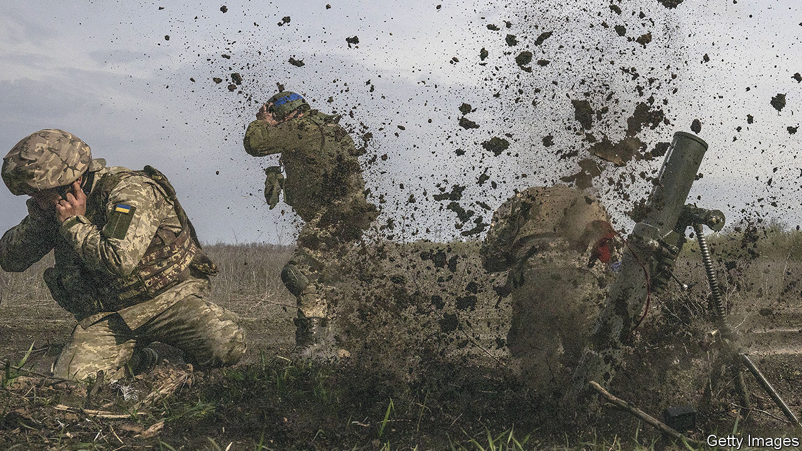
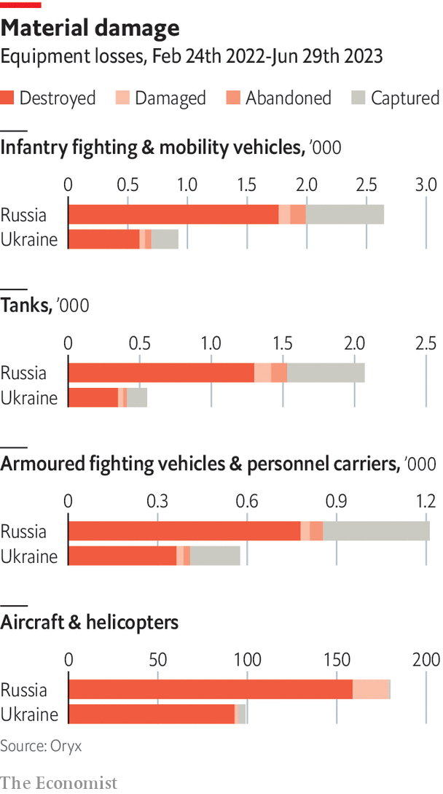

###### Lessons from Ukraine

# The war in Ukraine shows how technology is changing the battlefield 

##### But mass still counts, argues Shashank Joshi in the first of seven chapters of a special report on the future of warfare 

 

> Jul 3rd 2023 


IN THE 1970s Soviet generals realised that America, with its lead in microelectronics, was racing ahead in the development of long-range precision weapons, sensors (such as satellites) to spot targets, and networks to connect the two. They gave this a grand name: the “reconnaissance-strike complex”. Operation Desert Storm, America’s swift and easy triumph over Iraq in 1991, seemed to offer further proof of the concept. Why duke it out over trenches when you could paralyse the enemy with pinpoint strikes on command posts and logistics deep behind the front lines? American thinkers hailed a “revolution in military affairs”, or RMA.

Even hard-nosed armies like the Israeli Defence Forces agreed. “Future wars, its senior commanders believed, would no longer include major manoeuvres of massed formations,” wrote Eado Hecht, a lecturer at Israel’s staff college. “The conquering of territory was deemed irrelevant and even…counter-productive.” Azerbaijan’s victory over Armenia in 2020 seemed to confirm the dominance of precision weapons over ground forces. “We have to recognise that the old concepts of fighting big tank battles on the European landmass are over,” said Boris Johnson, Britain’s prime minister, in November 2021. “There are other, better things we should be investing in [such as] cyber—this is how warfare in the future is going to be.” Three months later Russia invaded Ukraine.

The ensuing war has been a lesson in old-style attrition: an industrial-scale contest of manpower, steel and explosives. Russia is thought to have had over 200,000 casualties, killed and wounded. That is four times the number of Soviet casualties in Afghanistan, a war that lasted for a decade. It is two and a half British armies. More than 20,000 Russians died between December 2022 and April 2023 alone, say American sources, most of them in or around Bakhmut, a previously inconsequential town in eastern Ukraine. Not since Iran’s ruinous siege of Basra in 1987 has an army expended so much, in such a short time, for so little. 

Ukraine, too, has bled badly. Leaked American intelligence reports in late February suggest that it has suffered over 100,000 casualties itself, including more than 15,000 killed. The pre-war armies of both Russia and Ukraine have been annihilated and created anew, filled out with conscripts and volunteers with little or no military experience. Many of those in the vanguard of Ukraine’s current counter-offensive will have had just a few weeks of training. Some European countries, like Finland, would be able to mobilise many troops in short order, if put in a similar situation. Most, having abandoned conscription, would not.

 

Comparisons with the first world war are overheated: Britain alone fired over 200,000 shells a day in the week before the Somme offensive in 1916, compared with Ukrainian estimates of 60,000 at Russia’s peak rate of fire last summer. But ammunition consumption has far outstripped both pre-war expectations (causing artillery barrels to melt) and production capacity, exposing gaping holes in the West’s industry. “Munitions are like cement,” writes Jonathan Caverley of the US Naval War College. “Consumers do not always need them but require massive amounts when they do.” Ukraine’s counter-offensive would be impossible without an influx of shells from South Korea.

This orgy of indecisive human and material destruction over a trench-scarred landscape is not what military technologists had in mind when they talked up the RMA. The war’s quintessential weapon, artillery, would be familiar to a Napoleonic soldier. “What blunted the Russians north of Kyiv,” says Jack Watling of the Royal United Services Institute (RUSI), a think-tank, “was two brigades of artillery firing all their barrels every day.” Ukraine serves as a rejoinder to the idea that technology always trumps mass: that quality can replace quantity. General Sir Patrick Sanders, head of the British army, put it acerbically last year: “You can’t cyber your way across a river.”

But the paradox of the war is that mass and technology are intimately bound together. Even the artillery war shows this. Weeks before the invasion, America sent Ukraine Excalibur shells. Inside each was a small, rugged chip that could receive GPS signals from America’s constellation of navigation satellites. Whereas Russia often relied on barrages over a wide area, Ukrainian gunners could be more precise. Such rounds were “disproportionately effective”, noted a study published by Mr Watling and his colleagues at RUSI, drawing on data from Ukraine’s general staff. Not only did they take out targets more reliably; they reduced the number of shells needed, lowering the logistical burden (shells are heavy). 


Enter the drones

 are at the heart of precision fire. The idea of correcting shellfire by aerial observation dates from the American civil war, when balloons were used for the job, notes Richard Barrons, a retired British general. Drones which returned film by parachute were employed from the 1970s, he says. By the 1980s these could send back data in real time, if the drone remained in the right line of sight. Now the skies are thick with them: during the battle for Bakhmut there were 50 up at any one time. Around 86% of all Ukrainian targets are derived from drones, says T.J. Holland, the top enlisted soldier in America’s XVIII Airborne Corps. 

In the first six months of the war, Russian artillery units that had their own drones, rather than relying on those from headquarters, could strike targets within three to five minutes of detecting them. Those without drones took around half an hour—with lower accuracy. The drones are essentially disposable: around 90% of those used by the Ukrainian armed forces between February and July 2022 were destroyed, according to RUSI. The average life expectancy of a fixed-wing drone was approximately six flights; that of a simpler quadcopter a paltry three. A more recent study says Ukraine is losing 10,000 per month.

 


For years, the West’s armies have aspired to a way of war in which a cornucopia of “sensors” (video cameras, thermal imagers, radio antennae and so on) would detect targets, pass data to the best-placed “shooter”, whether a howitzer, missile or warship, and create a “kill chain”—or, to use a newer buzzword, a “kill web”—of unprecedented speed and efficiency. This was the vision of the Soviet reconnaissance-strike complex and the RMA: a transparent and semi-automatic battlefield. Ukraine is not yet that. But it is a test bed for the technology, and a tantalising glimpse of the possible. 

Consider a drone filming a Russian position. If the operator spots a Russian tank, he can manually mark its location on Kropyva, a Ukrainian-built app, sharing its position with every artillery battery in the area. That system, sometimes dubbed Uber for artillery, has brought engagement times down from tens of minutes to a couple, often the difference between success and failure. Such digital links between sensors and shooters are being refined further.

Drones are collecting vast amounts of video footage, running to petabytes per hour. They cannot send it all back: there is not enough bandwidth, and communications are often jammed. The work must be done “on the edge”, meaning on the drone itself. An increasing number of Ukraine’s drones have “fairly rudimentary AI capability” aboard, says a European general. Small, low-powered chips can work out whether an object below is a T-72 or a T-90 tank, a job that could once have been done only on a distant cloud server. The drone can transmit a few kilobytes of essential information—say, the type of target and its co-ordinates—even if its communications are intermittent. 

This digitisation of hardware reflects a collision of old and new ways of war. Much kit Ukraine has received is vintage, such as American  or Soviet missile launchers designed before the Cuban missile crisis, or is stripped of sensitive components. Ukraine is pioneering “the ability to turn it from a dumb piece of cold-war metal into something that’s genuinely networked and part of this algorithmic warfare,” says a foreign adviser in Kyiv. “It is maddening,” noted James Heappey, a junior British defence minister, that “I am providing to the Ukrainians…capability that we’re still years away from getting in the British armed forces.”

Information is everywhere. Ukraine’s access to Starlink, a constellation of satellites in low-Earth orbit launched by Elon Musk’s SpaceX, an American firm, means that the lowliest soldiers have connectivity and intelligence that might once have been confined to brigade commanders. No complex equipment is required. In the corner of a smart Kyiv restaurant, a Ukrainian soldier flips open a Macbook and shows this correspondent a live feed of the battlefield, complete with Russian jets on the move.

The Delta app, developed by tech-savvy volunteers, combines everything from drone feeds to information gleaned from Russian social media. It is integrated with America’s National Geospatial-Intelligence Agency, so users can pull up images from commercial satellites (though not the most sensitive ones). This allows data streams to be combined in clever ways. A battalion might use American radio-frequency satellites to detect emissions from a Russian radar in a general area, and then send a cheap Chinese-made drone on a one-way mission to pinpoint its location. 

At the tactical level, Russia has waged a form of networked warfare. After a sluggish start, it now uses computerised command and control to knit together drones and artillery batteries. It also has good human intelligence (ie, spies) and satellites of its own. But the war has shown that intelligence is not enough: you also have to use it well. Russia’s air force failed to pick off Ukraine’s air defences in the first days of fighting not just because of poor training and preparation, but because it took two days, and sometimes longer, for Russian military intelligence to send target information to a command centre in Moscow and onwards to warplanes. The targets were typically long gone by then. Even now, 16 months on, the Russian army struggles to find and strike moving targets. 

Ukrainian planners, in contrast, waged “data-driven combat” at a level of “speed and precision that NATO has not yet achieved”, concludes a report by Nico Lange, a former chief of staff at Germany’s defence ministry. Sometimes that has been down to tools like Kropyva and Delta. Firms such as Palantir, an American tech company, have used cutting-edge AI to help Ukraine find high-value targets. But data-driven warfare can be quietly prosaic, too. A Ukrainian police officer explains that last year his units were locating Russian troops simply by intercepting 1,000 conversations a day (the figure is now higher). If they found a general, the details were shared in an ad hoc WhatsApp group. “We were connected to the people who were literally bombing.” 

This speed and precision has consequences for tactics. “We’re going to fight under constant observation and in constant contact,” says General James Rainey, head of the US Army’s Futures Command. “There is no break. There is no sanctuary.” One response is to resort to century-old methods. Trenches and fortifications run for hundreds of kilometres across eastern Ukraine. Camouflage is another tactic, though it is getting harder as sensors are combined: a thermal blanket might confound an infrared camera, but radar satellites will pick up subtle tyre tracks leading to a concealed position. The best way of surviving, says RUSI, is simply to disperse and move more quickly than the enemy can spot you. Even Ukrainian special forces operating in small teams can be found by Russian drones if they stay in one place for too long.

This jeopardy is reflected in a curiously sparse battlefield. In Ukraine some 350,000 Russian troops are arrayed on a front line stretching 1,200km (750 miles)—around 300 men per km and, at times last year, less than half that. That is around a tenth of the average for the same area in the second world war, notes Christopher Lawrence, head of the Dupuy Institute, which collects such data. Battalions of several hundred men fill areas that would once have been covered by brigades of a few thousand. 

In theory, says Mr Lawrence, this seems a ripe environment for attackers. Thin front lines are easier to break through. And new sensors, more accurate munitions and better digital networks make it easier to find and strike targets. The catch is that attackers must concentrate their forces to pierce well-defended front lines, as Ukraine is now trying to do with its counter-offensive. And such concentrations can be detected and struck—not always, but more often than in the past. “At this time,” concludes Frank Hoffman of the National Defence University in Washington, “a shift in favour of the defender is evident in ground warfare just as it was in the days of Helmuth von Moltke the Elder, when the firepower revolution of the late 19th century made massed formations and manoeuvre prohibitively difficult.” 

The result is a paradox. Precision warfare can counter some advantages of mass: Ukraine was outnumbered 12 to one north of Kyiv. It can also complement mass. Software-based targeting saves around 15-30% in shells, according to sources familiar with the data. But what precision cannot do, says Michael Kofman of the Centre for Naval Analyses (CNA), a think-tank, is substitute for mass. The idea behind the Soviet reconnaissance-strike complex or America’s RMA was to win by paralysing the enemy, not wearing him down. But there seems to be no escape from attrition. War on the cheap is an illusion. Many people expected Russia’s invasion to be “a second Desert Storm”, says Andrew Krepinevich, an American defence official who pioneered the idea of the RMA in the 1990s. “What we got was a second Iran-Iraq war.” 

This special report focuses on the military lessons, especially for the West, from the war. These include logistics, civil defence and naval warfare. Russia, too, is learning lessons. The place to begin, however, is with a technology that threatens to blunt some of the advantages of drones and precision: electronic warfare.■

