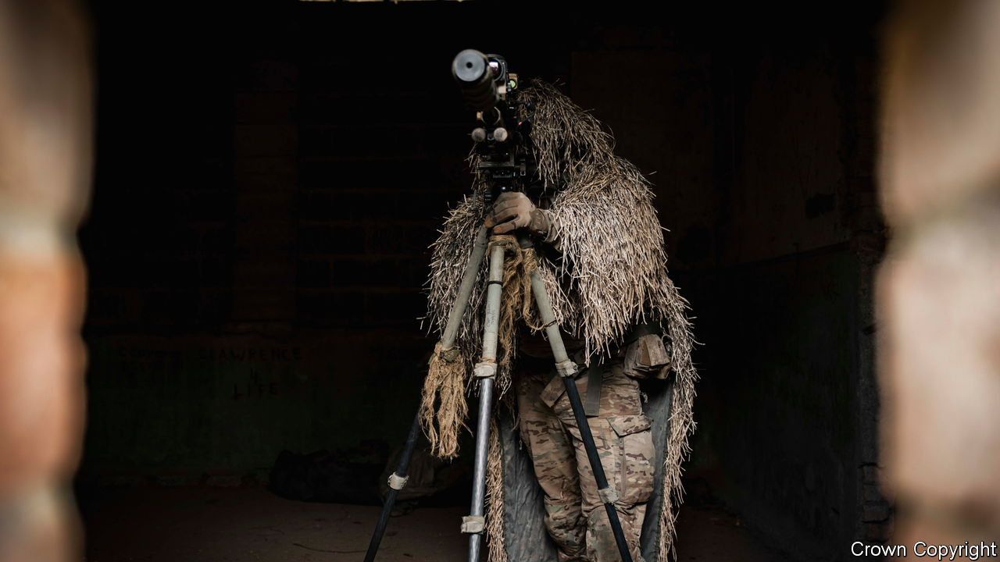

###### Best practice

# Western armies are learning a lot from the war in Ukraine 

##### Ukraine is teaching armies to think, train and plan differently 

 

> Jul 3rd 2023 

SALISBURY PLAIN in England is a far cry from Zaporizhia. But—briefly—Russians are here. A battalion from the British Army’s parachute regiment plays Task Force Hannibal, a unit that mimics Russian doctrine. They face battalions from the Royal Irish and Gurkha regiments. The “Storm Wessex” exercise imitates conditions in Ukraine: precise firepower, the “pervasive stare” of sensors and jamming galore. The visual and electronic signatures of each unit are shown to commanders. In the control centre, a satellite image shows the radar-reflecting corrugated-iron roof of a defensive position: the lesson, it is better to use wood. Engine exhausts are covered to hide from infrared cameras. Voices are hushed to evade acoustic sensors. 

Soldiers learn by failing. In round one a battlegroup uses high-frequency radio. The source is located and wiped out. In round two troops communicate securely. Hannibal sends a drone to investigate. The group’s camouflage is sub-par and it is destroyed again. In round three the group is quiet, concealed and its sentry shoots down the drone. That is a mistake: Hannibal rains fire on its last recorded position. By round five the defenders have wised up to use decoy electronic emitters. “By doing this,” says an officer, “our young leaders are learning in a much more visceral way.” 

Western armies are busily identifying what lessons they can find from Ukraine. Every two weeks the British army collects data from the battlefield and from Wiesbaden in Germany, a hub for supporting Ukraine. A “Russia-Ukraine Insights Hub” led by Rear Admiral Andrew Betton has written a highly classified 70-page report. “It’s reinforcing some age-old lessons,” says the rear admiral. “Resilience is one of the core strands that comes out of our work: the resilience of your military, the resilience of your industrial base, but fundamentally the resilience of your society.” 

It is still early to draw firm conclusions. The urban grind of Bakhmut differs from armoured thrusts. Tactics that work one month fail the next, as people adapt. And a war on the European steppe between two Soviet-legacy armies differs from a future air and sea war in the Pacific. But some principles are emerging. 

First, the modern battlefield can be an unsparing place. Modern sensors can see things with unprecedented fidelity. Modern munitions can hit them with unprecedented precision. Artificial intelligence, whether on board a drone or in a corps hq, fuelled by torrents of data, can identify and prioritise targets with unprecedented speed and subtlety. But Western armies are not optimised to master these technologies. America’s years-long procurement cycle is “fine for tanks or helicopters”, says T.J. Holland of America’s XVIII Corps, but “too slow to keep up with the pace of cyber”.

Need to keep moving

Second, armies that want to survive must disperse, hide and keep on the move. Camouflage and deception are back in vogue. Headquarters must shrink in size, frequently change location and mask their radio emissions. “I haven’t met a soldier who hasn’t learned something from our Ukrainian partners,” says Major-General Chris Barry, director of the British Army’s land-warfare centre. “The way they dig their positions…it drives [our] standards up.” One official notes that Ukrainian troops, having learned the hard way to minimise electronic signatures, do not switch their mobile phones on even in the English countryside.

Fitness still matters. The need for “constant movement” will be brutal on troops, observes General James Rainey of the us Army’s Futures Command: “What are the effects on the humans operating at that kind of tempo?” An attack that would once have required a three-to-one numerical advantage over the defender might now require nine-to-one, he says, for soldiers will not have time to rest. 

Third, technology is pushing firepower and intelligence further down the chain of command. A platoon with access to Ukraine’s Delta app, loitering munitions and Starlink terminals can see and strike targets that would once have been the preserve of higher echelons. “This journey of combining arms is getting lower and lower,” says General Barry, pointing to Russia’s failure to seize an airfield north of Kyiv on the war’s first day. “The defining act at Hostomel, the destruction of the first aircraft that really unpicked the Russian assault, was probably done by an individual with a phone, a Stinger [missile] and a drone.” 

This has many implications. It will complicate logistics: how do you push food, ammo and medical care to a larger number of smaller units that are increasingly spread out? It will change recruitment and training: soldiers need more initiative, technical knowledge and skill. It is also an opportunity. Armies once had to concentrate forces in one place to achieve mass. Now they can deliver the same effect in a decentralised way. The us Marine Corps, which is pushing precision weapons down to squads of 13 people, is reorganising itself on these principles. 

There is a fourth lesson, too. Technology can make war more efficient. But if both sides have the technology, even a highly efficient war is likely to involve enormous costs in blood, metal and treasure. Armies without the size and depth to absorb losses and remain viable on the battlefield may find that no amount of digital wizardry or tactical nous can save them.■

