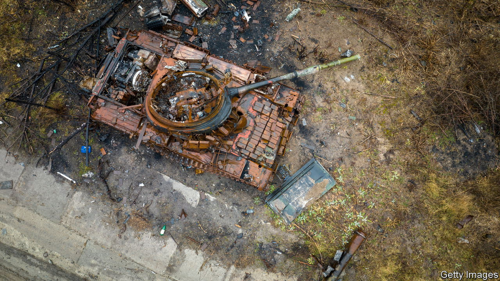

###### Military logistics

# Why logistics are too important to be left to the generals 

##### Russia’s invasion shows how war can hinge on logistics 

 

> Jul 3rd 2023 

THE ISRAELI historian Martin van Creveld called armies “ambulant cities”. Keeping hundreds of thousands of armed men fuelled, fed and equipped is a Herculean effort. Sending them to war without regard for such things can go badly wrong. Russia’s invasion of Ukraine in February 2022 offers a cautionary tale. In the first days of the war Russian troops flooded south from Belarus with inadequate food, fuel or ammunition. Military convoys clogged up the roads to Kyiv—including a remarkable 60km (37 miles) traffic jam north of the capital. Ukrainian drones, special forces and artillery tormented the slow-moving invaders. Unarmoured fuel trucks and other logistics vehicles were especially juicy targets. In a battle south of Chernihiv, says a general, “They thought they had us surrounded…we just cut off all the logistics for them and that’s it.” The unit was destroyed with .

Such foul-ups revealed deeper problems. All modern armies use two approaches to logistics, explains Ronald Ti, a military logistician at King’s College London: “pull” logistics, which involve responding flexibly to consumption and demand signals by units in the field, and “push” logistics, in which ammo and material are dispatched based on predetermined rates of use. Russia relies on the second, says Dr Ti, largely because of a Soviet legacy of top-down command and a lack of modern supply-chain management. That works well if consumption is stable. It rarely is—as the first days of the war in Ukraine showed. 

Western armies tend to have high “tooth-to-tail” ratios, with as many as ten support personnel for every combat soldier. Russia has fewer. Like the Soviet Union, it relies on moving fuel by pipeline and other material by rail. That can be highly efficient: Russia’s army managed to shift and fire a cumulative total of 700,000 tonnes of shells and rockets in the first five months of the war. But it ties the army to railheads and large depots nearby. That has turned out to be a problem. In the spring of 2022 Russian shellfire was grinding down Ukraine’s army in the eastern Donbas. Russian guns out-pounded Ukrainian batteries by three to one. That changed when Ukraine acquired American HIMARS launchers and European systems capable of firing rockets precisely over 70km. Suddenly it could hit Russian fuel depots and ammo dumps well behind the front lines. Many had not budged since 2014. 

The ensuing bonfire of supplies starved Russian guns of ammo. It forced Russia to switch from big, centralised depots to smaller, dispersed ones farther from the front. The longer distances to haul heavy shells, plus a paucity of trucks, pallets and logisticians, threw grit into the wheels of Russia’s military machine. Ukrainian officials say this paved the way for successful offensives in Kherson and Kharkiv. Nico Lange, a former German defence official, says that a Ukrainian soldier chalked up this success to understanding Russia’s logistical weaknesses: “It’s basically like fighting ourselves from ten to 15 years ago.” 

Ukraine is not immune to such problems. Many of its arms depots were blown up in the years before the war in suspected Russian sabotage. Others have been struck since. Its army also relies on railways. But its supply lines have proved more reliable, agile and resilient—helped by the fact that it is fighting on its own soil. Mr Lange points out that Ukraine’s rail-based logistics depend on domestic steel and metal industries, which provide a ready stock of parts and tools, and a rapid repair capacity. Old locomotives and transport cars have been pulled out of storage. “It is probably no exaggeration to state that no European NATO state today would be capable of military logistical achievements like those of Ukraine during this war,” he concludes.

One lesson is that logistics are too important to be left to the generals. Some 30 flights a day land in Rzeszow, in eastern Poland, carrying military aid for Ukraine. It is sent on overland to depots around the country, where military units get it to the front line. This has been a joint effort by the state, private sector and civil society, says a Ukrainian minister closely involved. About 90% of it is financed by the private sector, he says, with money and vehicles coming from agricultural firms, energy companies with petrol stations, and banks. Close co-operation with Poland means that paperwork at the border for arms shipments takes minutes—a degree of frictionless cross-border military movement that would be the envy of many NATO members. 

The problem is keeping the weapons going once they arrive. Steven Anderson, a retired American general who oversaw logistics in Iraq, says that the “operational readiness rate” for equipment there was 95%. Anything below 90% would get a commander pulled up in front of bosses. In Ukraine anecdotal data suggests it is only around 50%, he says. “Half of what we give them is broken at any given time and they’re struggling mightily.” For much of the war, Ukraine’s exhausted artillery pieces have been sent to eastern Europe to fix. Since the autumn, more can be repaired in Kryvyi Rih, an industrial city near the southern front. But its capacity is limited. Mr Anderson complains that less than 4% of American aid has been allocated to support and maintenance.

The rush to improvise

One result is improvisation. A scramble for spares is part of every war. During the Falklands war Britain raided aviation museums around the world for refuelling probes for Vulcan bombers. Ukraine’s challenge is acute: it operates what is probably the most diverse arsenal of artillery and armour anywhere. Each system requires different ammo, spare parts and skills. And each is working more intensively than its manufacturers expected. Repair kits designed for moderate use have proved completely unsuitable for barrel-melting, gun-shaking barrages.

That is forcing Ukraine to pioneer new forms of wartime sustainment. Ukrainian volunteers are 3D-printing spare parts in buildings a few hours’ drive from the front. Key to this is decentralisation. Individual brigades often find their own parts rather than asking the general staff’s logistics command. “They just go to the garage,” says one source familiar with the underground supply chain, “and say: I need this piece. Can you do it?” Separately, America’s Airborne XVIII Corps is using algorithms to estimate the barrel life of Ukrainian howitzers, when they need spare parts and when fresh munitions must be pushed to the front.

 America has grown used to sustaining wars thousands of miles away with scant threats to ships, planes and trucks carrying supplies to ports, airfields and depots. Those days are over. “Decades of wargaming, analysis, and empirical evidence suggest that attacking [American] logistical dependencies…is the most effective way of fighting the United States,” concludes Chris Dougherty, a former Pentagon planner, in a paper. Chinese attacks on logistics have “paralysed” American forces in war games, he says. He urges the Pentagon to shift money from combat forces to logistics. Armies need to position more stocks forward and “live off the land” to acquire fuel, lubricants, food and spare parts locally. Troops must fight on their own for weeks with minimal support, he adds.  have long had “second-class status”, he says, despite a “starring role” in military history. Ukraine shows that anew. ■

