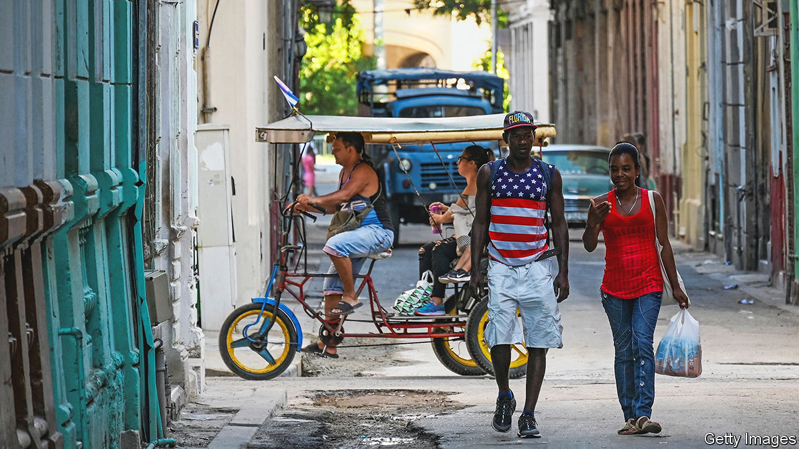

###### The worms return

# Cuba’s Communist government taps the diaspora for cash 

##### The government makes it easier for exiles to visit, and spend dollars 

 

> Jul 6th 2023 

Soon after the Cuban revolution in 1959 Fidel Castro, its leader, began damning people who fled as  (worms). The name came from the cylindrical bags into which the emigrants stuffed their belongings. In the four decades that followed the revolution more than 1m Cubans left the country. Castro was not entirely sorry to see them go. Better for malcontents to leave the island than to make trouble at home, he reckoned. These days  send back to Cuba some $2bn-3bn in cash a year, 2-3% of GDP. But the government has punished exiles. It has allowed only those with Cuban passports to visit the island and has charged high fees to let them keep those documents. 

The exodus has grown recently as living conditions have worsened and political repression continues. Last year emigration hit a record. The US Customs and Border Protection agency estimates that more than 306,000 Cubans—more than 2% of Cuba’s population—crossed the United States’ southern border in 2022. Cuba’s government has now decided to be nicer to . On July 1st its foreign ministry adopted rules that make it easier and cheaper for Cubans abroad to return. It extended from six to ten years the validity of their passports and cut in half the renewal fee for Cubans living in the United States (to $180). It has scrapped a passport-maintenance fee, which was payable every two years. 

Cuba is changing these rules because its economy is in dire shape. The pandemic, combined with restrictions imposed by the United States on travel and remittances, has shrunk receipts of foreign currency. The number of tourists is a quarter of what it was in 2019. A decline in foreign countries’ demand for Cuban doctors and nurses has reduced the island’s income. Energy shortages have hurt domestic production. The government has not liberalised foreign trade and entrepreneurship enough to speed up growth, expected to be just 1.5% this year. Prices of goods on the black market have soared. Last week the peso’s black-market exchange rate hit 200 to the dollar, matching an all-time low. 

And so the government is seeking ways to tap the diaspora, which includes 3m people in the United States, for extra cash. According to the Havana Consulting Group in Miami, the 113,000 Cubans who visited the island between January and April this year spent more than the 500,000 Canadians who came in the same period. Cubans rent cars and spend freely in restaurants and shops and on beach holidays with family members living on the island. They also bring medicines, bathroom staples like toothpaste and appliances Cubans can’t buy at home. Alongside the new migration rules, the government is relaxing restrictions on imports of these products. It would “rather stimulate the existence of an informal market” than liberate the private sector, says Emilio Morales, head of the Havana Consulting Group. 

Cubans will be glad of the extra toothpaste. But  cannot cure the economy or provide freedom. ■

