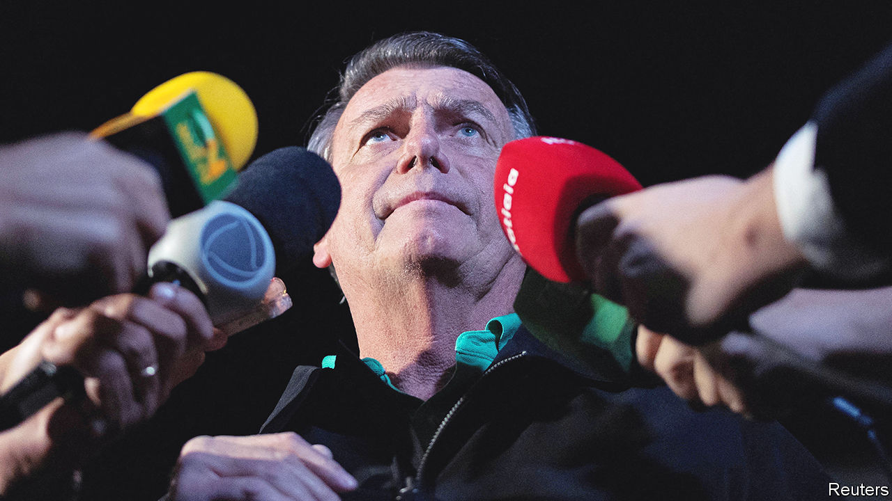

###### Dumping the Trump of the tropics

# Jair Bolsonaro is barred from office for eight years 

##### What the followers of Brazil’s far-right former president do next will be crucial for the country 

 

> Jun 30th 2023 

ON JUNE 30TH Brazil’s highest electoral court barred Jair Bolsonaro, who was the country’s president until the end of 2022, from holding public office for eight years. A populist of the far right who had little respect for democracy, he has now been cast out of electoral politics for undermining public trust in the integrity of Brazil’s voting system.

In July last year he invited dozens of foreign diplomats to the presidential palace to watch a slide show in which he asserted that Brazil’s voting machines were unreliable. Mr Bolsonaro repeatedly made the same baseless claim during the presidential campaign, which he lost narrowly to Luiz Inácio Lula da Silva, a left-winger. The pow-wow with diplomats was broadcast live on public television and social media. Mr Bolsonaro denies wrongdoing, saying that the meeting served no electoral purpose. But a majority of electoral-court justices ruled that he had abused his powers and misused state media. 

Their decision removes from active politics a figure who in the past five years has disrupted and redefined it. An obscure congressman but a social-media virtuoso, Mr Bolsonaro became a standard-bearer for Brazilians enraged by corruption, hostile to the left, supportive of traditional family values or nostalgic for the military dictatorship of 1964-85. He was the surprise winner of the presidential election in 2018. In office he attacked the press and the judiciary, spread falsehoods about the covid-19 pandemic, in which 700,000 Brazilians died, and encouraged deforestation in the Amazon. He revels in the epithet “Trump of the tropics”. On January 8th this year supporters of Mr Bolsonaro who believed his claim that he had won the election stormed Congress, the Supreme Court and the presidential palace.

What happens now to , when its leader cannot be on a presidential ballot until 2030 at the earliest, is a crucial question for Brazil. His movement may not need him to survive. Some of the attitudes he represents will remain prominent in political competition, becoming a crucial element in a right-of-centre force that had little importance until Mr Bolsonaro came along. But it’s possible that under other leaders it will moderate, becoming less of a threat to democratic norms and institutions than its founder was. 

If that is what happens, Brazil will have ended an episode of right-wing populism more easily than the United States has done. There are at least three reasons why it might. First, Brazil’s courts are nimbler. The power of its electoral tribunal is unparalleled in the democratic world, says James Gardner of the University at Buffalo in New York state. Whereas in most countries administrative agencies organise elections and separate courts try violations of electoral law, Brazil’s tribunal does both. That speeds up decisions and makes appeals difficult. (Mr Bolsonaro is expected to appeal against his political ban at the Supreme Court but is unlikely to succeed, in part because the membership of the two courts overlaps.) 

Second, unlike the United States Brazil has a recent history of removing presidents from office and imprisoning former presidents. Lula himself spent 19 months in jail on corruption charges before his conviction was overturned in 2021. Brazil’s constitution says that candidates who misuse their power and resources can be made temporarily ineligible for office. A law from 2010 bars from running for office temporarily people convicted of crimes by a panel of judges. The United States has no such prohibitions at the federal level. 

Finally, Mr Bolsonaro does not have the sort of backing from a political party that Donald Trump enjoys. Mr Trump can credibly threaten to blow up the Republican Party by running as an independent and thus bring it to heel, says Filipe Campante of Johns Hopkins University. Brazil has many more parties than does the United States (19 are represented in Congress). Mr Bolsonaro has belonged to at least nine. Legislators who share his ideology are not always loyal to him, preferring pork to principle. They have voted for some of Lula’s most important economic initiatives. 

Another reason for Mr Bolsonaro’s subdued exit may be that he lacks Mr Trump’s survival instinct. In an interview days before the ruling, a journalist from , a newspaper, asked him how he felt about the trial. “What can I do about it?” he shrugged. Soon after his election loss Mr Bolsonaro decamped to Florida, where he remained for three months. Since returning to Brazil in March, he has been conspicuously absent from politics. He has not ruled out returning to the United States, where, he boasted, a real-estate company had offered him a job as its pitchman.

His supporters, so far at least, seem equally deflated. Few  came out to protest against the court’s decision. The army, which played a prominent role in Mr Bolsonaro’s government, has shown little inclination to defend him. As he was slandering the electoral system, the United States warned Brazil’s army that military co-operation would suffer if it did not respect the election result, according to the (Brazil gets equipment and training from the American army.) Brazil’s army thought: “let’s leave all the problems with him” and stay in the barracks, says Emilio Peluso of the Federal University of Minas Gerais. 

Yet Mr Bolsonaro’s ideas are not going away. A recent poll showed that a quarter of the electorate call themselves , compared with 29% who back Lula’s Workers’ Party. Some polls show that young voters disapprove of Lula more than older ones. During Mr Bolsonaro’s ascent politicians representing the interests of agribusiness, gun owners and evangelical churches increased their representation in Congress. Today the agribusiness lobby has 347 of the 594 seats in both houses, up from 280 in 2018. His military-tinged authoritarianism may not outlast him, but conservative social mores and pressure to exploit the Amazon rainforest will continue to have political force. 

What effect that has will depend in part on who, if anyone, inherits his movement. Two relatively moderate governors seem to be the strongest candidates. Tarcísio de Freitas, the governor of the state of São Paulo, Brazil’s largest and richest, is today the most popular politician of the right. Mr de Freitas, who was infrastructure minister in Mr Bolsonaro’s government, is a half-hearted disciple. In December he said he was not a “at root” and was seen joking around with Alexandre de Moraes, the electoral court’s president. He even praised Lula for his fast response to deadly floods in São Paulo in February. Mr de Freitas has good relations with business and is seen as a competent manager and skilful political operator. Although some  regard him as a traitor, the ex-president is more emollient. In the  interview, Mr Bolsonaro called Mr de Freitas an “excellent manager”. 

Another possible heir is Romeu Zema, the Thatcherite governor of Minas Gerais, a rich south-eastern state. Mr Zema, a scion of a family with a retail empire, rose to power during the anti-establishment wave in 2018. Without ever having held public office he defeated two experienced politicians to win the governorship. He supported Mr Bolsonaro in both 2018 and 2022, but was quick to recognise Lula’s victory. Mr Zema may have stronger reasons than Mr de Freitas to run for the presidency next time: term limits prevent him from running for governor of Minas again. 

There are less reassuring possibilities. Even barred from office Mr Bolsonaro could remain a disruptive force and the de facto leader of the opposition. Whether that happens may depend in part on the course of numerous other investigations. The electoral court alone is considering 15 other cases of alleged campaign violations. Other courts are looking into questions such as whether he falsified covid-19 vaccination records for members of his family and inner circle; failed to declare millions of dollars worth of diamonds given to his wife by the government of Saudi Arabia; and incited the mob on January 8th. He denies wrongdoing. 

A younger disrupter could take his place. Nikolas Ferreira, a 27-year-old congressman, gun enthusiast and social-media celebrity, could be a contender. In last year’s election he won more votes than any other congressional candidate. Mr Bolsonaro has hinted that his wife could become his political heir. Meanwhile two of his sons are in the legislature.

Whether  in its most virulent form remains a threat to Brazil’s stability will depend largely on luck and the conduct of the current government. If the economy stagnates or another huge corruption scandal emerges, Mr Bolsonaro himself could return to full political strength, thinks Bruna Santos of the Brazil Institute of the Wilson Centre, a think-tank in Washington. He need not be on the ballot to be a menace to his country. ■


