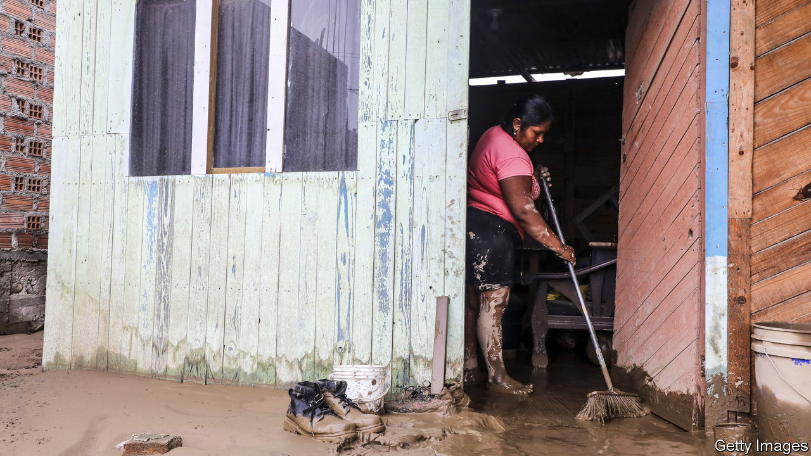

###### Little boy blues

# This year’s El Niño will hit Peru especially hard 

##### The economic costs are higher and longer lasting than previously thought 

 

> Jul 6th 2023 

WINTERS IN LIMA, Peru’s capital, are dreary. By now the city is normally enveloped in a cold mist. This year, though, daytime temperatures are around 21°C (70°F). Ice-cream sellers are still doing brisk business at Lima’s beaches. “Will there be a winter this year?” ask headlines in local newspapers.

Probably not. Forecasters expect much of Peru to remain warm this year. The eastern Pacific is getting hotter, especially off the coast of South America. On July 4th the World Meteorological Organisation announced the onset for the first time in seven years of El Niño, a warming in the Pacific that affects global weather. Near Peru, a “coastal El Niño” started in March. Sea-surface temperatures have been more than 2.3°C above normal in recent weeks, twice as much as in other parts of the Pacific. This comes after three straight years of La Niña cooling events, which may have helped trap heat below the ocean’s surface.

Not all Peruvians are enjoying the change as much as the frolickers on Lima’s beaches. This year the warming Pacific brought a cyclone for the first time in more than two decades. Downpours flooded neighbourhoods in cities on the northern coast. In the regions of La Libertad and Lambayeque the amount of rainfall at three measuring stations broke records in March. In the Andes mountains landslides stranded towns. At least 99 Peruvians died and 50,000 lost their homes.

Then came the worst outbreak of dengue in Peru’s history. Puddles, pools and emergency drinking-water stores provided breeding grounds for the mosquitoes that spread dengue, which can cause internal bleeding and organ failure. More than 160,000 people have been infected and at least 213 have died so far. The outbreak has overwhelmed poorly equipped hospitals. At least 25 children reportedly died because the hospitals could not provide paediatric intensive care. A wetter, warmer Peru is likely to bring more mosquitoes, and so more dengue. 

El Niño (the little boy) got its name in the 17th century from Peruvian fishermen who noticed warmer water and smaller catches, normally around Christmas time. It has been disrupting life along the coast for millennia. Some pre-Columbian people in what is now northern Peru coped by settling on higher ground. Their irrigation systems made use of floodwaters during the wet years while storing water for use during droughts. 

Present-day Peruvians seem less adaptable. Although it is illegal to build homes and businesses on flood plains and in the path of seasonal rivers, they do so anyway. Elected officials look the other way. After flooding caused by the coastal El Niño of 2017 the government launched a $7bn programme worth 3% of gdp, later doubled, to rebuild and provide protection. Even so, many of the same areas were flooded again. The local press reported that only a fraction of the money was spent on flood prevention, and that regional authorities failed to use all of the money available. “We had six years to prepare and we did nothing,” says Patricio Valderrama-Murillo, a geoscientist and El Niño expert, “not even basic things like installing drainage systems in cities flooded again and again.”

El Niño is hurting the economy. This year’s flooding destroyed irrigation canals and could bring locusts, rats and plant diseases to farm regions, authorities warn. Warm water will drive away anchovies, the raw material of Peru’s massive fishmeal industry. The central bank’s governor expects that El Niño will reduce GDP growth by 0.5 percentage points this year and by 0.6 points in 2024. 

El Niño events probably cost more and have longer-lasting effects than have previously been estimated, especially for coastal tropical countries like Peru, according to a recent study by academics at Dartmouth College in New Hampshire, published in , a journal. Because of El Niño events in 1982-83 and 1997-98, Peru’s gdp in 2003 was 10% lower than it would have been, the authors found. 

Peru’s rainy season, when the damage from El Niño is likely to be greatest, resumes in five months. That gives the government time to take measures to protect lives and infrastructure. It will have to do much more to avert future disasters. Lima’s care-free beaches are also an alarm. ■


