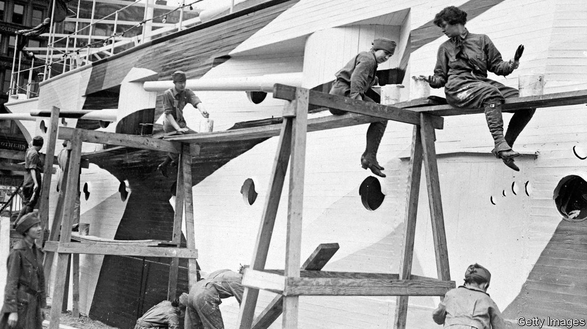

###### The Economist explains

# Can Russia’s navy thwart attacks by repainting its ships? 

##### Old-fashioned deception has new benefits in an age of AI and drones 

 

> Jul 3rd 2023 

ON JUNE 22ND the , a Russian warship, was spotted in Sevastopol, a Crimean port on the Black Sea, sporting a striking new paint job. Its bow and stern were black and the midsection white, ensuring that, from a distance, the ship looked smaller than it really was. According to H.I. Sutton, an independent defence analyst, three other Russian ships in the Black Sea Fleet have been similarly redecorated. Why?

Camouflaging vessels at sea is notoriously difficult. Attempts at full concealment have proved fruitless; at best, ships can be made slightly harder to make out at long range. But during the first world war Britain and America began to deploy  to help protect their boats. Rather than hiding their ships, they aimed to confuse the enemy. 

Norman Wilkinson, a British artist, developed so-called “dazzle” camouflage, the most widely adopted scheme. He suggested painting ships with intersecting geometric shapes in bold contrasting colours. When viewed through a periscope—at the time, submarines were the biggest threat to warships—Wilkinson’s irregular pattern broke up the outline of the vessel, making it harder for the enemy to judge its shape and direction of travel. Submarine commanders needed to calculate the right amount of lead time when firing a torpedo into a moving ship’s path; any errors induced by the dazzle could cause the torpedo to miss. (The effectiveness of the method is still disputed.)

The second world war saw the introduction of other paint schemes. These included the American Navy’s “Measure 32”, which, as with the , used patches of light and dark to make it hard to tell a ship’s true size, especially in poor visibility. The goal was to make it hard to distinguish aircraft-carriers, battleships and other high-value targets from cruisers and smaller vessels. 

Naval camouflage largely died out after the war. Radar superseded visual observation, and submarines used sonar to detect their targets. But recent developments have seen a revival in visual-deception techniques. Since Russia’s invasion in February 2022 Ukraine has attacked its vessels in the Black Sea with uncrewed surface vessels (USVs):  that are used for kamikaze attacks. A remote human operator typically guides the USV using video feed from a camera on the bow. 

The new paint jobs on Russian ships like the are almost certainly designed to confuse USV operators. Ukraine has carried out  at high speed, giving operators just a few seconds to identify targets. A deceptive paint scheme might reduce their chances of picking out a warship among nearby cargo vessels and support ships.

Mr Sutton notes that the camouflage may also make Russian ships harder to monitor by satellite. Some tracking systems, especially in the commercial sector, rely on artificial intelligence (AI) to identify vessels; they might also be fooled by unusual paint, especially when the images are of low quality. 

Human analysts are less easily deceived. But this may matter less in future. So-called “adversarial examples,” which introduce changes that are invisible to a human but cause AI to misidentify an object, are already in use. It may take more than a lick of paint to stop drone boats. But thinking carefully about deception tactics remains worthwhile. ■

