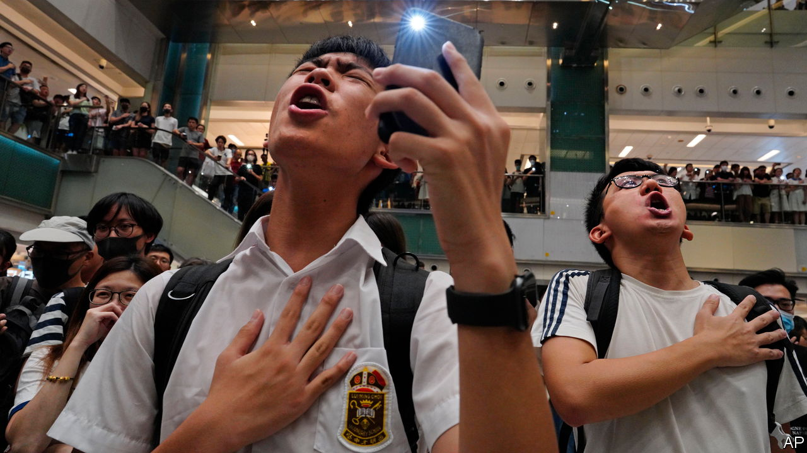

###### The Economist explains

# Why Hong Kong is criminalising a song 

##### And what it means for global tech platforms that allow people to stream it 

 

> Jul 5th 2023 

ON JULY 5TH Cheng Wing-chun, a 27-year-old Hong Konger, became the first person in the territory to be convicted of insulting China’s national anthem. Mr Cheng posted a 94-second video to YouTube of a local athlete receiving a gold medal at the Tokyo Olympics in 2021, in which he substituted “March of the Volunteers”, China’s national anthem, with “Glory to Hong Kong”, a popular pro-democracy anthem. His conviction is a sign of things to come: Hong Kong’s government wants to silence the song for good. A civil injunction, filed by the territory’s Department of Justice (DoJ) in June, is pending. If it is granted— which it probably will be—the melody, lyrics and any adaptations of “Glory” will be banned; disseminating it will become illegal. Even whistling the tune could get Hong Kongers in trouble. Why are Hong Kong’s authorities clamping down on “Glory” now—and what will be the implications of the ban?

The catalyst was a series of gaffes. In March officials at the Ice Hockey World Championship in Bosnia and Herzegovina—who had searched for “Hong Kong national anthem” online—mistakenly played the catchy Cantonese tune instead of China’s anthem. It was the fifth such blunder at an international event in the past year. Hong Kong’s government demanded that Google demote “Glory” in its search results. But the tech giant refused, saying that there was no evidence that the song was illegal. The DoJ is now attempting to force its hand. 

The ban would be the latest blow to freedom in Hong Kong. Since the national-security law was passed in June 2020, protest, free speech and local independent media have been smothered. Authorities show no sign of loosening their grip. On June 4th, more than 20 people  the Tiananmen Square massacre of 1989 were detained. On July 3rd the government  of HK$1m ($128,000) for information leading to the arrest of any of eight pro-democracy activists and former lawmakers now thought to be residing in America, Australia and Britain. (Their adopted countries are unlikely to give them up.) People have been arrested for trivial acts, such as carrying a mobile phone with a sticker of a forbidden slogan or owning “seditious” children’s cartoons. Using the national-security law to lock people up over a song is further proof of the government’s thin-skinned insecurity. 

All this is worrying for the international businesses that Hong Kong has attempted to woo back since the end of the territory’s covid-19 lockdown. The plan to ban “Glory” puts tech firms who host it on their platforms in a tight spot. Hong Kong’s national-security law asserts jurisdiction over anyone in any country—of any nationality—deemed to have broken the law even if they have never visited the territory. Meta, the parent company of Facebook, Instagram and Whatsapp, said that between July 2020 and June 2022 it had been forced to remove content globally on 50 occasions because of Hong Kong’s laws.

A DoJ representative said the injunction against “Glory” would target those who were trying to incite secession or sedition, or to violate the national-security law, rather than the “world at large”. But the writ cites 32 YouTube links that could be deemed “seditious”. If it is granted, tech giants will be forced to choose between global censorship of the song—opening them up to criticism from the West—or exposing their offices and employees in Hong Kong to raids, or even arrests. The anthem—which briefly topped local charts after the writ was filed—has already disappeared from Apple Music and Spotify. Spotify claims it was removed by the artist. ■

