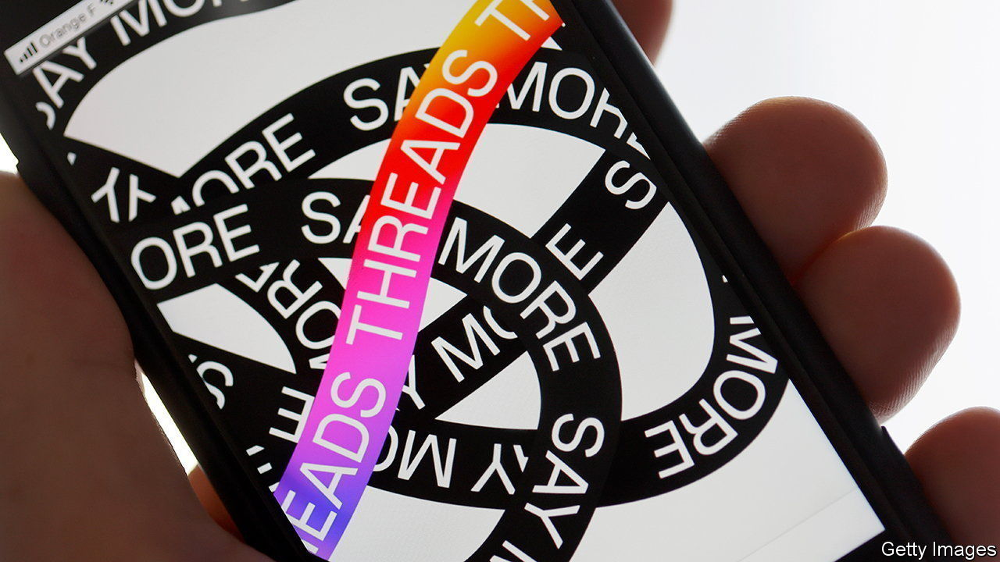
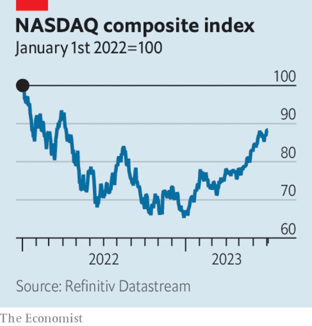

###### The world this week

# Business 

#####  

 

> Jul 6th 2023 

Meta unveiled , a text-based conversation app that it is promoting as a more “friendly” social-media rival to Twitter. Threads is linked to Instagram, one of Meta’s existing social-networking sites, allowing its young base of users to switch easily between the two. With Twitter becoming ever more erratic under Elon Musk’s stewardship, Threads could be an existential threat to the platform. Some 10m people signed up to Threads in the first seven hours, according to Meta. 

 


 stockmarket valuation closed above $3trn for the first time. The company’s share price has risen by nearly 50% this year, as investors bet on dizzy growth in iPhone revenues. Tech stocks in general have rallied after last year’s rout. The  composite has gained 32% since the start of 2023, its best first-half of a year since 1983. A handful of companies are driving the rally, notably Nvidia, which makes chips for use in artificial intelligence. Its stock is up by almost 200% this year. 

 share price is also soaring. The maker of electric cars delivered 466,000 vehicles between April and June, up by 83% from the same three months last year and a company record, and produced 480,000. Underlining the phenomenal demand for electric vehicles , a Chinese rival to Tesla, sold 700,000 electric and plug-in hybrids in its most recent quarter, its best ever for sales. 

Alef Aeronautics, a startup backed by a VC investor in Tesla and Space X, received an airworthiness certificate from the Federal Aviation Administration for its Model A , the first time such a vehicle has obtained US government approval to fly. Alef aims to start selling its fully electric car, which can take off and land vertically as well as drive on roads, by the end of 2025. 

Political bias

A federal judge in America imposed a temporary injunction on government officials talking to social-media companies about removing content that comes under the purview of  (not including criminal or terrorist themes). The case, which has not been finally resolved, was brought by the states of Louisiana and Missouri. The judge, who was appointed by Donald Trump, said it was “telling” that it was mostly conservative views that the government sought to scrub from social platforms. 

 KSE 100 stockmarket registered its biggest gain in 15 years, after the government secured a $3bn short-term bail-out from the IMF. The deal gives Pakistan breathing room as it tries to avoid defaulting on debt repayments. Its foreign reserves have dwindled, leaving some businesses unable to pay for imports. 

China slapped export curbs on gallium and germanium, materials that are used to manufacture . The decision was taken on grounds of national security but is seen as retaliation for Western sanctions on Chinese technology. The restrictions were announced shortly before Janet Yellen, America’s treasury secretary, was due to visit China for talks. 

Pan Gongsheng was named the new political chief of central bank, and is expected to soon take over the job of governor. Mr Pan, a former senior fellow at Harvard, has been a deputy governor since 2012 and was in charge of managing the country’s vast foreign-currency reserves. Observers think it unlikely that he will change the bank’s cautious approach to economic stimulus, at least for now. 

 central bank left its benchmark interest rate on hold at 4.1%, which surprised some economists. The bank raised the cash rate in June and sent out hawkish signals about further increases. At this week’s meeting the rate-setters suggested that they wanted to evaluate the effect of previous increases, but didn’t rule out more tightening in the future. 

Saudi Arabia and Russia took additional steps to lower  in the hope of boosting prices. The Saudis are extending a cut of 1m barrels a day until the end of August and the Russians are making an additional “voluntary” reduction of 500,000 b/d. Prices didn’t rise much in response. Brent crude has been trading around $72 to $76 a barrel since early May. 

In  Reliance Jio, part of the Reliance conglomerate run by Mukesh Ambani, the richest man in Asia, launched a basic internet-connected phone for 999 rupees ($12). The cheap “feature” device will lower the cost of a 4G phone for the 250m Indians who still use 2G, enabling them to tap mobile-payment services. 

The fashion for travel

Travellers to Japan may never again have to worry about packing a business suit or cocktail dress. Japan Airlines has rolled out a new service whereby passengers can  before they board via an app. The sets of clothing will cost up to ¥7,000 ($49). Unfortunately for bigger customers, the clothes come mostly in only small, medium and large.

