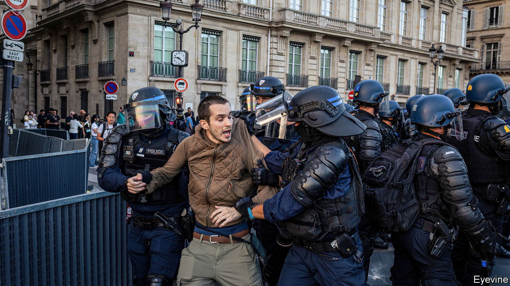
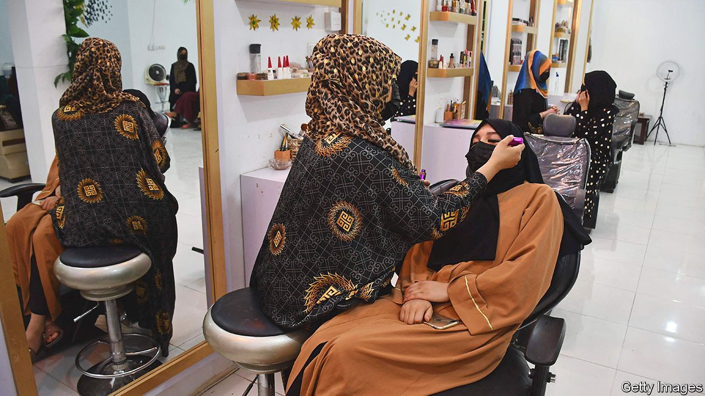

###### The world this week

# Politics 

#####  

 

> Jul 6th 2023 

Emmanuel Macron held a meeting with mayors from municipalities in  that were hit by a week of rioting. The violence started after police shot dead a teenager of Algerian descent for driving away from a traffic stop. The ensuing riots spread from Paris to most cities across France, even spilling over to Belgium and Switzerland. More than 4,000 rioters were arrested; their average age was just 17. The government promised to help rebuild the more than 2,000 businesses that were attacked by looters. The French president told the mayors that “We all want a lasting, republican order.” 

The  is still actively recruiting mercenary troops to fight in Ukraine, according to press reports. That would contradict the agreement that Wagner reached with the Kremlin following a recent aborted mutiny. , Wagner’s leader, who supposedly went to Belarus as part of the agreement, is now in St Petersburg, according to the Belarusian dictator, Alexander Lukashenko.

Russia said it shot down five drones over the suburbs of , the third drone attack on Russia in two months. No one was injured. Vnukovo International Airport was closed as a precaution for a short time.

 extended Jens Stoltenberg’s term as secretary-general by a year. He was supposed to step down on October 1st, but the military alliance can’t settle on an alternative for the job and have decided to stick with the continuity that Mr Stoltenberg brings to the position. He has won widespread praise for his leadership during the war in Ukraine. 

Elena Milashina, a Russian investigative journalist, was attacked by masked men soon after she arrived in , leaving her hospitalised. She has reportedly received death threats in the past from Ramzan Kadyrov, Chechnya’s thuggish leader.

Casualty

  celebrated its 75th anniversary. The NHS is beset with problems: staff shortages, strikes and long waiting times, a bad prognosis for the septuagenarian service. Rishi Sunak, the prime minister, has set out a long-term workforce plan which aims to cure its ills. The NHS is the biggest employer in Europe, with 1.4m staff, but it is short of 112,000 workers.

 launched its biggest raid on a  city in the West Bank since 2002. During the 48-hour incursion into Jenin, 12 Palestinians (Israel says they were all militants) and one Israeli soldier were killed and dozens of Palestinians injured. The Israelis said they destroyed 30 workshops and weapons caches. Hamas, the Islamist group that runs Gaza, claimed that a car-ramming and stabbing attack in Tel Aviv in which seven Israelis were injured was in response to the raid on Jenin. 

 president, , said he would not run for re-election next year, ending speculation that he would flout a constitutional requirement that he should serve no more than two terms. However, he repeated his argument that a tweak to the constitution allowed him a third term. Democrats in the region hope his decision will help persuade other leaders to follow suit.

Salva Kiir, who has presided over  amid much turmoil since its independence in 2011, said that delayed elections set for next year would go ahead and that he would run for re-election. His rival and current vice-president, Riek Machar, is expected to stand against him.

The  showed no sign of ending, despite a string of short-lived ceasefires. Violence persisted across the country, especially in the capital, Khartoum, and in Darfur, the long-troubled western region. 

Joe Biden said he would use “every tool at our disposal” to push through a scheme for student-debt relief, after the  struck down his original plan. The court made several radical decisions at the end of its term, notably scrapping the  that have steered college admissions for decades. The court found that the policies “require stereotyping” and discriminated against Asian-Americans. It also bolstered the rights of businesses to withhold services to gay weddings on free-speech grounds. 

constitutional court suspended the declaration of the results from an election held on June 25th. Bernardo Arévalo, the candidate of the anti-corruption Semilla party, had unexpectedly won a place in the run-off election for the presidency by coming second to Sandra Torres, a former first lady. Observers think that the country’s elite is threatened by the candidacy of Mr Arévalo and is trying to nobble his chances.

 top electoral court prohibited , who was the country’s president until last year, from running for office for eight years. The court said that before last year’s election Mr Bolsonaro had undermined trust in Brazil’s voting system. 

 government banned María Corina Machado, a leading challenger to the country’s authoritarian president, Nicolás Maduro, from holding public office for 15 years. Ms Machado was among the favourites to be the opposition’s candidate in a presidential election next year. 

Wan Muhamad Noor Matha was appointed speaker of  parliament following May’s election. Mr Wan Noor served in a former government led by Thaksin Shinawatra, who was deposed by a military coup in 2006. It is still unclear whether Pita Limjaroenrat, from the pro-democracy Move Forward party, has enough support to become prime minister. 

The International Atomic Energy Agency, a UN watchdog, approved plans to discharge contaminated water from Japan’s  into the sea over the next 30-40 years. The IAEA says the plan is safe, but plenty disagree. 

 


In  the Taliban ordered beauty salons to close within a month, their latest restriction on women’s rights. Most salons already operate with their windows covered to keep the morality police away. 

 offered rewards of HK$1m ($128,000) for information leading to the arrest of eight pro-democracy activists who had fled overseas. The dissidents are accused of various offences under a draconian national-security law that criminalises activities endangering China, regardless of where they occur. America, Australia and Britain, where the activists are thought to live, condemned the bounty scheme.

Living in a doll’s house

Vietnam banned the release of  because a scene from the film includes a map showing the infamous “nine-dash line”. The line marks territory in the South China Sea that China claims. Other countries, such as Vietnam, think it is make-believe.

