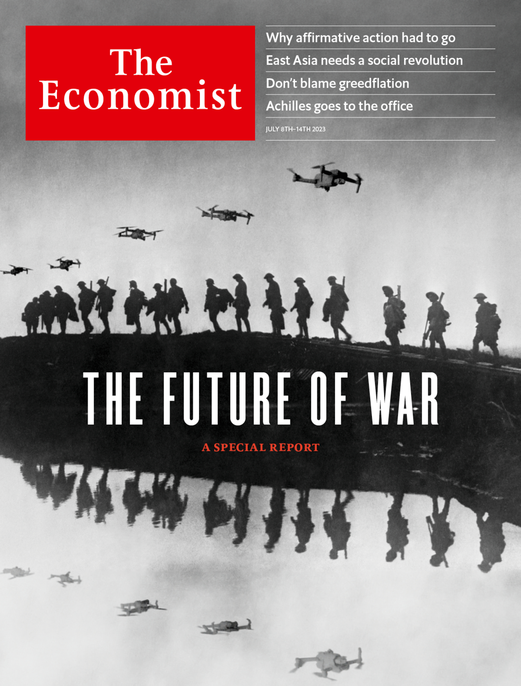
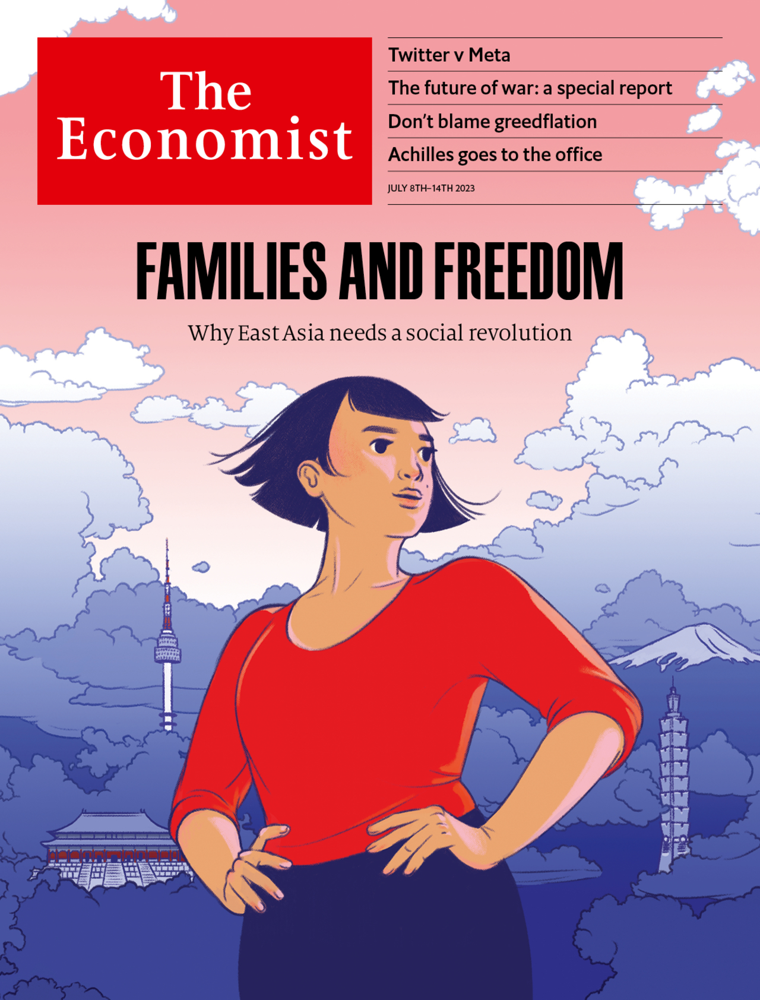

###### The Economist

# This week’s covers 

##### How we saw the world 

 

> Jul 6th 2023 

IN MOST OF the world this week we concentrate on the future of war. The conflict in Ukraine points to a new kind of high-intensity war that combines cutting-edge technology with industrial-scale killing and munitions consumption, even as it draws in civilians, allies and private firms. Rather than recoiling from the death and destruction, liberal societies must recognise that wars between industrialised economies are an all-too-real prospect—and start to prepare.

 


: 

: 


In Asia we focus on the family. In China, Japan, South Korea and Taiwan, Asians’ supposed commitment to conservative family life is collapsing. To many people, marriage seems increasingly anachronistic and unaffordable. Governments must try harder to manage a momentous social change they cannot prevent.

 


: 

: 

