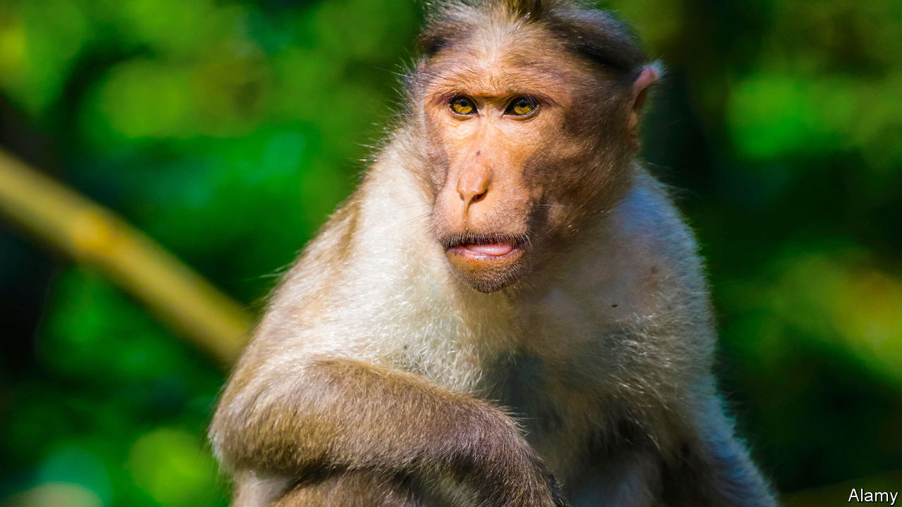

###### Lab monkey shortage in America

# America has a shortage of lab monkeys 

##### That is bad for biomedical research and encourages smuggling 

 

> Jul 6th 2023 

AMERICAN AUTHORITIES arrested Masphal Kry, an official in Cambodia’s forestry administration, last November when he was heading to an international meeting about trade regulations for endangered species in Panama. Prosecutors accused him of conspiring with a smuggling ring. The contraband: monkeys, specifically long-tailed macaques. His gang allegedly grabbed wild macaques in Cambodia’s national parks and bribed officials to label them as captive-bred. Fake papers allowed Vanny Bio Research, a Cambodian pharma company, to ship these unfortunate primates to America for use in research. Mr Kry is facing trial in Florida’s Southern District Court.

The federal government funds seven National Primate Research Centres (NPRCs), which house in total around 20,000 primates, macaques but also baboons and marmosets. These centres then award primates to labs across America. NPRCs have fulfilled only a third of requests for untested-on macaques in 2021 and prices have soared. Before the covid-19 pandemic a rhesus macaque cost $8,000; by 2022 they had hit $24,000. Another species, long-tailed macaques, is probably per pound currently the most expensive traded wildlife, says Lisa Jones-Engel, a science adviser at PETA, an animal-rights group.

Getting lab monkeys from abroad became harder during the pandemic. Chinese authorities banned the export of all primates in early 2020. The Chinese government wanted to suppress the country’s wildlife trade, which is thought to encourage the transmission of pathogens—like sars-cov-2—from animals to humans. Chinese labs also need monkeys to achieve the Communist Party’s goal of China becoming a world leader in neuroscience by 2025. 

That forced American companies to rely on less scrupulous South-East Asian suppliers. Many scientists believe poaching is endemic across Cambodia. In February, the Department of Justice subpoenaed Charles River over 1,000 juvenile macaques the pharmaceutical company had bought from Cambodia; the DoJ suspected they were caught in the wild then exported. These primates are now in Texas and Maryland but also in limbo: they cannot be tested on, nor can they be flown back to Cambodia.■


