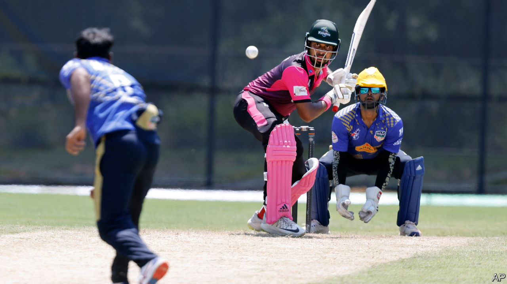

###### Major League Cricket

# Can baseball fans be won over by the world’s second biggest sport? 

##### America’s first ever professional cricket tournament starts on July 13th 

 

> Jul 6th 2023 

OVER TWO decades ago, Bill Bryson, a writer from Iowa, wrote of cricket that the English did not invent it “as a way of making all other human endeavours look interesting and lively; that was merely an unintended side effect.” The world’s second-most-watched sport, he said, “is the only sport in which spectators burn as many calories as players” (clearly Mr Bryson never watched a darts match, or saw Ben Stokes bat). His description of play compared it to a form of baseball, only with more absurd dress and far slower.

In so far as Americans think about cricket at all, most still imagine it how Mr Bryson did. Yet the first international cricket match took place between the United States and Canada in 1844, and before the civil war the sport was more popular in America than baseball. In more recent years the sport has quietly been gaining adherents.

On July 13th the first professional American cricket league will start play, for a 19-match tournament, hosted primarily at a former baseball stadium in Dallas. Six teams, representing five large American cities and Texas, will compete in “Major League Cricket” (MLC). They will play the Twenty20, or T20, format of the game, invented in 2003 as a faster version (by comparison, the current matches between England and Australia can each last for a gripping five days). Professionals from all over the world are being flown in. The plan, says Tom Dunmore, the league’s spokesman, is that this will eventually evolve into a full-blown regular competition.

The impetus behind this push, inevitably, is the rising number of immigrants in America from cricket-playing countries—in particular from the Indian subcontinent. The investors in MLC include high-profile Indian-Americans, such as Satya Nadella, the CEO of Microsoft. They must reckon that their fellow countrymen provide a ready market for cricket. The evidence of America’s extensive amateur leagues suggest they might be right. Chicago’s “Premier League” already features ten full teams who play a dozen matches a week. There are over 2,000 players on the books, of whom nearly 300 have the surname “Patel.” 

The investors in MLC hope that cricket could draw in new fans too. It helps that cricket has evolved to become more American. A T20 match lasts around three hours; less than a baseball game, and the ball is in fact in play more. Mr Dunmore says the matches in Dallas will be an “all-American extravaganza, with fireworks and big hitting”, intended to keep audiences entertained. The league has brought on baseball social-media influencers to sell the sport to their fans. It might seem improbable. But it was not long ago that soccer too was seen as a niche sport in America. Nowadays, your British correspondent gets asked almost daily which English Premier League team he supports.■


