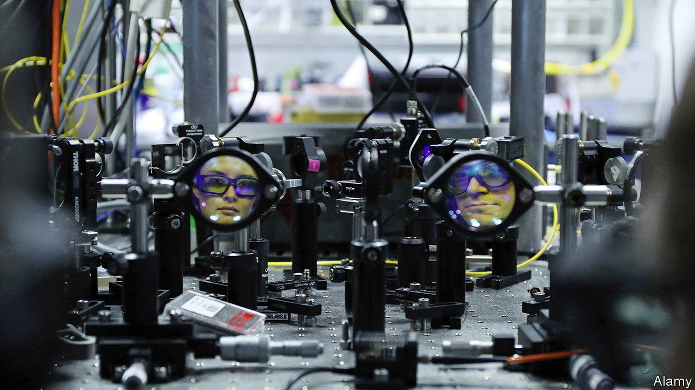

###### Quant, um

# Chicago hopes to become a world centre for quantum research 

##### But to what end? 

 

> Jul 6th 2023 

To a casual visitor, the basement of the William Eckhardt Research Centre, at the University of Chicago, might appear nothing special. Whereas the upper floors of the building are a postmodern tower of angled glass, underground the walls are bare-white MDF. Yet to David Awschalom, one of America’s leading molecular physicists, and the director of the Chicago Quantum Exchange, it is down here, three storeys below ground, that is the most exciting part of the architecture. The parts upstairs “were made to be beautiful”, he says. “This was made to be functional.” There is almost perfect silence, except for the quiet hum of the air-conditioning. Three feet of concrete absorb even the tiniest of vibrations caused by, say, a truck passing nearby, without affecting the instruments.

Such precision is necessary, because it is in the labs on these floors where students try to measure the movement of individual molecules. A fibre-optic line connects the building directly to Argonne National Laboratory, a government facility 20 miles away in the south-western suburbs of Chicago. Through it, scientists experiment with sending signals by the means of entangled quarks—particles that make up the protons and neutrons in the nuclei of atoms. That is just one part of a world-leading research cluster taking root in Chicago into quantum technology, attempting to apply the confusing nature of atoms to practical use in communications and computing. Roughly two-fifths of federal funding into quantum research is spent in Illinois, and four of the country’s ten quantum labs are in the state. 

It is still unclear whether quantum technology will ever amount to much. And a lot of the cutting-edge action in the field is happening in the private sector (in firms such as Google, IBM and Intel, and startups like IonQ) rather than in government-funded labs. But if the technology does take off, the Windy City hopes to be at the forefront of it.

Chicago’s strength in quantum research in part goes back to its days at the centre of research into the nuclear industry. Argonne National Lab opened in 1946 as a hub for research into nuclear power. Today, Illinois generates more electricity from nuclear power than any other state. According to Mr Awschalom, however, it was visionary thinking by Robert Zimmer, a former president of the University of Chicago, that was responsible the city’s more recent quantum leap.

A little over a decade ago, Mr Awschalom says, he was drawn back to Chicago from California when Mr Zimmer agreed to dip into the university’s endowment to fund a quantum-engineering programme. “I said I have to hire a dozen of faculty, build buildings, build laboratories, and he said, we will do it,” recalls Mr Awschalom. Hence the building of the lab, which cost $300m, as well as the hiring of staff.

What does it add up to? Quantum technology is still at an early stage. In the labs, postgraduate students work mostly on pure fundamental research—for example, examining how molecules of different materials, from diamond to silicon, can be manipulated at a quantum level. But applied, such research could unlock potentially transformative technology. For example, a computer that can use qubits, the quantum equivalent of a binary “bit” in a normal computer, could be hundreds of orders of magnitude more effective at some calculations than a binary computer. 

Unsurprisingly, resources are pouring into the sector to try to apply this research. The university has partnerships with dozens of firms, such as Toshiba, which helps run the communications experiment, and Google and IBM, which it announced projects with at the G7 in Hiroshima in May. But the military applications, as well as the competition with China to lead in strategic technologies, may help to explain why the government in particular is so keen to bolster quantum research. A quantum computer could potentially crack much of the encryption used on the internet. In December, Joe Biden signed a law requiring the government to research acquiring information technology resistant to quantum code-cracking. China has invested heavily in quantum computing too.

Many in Chicagoland hope that a quantum boom could be a boon for the wider region. Penny Pritzker, a tech investor (and sister of J.B. Pritzker, Illinois’s billionaire governor), says she is “bullish on the future of Chicago’s tech leadership” in part because of quantum technology. Her brother has pointed to quantum startups moving to Chicago as evidence that Illinois can become “the Silicon Valley of the Midwest”. In Mr Awschalom’s telling, quantum computing could be used for projects that still befuddle conventional computers, such as discovering new drugs or solving complex optimisation problems, such as running electricity grids. The advent of modern computing has transformed the entire world—but nowhere more than it has California, where most of the innovations originally happened. Perhaps Illinois can achieve the same. But it will be a long time before the technology becomes as qubitquitous as silicon chips. ■


