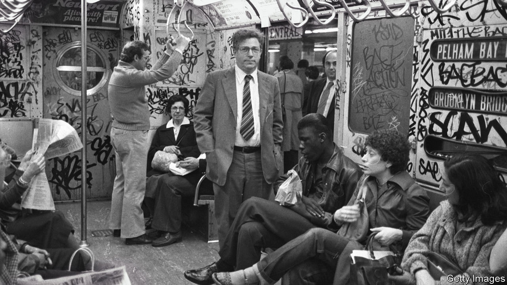

###### Citizenship

# Dick Ravitch, New York’s fiscal superman 

##### The developer who helped save the city and later kept the subway on track died on June 25th 

 

> Jul 6th 2023 

SUBWAY CARS were blanketed with graffiti inside and out when Richard Ravitch, who died on June 25th, became the head of the Metropolitan Transportation Authority (MTA) in 1979. Years of low investment meant the subway’s infrastructure was falling apart. Maintenance was deferred for months, if not years. The MTA’s workers had not had a pay rise in five years. The agency was deep in the red.

When the governor at the time, Hugh Carey, asked Mr Ravitch to become head of the MTA, which operates the subway, along with commuter lines, buses and some tunnels and bridges, he told the governor he was crazy to even ask. In his 2014 memoir Mr Ravitch wrote that “no one in his right mind would want to manage a system in the MTA’s condition.” But subway lines are the arteries of New York City. So Mr Ravitch, a regular rider, took the job, and arranged $8bn in investment using long-term financing to rebuild the system.

Luckily for New York, Mr Ravitch took a lot of tough jobs. In 1975, shortly after banks said they would no longer lend to the Urban Development Corp, a state authority, Carey appointed Mr Ravitch as its head. He kept it out of bankruptcy. Then he helped keep New York City from insolvency after it had been shut out of the bond market. Mr Ravitch helped create a financial-control board, which stabilised the city’s finances for decades, including after the September 11th attacks and the 2007-08 recession. 

Not only did he have the expertise to navigate municipal and state finance, he could get people in a room to talk. Often that room was in his apartment late at night and the talk, while eating a Chinese takeaway, was with a union leader or a mayor. Or it was the head of a bank getting a 5am tour of an MTA facility. 

In 2009 he was asked by Governor David Paterson to be his lieutenant, to help the state deal with the aftermath of the recession, particularly a looming $9bn budget deficit. He later said of the time that “it was, without a doubt, the most useless experience of my life.” Undeterred, he also advised Detroit and Puerto Rico during their financial crises.

He spoke bluntly in a gravelly voice and did not suffer fools or threats. Sam Roberts of the  recently told WNYC, a public-radio station, that Donald Trump once threatened to get Mr Ravitch fired if he did not get Mr Trump a tax break. Mr Ravitch replied: “I’m going to get you arrested unless you leave my office now.” Mr Ravitch was confident that New York City would bounce back after covid-19. This time, making it happen will fall to someone else. ■


