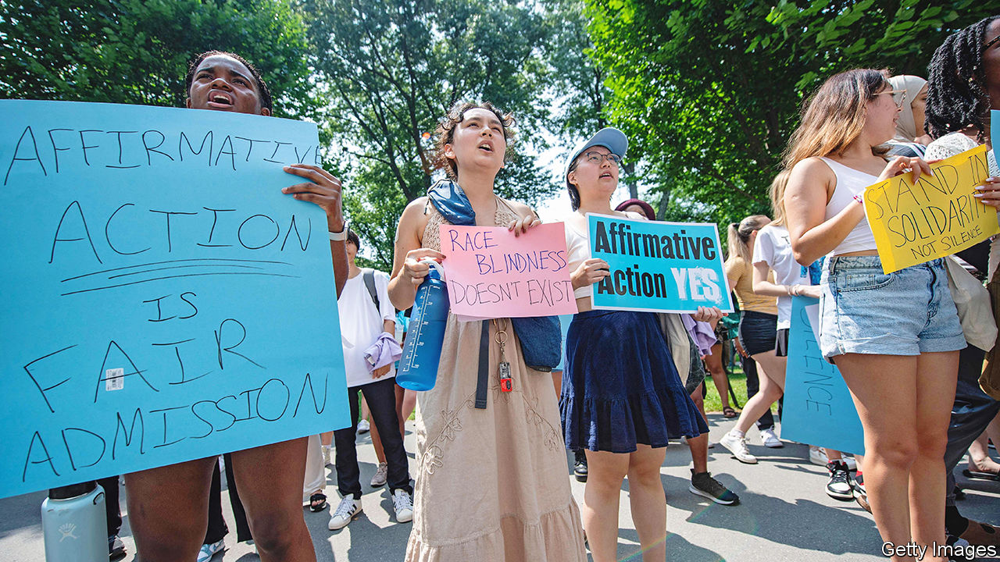

###### Affirmative inaction

# How American universities will react as race-based admissions end 

##### More enlightened policies could follow the Supreme Court’s ban 

 

> Jun 29th 2023 

FOR MORE than 50 years admissions officers at some of America’s swankiest universities have given a leg up to black, Hispanic and Native American students whose achievements in secondary school might not, on their own, have won them a place. On June 29th  declared this practice unconstitutional, ruling in a decision authored by John Roberts, the chief justice, that neither public nor private universities may use race as a factor when deciding which students to admit. The judgment by the conservative court could cause a swift, sharp drop in the number of students from these minority groups who go to America’s best campuses. But it could also spur changes that make university admissions more progressive.

Since their birth in the 1960s, race-conscious admissions policies had survived a number of challenges at the Supreme Court. The ruling that has finally eliminated them arose from a pair of cases first brought in 2014 by Students for Fair Admissions, an organisation founded by Edward Blum, a long-time opponent of racial preferences, against Harvard University and the University of North Carolina at Chapel Hill. By a vote of 6-3, the court agreed that systematic considerations of race in admissions decisions violate the Equal Protection Clause of the 14th Amendment. The decision does not apply to military academies. Chief Justice Roberts floated this carve-out in the oral hearings in response to an argument from the solicitor-general that, in the context of military training, racial diversity is a matter of national security. Nor does the ruling eliminate every last consideration of race. It allows admissions committees to take notice of students who, in essays or interviews, explain how their racial identity affects their lives. 

Experience in the nine states that currently forbid affirmative action in public colleges provides some clues as to what might now happen nationally. These bans, starting in the late 1990s, have not much altered the total number of students who enter higher education. But they have changed where they study. A survey of selective universities in six states found that they enrolled roughly 20% fewer black and Hispanic Americans in the years immediately after the bans than would otherwise have been the case. The number of black and Hispanic students admitted to California’s two most coveted public campuses—University of California, Los Angeles and University of California, Berkeley—dropped by around 40% (the Hispanic share has since recovered strongly). 

Students of colour who were turned away by the best universities often wound up attending second-tier institutions. This displaced some applicants who ended up attending third-tier campuses—and so on down the college spectrum. In California, Hispanics who went to less-prestigious public campuses as a result of this “cascade” became a bit less likely to graduate, according to a study by Zachary Bleemer of Yale University. Lower-tier colleges were perhaps less able to afford the kinds of support the students needed to succeed. Mr Bleemer calculates that Hispanic students who applied to the University of California system in the years immediately after the shift went on to earn about 5% less in their early careers than would have been the case had affirmative action remained legal.

What will now happen in other states—and in America’s highly selective private non-profit universities, which until now have not been affected by state bans—depends in part on whether universities concoct alternative ways to enroll underrepresented minorities. Many bright students say they value diversity on campus. The Supreme Court’s ruling will make this aim more difficult, but is unlikely to end it. “The ruling is impacting a policy, not the underlying principle of what drives our work,” says Matthew Hyde, dean of admissions at Trinity College, a selective liberal-arts college in Connecticut. “We’re still going to drive to craft dynamic, diverse communities of young people.”

Elite universities will probably start by redoubling efforts to get black, Hispanic and Native American students to apply in the first place. Low application volumes are the biggest direct obstacle to their enrolment. That these youngsters are less likely than white and Asian ones to have top grades is only part of the explanation: they also believe they have a smaller chance of getting in, and they are more likely to be put off by the eye-watering sticker prices of the elite universities. The ban on affirmative action may weigh down application rates further. That is what happened in California, where youngsters assumed they were less likely to be accepted or to fit in.

Public universities could also experiment with “top percent” schemes of the kind that legislators in Texas devised after banning race-conscious admissions in the 1990s. Its public universities began granting students who graduated in the top 10% of their high-school class automatic entry. The theory is that this can give bright kids who excel in underperforming schools, whatever their background, the same chance of going to a leading public university as children with more advantages.

A third idea is to ramp up wealth-based affirmative action, which remains legal. Youngsters from the poorest fifth of households make up 17% of all high-school graduates but only 8% of entrants to the 200 or so most-selective colleges; those odds are as bad as for any racial group. Granting some degree of advantage to clever-but-impecunious applicants would boost diversity more than doing nothing, while also providing opportunity to the least privileged white and Asian kids.

Creating a class

To make a good go of that, elite universities would probably have to ditch practices which presently favour applicants who are white and rich. These include galling favouritism for children of alumni (“legacy” applicants make up around 16% of Harvard’s class of 2025), and handing places to mediocre applicants who are fairly good at sport. It is “insane” that these persist even as universities promise to boost social mobility, says Richard Kahlenberg, an academic and proponent of class-conscious admissions. He is hopeful that the Supreme Court’s ruling will help create more progressive admissions systems. “That’s the paradox here,” says Mr Kahlenberg. “A conservative Supreme Court decision curtailing the ability of universities to use race in admissions will, over time, create the conditions under which a number of liberal public policies will be adopted.”

In theory some combination of these strategies—outreach, top-percent plans and preferences for the poor—could enable America’s elite universities to enrol a cohort that is about as diverse as at present, according to simulations by Georgetown University and Stanford University. 

But achieving this on a national scale would require university bosses to give these plays a huge push. And admitting more poor students over wealthy ones would also require universities to stomach lower income from tuition fees. A recent study of 19 universities in states that have banned affirmative action found that the race-neutral admissions policies that have replaced it have largely not been as effective at welcoming African-American and Hispanic students. In lots of these universities, the share of students who are drawn from these minorities has climbed back up from the lows it fell to immediately after bans were put in place. But some of that may be because of demographic changes which mean that there are many more African-American and Hispanic pupils in high schools.

The truth is that in recent years few elite universities have had much success improving the representation of disadvantaged minorities—even when they have used race-conscious admissions. These days black, Hispanic and Native American students make up 20% of all entrants to selective universities, according to researchers at Georgetown’s Centre on Education and the Workforce. Yet they are 40% of all high-school graduates. This gap has actually widened in the past two decades, even though campuses have been growing gradually more diverse. Focusing on the root causes of this unfairness—not least lousy and segregated K-12 schooling—has never seemed more urgent. ■


